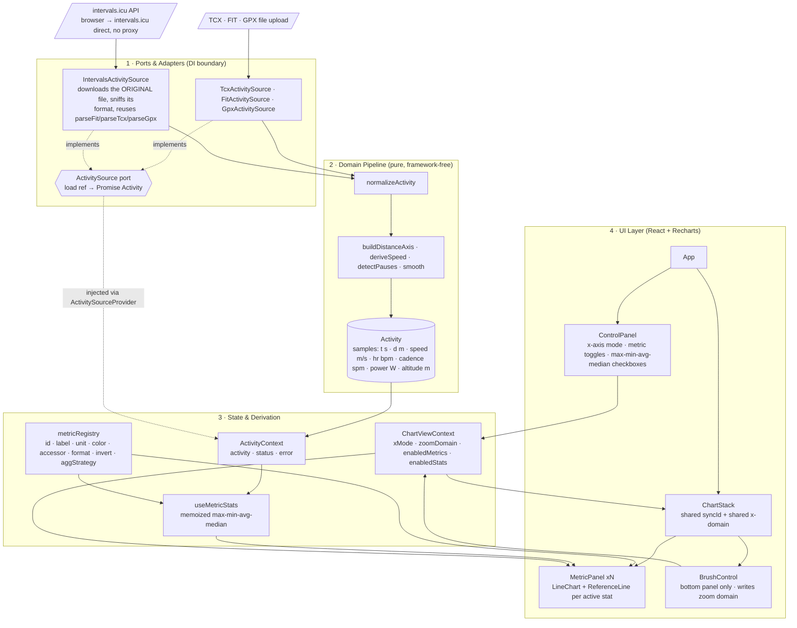

# ActivityMaxxer — Architecture Spec

> **Audience:** an implementing coding agent (or human) working from an empty Vite project.
> **Status:** implementation in progress — see checklist below.
> **This is a decision record, not a description of the system as built** — for the current map (layers, dependency graph, known couplings, Strava readiness) see [`ARCHITECTURE_STATUS.md`](ARCHITECTURE_STATUS.md).
> **Scope of v1:** running, cycling and generic GPS tracks, metric units only, TCX/FIT/GPX file input, stacked synced charts, statistic reference lines.

---

## 0. Implementation progress

Kept in sync after each feature lands — see build order in §11.

- [x] Test infra: vitest + React Testing Library, jsdom, `ResizeObserver` stub for Recharts
- [x] `domain/types.js` — JSDoc typedefs (Sample, Activity, RawTrackpoint)
- [x] `domain/units.js` — `formatPace`, `formatDuration`, `formatDistanceKm`, `mpsToSecPerKm` (TDD)
- [x] `stats/aggregate.js` — avg/max/median per `aggStrategy` (TDD). **Verified early:** avg pace = `totalMovingTime / totalDistance`, proven against a hand-computed case to differ from naive mean-of-instantaneous-pace by ~18%. `max` is invertAxis-aware (pace's "max" = fastest, i.e. numeric min).
- [x] `data/ActivitySource.js` port + `fixtures/sample-run.json` + `MockActivitySource` (TDD)
- [x] `metrics/metricRegistry.js`
- [x] `stats/useMetricStats.js` (TDD memoized hook)
- [x] `data/ActivitySource.js` — `ActivitySourceProvider`/`useActivitySource` DI context (TDD). **Fixed along the way:** `@testing-library/react`'s auto-cleanup needs a global `afterEach`, which this project doesn't have (`globals: false`); without it, DOM leaked across tests in the same file. `setupTests.js` now calls `afterEach(cleanup)` explicitly — applies to all future test files, not just this one.
- [x] `state/ActivityContext.jsx` — `activity`/`status`/`error`/`load(ref)`, backed by the injected `ActivitySource` (TDD)
- [x] `state/ChartViewContext.jsx` — `xMode`/`zoomDomain`/`enabledMetrics`/`enabledStats`/`hoverIndex` + setters (TDD). `enabledMetrics` is always re-sorted to canonical `metricOrder` on toggle, regardless of toggle sequence, so anything iterating it directly gets a stable order.
- [x] `app/providers.jsx` — `AppProviders({ source, children })` composing all three (TDD)
- [x] `ui/SyncedTooltip.jsx` — Recharts `<Tooltip content>` shared by every panel; header always shows elapsed time *and* distance regardless of `xMode`, body shows that panel's metric label/value/unit. Built now (ahead of its own build-order slot) because a panel needs *some* Tooltip for Recharts to render a crosshair at all — see next item.
- [x] `ui/MetricPanel.jsx` + `ui/ChartStack.jsx` — hardcoded via `ChartViewContext`'s default `enabledMetrics` (all of `metricOrder`, since `ControlPanel` doesn't exist yet to change it); `ChartStack` filters `metricOrder` by `activity.availableMetrics ∩ enabledMetrics`, first panel 200px / rest 140px, only the bottom panel shows axis ticks. Axis alignment and syncId crosshair sync are verified against real rendered Recharts SVG output in jsdom (parsed path/line pixel coordinates), not just component props. **Two jsdom pitfalls cost real debugging time:** (1) `ResponsiveContainer` measures its container via `getBoundingClientRect()` on mount; jsdom's is always all-zero, so every chart rendered at 0×0 with no children at all until `setupTests.js` got a global fixed-rect stub (800×200). (2) Recharts' default axis `interval="preserveEnd"` decides which ticks to keep using real text-length measurement, which jsdom can't do reliably — it was silently collapsing every axis to a single (often out-of-range-looking) tick. Fixed with `interval={0}` on both axes, which is a reasonable production default too since `tickCount` already caps how many "nice" ticks get generated. (3) Recharts schedules mouse-move handling via `requestAnimationFrame`, not synchronously — crosshair-sync tests must `fireEvent.mouseMove` then `await` a couple of rAF ticks before asserting on `.recharts-tooltip-cursor`.
- [x] `ui/ControlPanel.jsx` + `MetricToggle` + `StatCheckboxes` + `XAxisModeSwitch` (TDD, system test). Reads `activity.availableMetrics` directly, so it never offers a control for a metric the loaded activity has no data for — mirrors the filter `ChartStack` already applies. `MetricToggle`'s accessible name is just the metric label (e.g. "Cadence"); `StatCheckboxes` needed an explicit `aria-label` per input (`"Cadence max"`) because three plain "max"/"avg"/"median" checkboxes recur once per metric row and would otherwise collide under the same accessible name. Verified end-to-end against real rendered Recharts output (not just context state): unchecking a metric toggle removes that panel from `ChartStack`, checking a stat checkbox adds a `.recharts-reference-line` to the right panel only, and flipping the x-axis-mode switch changes the bottom panel's tick values from elapsed seconds to metres.
- [x] `Brush` + controlled `zoomDomain` wired across all panels (TDD, system test). Only the bottom panel renders the `Brush`; its `onChange` writes `zoomDomain` via `ChartViewContext`, which every panel's `XAxis domain` already read. **Non-obvious Recharts wrinkle:** `Brush` also tracks its own selected sample-index range internally (independent of our `zoomDomain`), and that index range — not literally `'dataMin'/'dataMax'` over the full sample array — is what those sentinels resolve against for every synced panel. Left uncontrolled, the Brush's index selection survives an `xMode` switch even after our `zoomDomain` context resets to `['dataMin','dataMax']`, silently re-narrowing "full" to whatever was last brushed (e.g. distance axis clipped to 0–100m instead of 0–200m after zooming in time mode then switching to distance). Fixed by making `Brush` a controlled component: `startIndex`/`endIndex` are derived from `zoomDomain` each render, so a context reset now also resets the Brush's own selection. Verified by simulating a real Recharts drag (`fireEvent.mousedown` on `.recharts-brush-traveller`, then `mousemove`/`mouseup` on `window`, since Brush's drag handlers are attached to `window`, not the traveller) — jsdom's `MouseEvent.pageX` is a getter that just returns `clientX` (no scroll-offset support), so the drag delta must be sent as `clientX` or Brush's internal math sees zero movement. Also discovered empirically: Recharts drops out-of-domain samples entirely from the line path on zoom (`M`/`L` point count shrinks) rather than clamping their pixel position to the plot edge — the system test asserts on point count for that reason, not on the pixel position of a specific sample.
- [x] `ui/FileDropZone.jsx` (TDD) — click-to-browse (hidden `<input type="file">` behind a `<label>`) + real drag-and-drop (`dragenter`/`dragover`/`drop`), hands a raw `File` up via `onFileSelected` and does no parsing itself, per the dependency rule in §3. Tracks its own `isDragActive` for a visual affordance, cleared on both `dragleave` and `drop`.
- [x] `ui/EmptyState.jsx` + `ui/ErrorState.jsx` (TDD) — `EmptyState` composes `FileDropZone` with a "Load sample activity" button (`onFileSelected` / `onLoadSample`) so the UI is explorable without a real TCX export on hand; `ErrorState` surfaces `error.message` directly (adapters throw specific reasons) behind `role="alert"` with a "Try again" button.
- [x] `App.jsx` wired end-to-end against `MockActivitySource` (TDD, system test). Exports `AppShell` (reads `ActivityContext`/renders by `status`) separately from the default-exported `App` (`AppShell` wrapped in `AppProviders` with a real `MockActivitySource` instance) — mirrors how every other UI test in this repo drives a component through `AppProviders` with a source double, and lets `App.test.jsx` cover `loading`/`error`/retry paths the real Mock can never produce (it always resolves). `AppShell` keeps the last-attempted `ActivityRef` in a `ref` so `ErrorState`'s "Try again" replays the exact same `load()` call rather than only ever falling back to the sample. Verified end-to-end against real rendered Recharts output, same as every other UI item above: idle → `EmptyState` → click "Load sample activity" or drop a file → `ControlPanel` + `ChartStack` render with real synced panels. Applied the §9 dark-theme tokens (`styles/tokens.css`, `styles/global.css`) and removed the leftover default-Vite-template files (`App.css`, `index.css`, `assets/{hero.png,react.svg,vite.svg}`) that weren't part of the folder scaffold in §4. **Verification gap, logged for transparency:** this sandbox has no headless-browser tooling (no `chromium-cli`/Playwright installed) and no Accessibility permission for AppleScript UI-scripting, so only the empty state was confirmed against a real rendered screenshot (Safari, `localhost` dev server) — the loaded-chart view was *not* independently screenshotted by the agent. The interactive flow's correctness rests on the system test above (real Recharts SVG assertions) plus a manual walkthrough handed to the user to click through themselves.
- [x] `domain/smooth.js`, `domain/buildDistanceAxis.js`, `domain/deriveSpeed.js`, `domain/detectPauses.js` (all TDD). `buildDistanceAxis` clamps any decrease/reset to the previous value and holds forward through a missing sample; falls back to haversine-over-lat/lon cumulative distance only when `DistanceMeters` is absent from *every* trackpoint (not per-sample — a file with occasional gaps in an otherwise-present field holds-forward instead, since "absent entirely" per §8 is a whole-file condition). `deriveSpeed` only reconstructs speed from distance/time deltas when the file has **no** sensor speed anywhere; when it does, per-sample nulls are passed through as-is rather than backfilled from the derived path, so a partially-instrumented file doesn't silently mix real and synthetic speed. `detectPauses` implements both §8 triggers (gap > 10s, sustained speed < 0.3 m/s for > 10s) as independent passes over the sample array.
- [x] `domain/normalizeActivity.js` — the pipeline entry point (TDD). Drops trackpoints that carry only a timestamp and nothing else (judged on the raw adapter fields, before any derivation), then runs `buildDistanceAxis` → `deriveSpeed` → `detectPauses` and assembles `Sample[]`. `availableMetrics` is computed here directly from which sample fields actually have data (not via `metricRegistry`, to keep `domain/` free of a dependency on the `metrics/` layer above it — see §3 dependency rule) — pace is "available" whenever any sample has `speed`, since pace is always derived at display time, never stored.
- [x] `data/tcx/parseTcx.js` (TDD) — namespace-aware (`getElementsByTagNameNS`, both the TCX and `ActivityExtension/v2` namespaces, prefix-independent), flattens every `Lap > Track > Trackpoint` under the `Activity` into one array (laps aren't surfaced yet, per §12). Doubles `TPX > RunCadence` (strides/min) into steps/min; ignores the top-level bike `<Cadence>`. Throws a specific, user-facing `Error` (shown verbatim by `ErrorState`) for: invalid XML, no `Activity` element, a non-`Running` `Sport` attribute (v1 is running-only — silently mislabeling a bike file would corrupt the cadence math), and zero usable trackpoints. Deliberately does **not** drop time-only trackpoints itself — that's `normalizeActivity`'s call, per the dependency rule that adapters do field-mapping only, never interpretation; a test locks in that layering so it can't silently drift.
- [x] `data/tcx/TcxActivitySource.js` (TDD) — `File.text()` → `parseTcx` → `normalizeActivity`, the last two of which now do the real work `MockActivitySource` always skipped. Rejects a non-`file` ref rather than silently no-op'ing.
- [x] **Real Garmin cross-check, unblocked** — user supplied a real 30-minute Garmin TCX export (`fixtures/activity_23870166877.tcx`, 1801 trackpoints, ~1 Hz) plus its Garmin-reported stats (`fixtures/activity_23870166877-meta.json`): 4.71 km, 30:00, avg pace 6:22/km. A dedicated integration test (`TcxActivitySource.realGarminFixture.test.js`) parses the real file end-to-end and asserts computed avg pace against Garmin's reported value — **matches to the second** (computed 6:22.06/km vs. reported 6:22/km), the strongest evidence yet that the `weightedPace` strategy (§6) is correct, not just internally consistent. This file also has no `<Watts>` anywhere, which incidentally covers the "at least one missing metric" case §11 step 8 asked for — `availableMetrics` correctly omits `power` and `ControlPanel` renders no toggle for it. It has **no gaps or sub-0.3 m/s stretches** (checked with a one-off script before writing tests), so `detectPauses`'s two trigger paths are verified only by synthetic unit tests, not against this real file — worth re-running the cross-check if a Garmin export containing an actual pause becomes available.
- [x] `App.jsx` composition root now dispatches by `ActivityRef` shape instead of injecting a single adapter instance: a `{type:'file'}` ref (drag-drop or browse) goes to `TcxActivitySource`, a `{type:'id'}` ref (the "Load sample activity" button) still goes to `MockActivitySource`. Both concrete adapters are instantiated in exactly one place (`App.jsx`); no other file imports either. This is a small deviation from §5's "swap the source instance, nothing else changes" framing — that framing assumed one adapter per app, but the sample-activity convenience button needs the mock fixture to keep working *alongside* real parsing, not instead of it. `App.test.jsx`'s file-drop test now exercises a real (small, hand-built) TCX string end-to-end and asserts the resulting `availableMetrics` to prove it went through the real parser, not the fixture. **Superseded 2026-08-07** (last entry in this list): the `{type:'id'}` → mock branch is gone with the sample button, so the dispatcher only picks between the two real parsers and §5's one-adapter-per-app framing holds again.
- [x] `data/fit/parseFit.js` + `data/fit/FitActivitySource.js` (TDD) — FIT (binary) parsing via `@garmin/fitsdk` (official Garmin package, zero runtime deps, pure ESM) added to recover Stryd running power, which Garmin Connect's FIT→TCX exporter silently drops (the existing `activity_23870166877.tcx` fixture has no `<Watts>` anywhere despite the run being recorded with a Stryd pod). **Non-obvious finding, verified at the byte level against the user's real FIT export (`fixtures/23870166877_ACTIVITY.fit`):** the `record` message definitions in this file don't include the standard power field at all — power exists *only* as a developer field, tied to a `developer_data_id` message whose `application_id` (`18fb2cf0-1a4b-430d-ad66-988c847421f4`) is Stryd's registered FIT app id. `@garmin/fitsdk` keys `record.developerFields` by a sequential `key` assigned during decode, not by `fieldDefinitionNumber` — resolving the right key requires matching `fieldDescriptionMesgs` by `nativeMesgNum === 20 && nativeFieldNum === 7` (i.e. "mirrors record's standard power field") first. A generic/naive FIT reader that only knows the standard profile would reproduce the exact same "no power" bug the TCX export has. See §8 for the rest of the FIT-specific parsing notes this uncovered (cadence doubling parity, semicircle lat/lon conversion, decode error shape). `parseFit` is `async` (unlike sync `parseTcx`) because `@garmin/fitsdk` (~1.3 MB, almost all of it the FIT field/message profile table) is dynamically imported *inside* it, keeping that weight out of the eager bundle for TCX-only users; `FitActivitySource` imports it normally since the file itself is tiny. `App.jsx`'s composition-root dispatcher now routes a dropped/browsed file to `FitActivitySource` or `TcxActivitySource` by extension (`.fit` vs `.tcx`) rather than always going to TCX. **Real Garmin FIT cross-check:** `FitActivitySource.realGarminFixture.test.js` parses the same 1801-trackpoint, 30-minute activity as the existing TCX cross-check test and matches it on distance/duration/avg pace — but where that TCX test asserts `power` is *absent* from `availableMetrics`, this one asserts the inverse: `availableMetrics` *does* contain `'power'` (avg 224 W, sane 85–270 W range), which is the actual proof the recovery works end-to-end, not just that the file parses.
- [x] **Cycling support** — widened `Sport` to `'running'|'cycling'` and wired the previously-dead `metricRegistry[id].sports` filtering into `ControlPanel`/`ChartStack` (via a new `isMetricForSport()` helper) — that field existed since the registry was first built but nothing read it until now. `parseTcx`/`parseFit` now resolve the file's actual sport (TCX `Sport="Biking"`, FIT `sessionMesgs[0].sport === 'cycling'`) instead of hard-rejecting anything but running; both branch cadence handling on it (TCX: plain top-level `<Cadence>` instead of `TPX>RunCadence`; FIT: `record.cadence` passed through undoubled) since the running-specific strides→steps doubling would silently corrupt a bike file's cadence otherwise — see §8. New `speed` metric (km/h, `metrics/metricRegistry.js`) replaces `pace` for cycling activities (`pace.sports` narrowed to `['running']`, `speed.sports` is `['cycling']`) — average speed uses `movingOnly` rather than `weightedPace`, since (unlike pace) average speed *is* the time-weighted mean of instantaneous speed by definition, so the reciprocal-avoidance strategy pace needs doesn't apply. Deliberately reuses `--metric-pace` as `speed`'s line color rather than adding a new CSS token, since the two are mutually exclusive per activity and never render together. `cadence.unit` became the registry's first sport-dependent field (`(sport) => sport==='cycling'?'rpm':'spm'`), resolved via a new `metricUnit()` helper everywhere `metric.unit` used to be read directly (`MetricPanel`'s `StatLabels`/`Tooltip`, `SyncedTooltip`) — both now take a `sport` prop threaded down from `activity.sport`. `normalizeActivity`'s `availableMetricsOf` stays sport-agnostic by design (per its existing comment) — it flags both `'pace'` and `'speed'` as available whenever sample speed data exists; sport-based visibility is entirely a UI-layer concern.
- [x] **Inferred workout name + sport chip** — added `Activity.name` (§5), computed in `normalizeActivity` by the new `domain/deriveWorkoutName.js` (TDD) from a time-of-day bucket (viewer's local browser time, i.e. `Date.prototype.getHours()`, not UTC — neither file format carries a timezone offset, and this is usually close enough since people tend to view an activity from roughly where they recorded it) plus a sport label. FIT's `sportLabel` (see §8) is used when present (e.g. "Morning Trail Run"); TCX and profile-less FIT files fall back to a generic `'running'`/`'cycling'` → `"Run"`/`"Ride"` map (e.g. "Morning Run") — so FIT and TCX exports of the *same* activity can get different names. New `ui/ActivityHeader.jsx` renders the name plus a separate, stable sport chip ("Running"/"Cycling", i.e. `activity.sport` capitalized) — deliberately **not** `sportLabel` again, which would just duplicate the name; the chip is the broad classification that also drives unit conventions elsewhere (spm vs rpm), the name is the specific, richer title.
- [x] **Cadence Y-axis zoom** — `stats/aggregate.js` gained `computeYDomain()`, which wires up the previously-dead `domainPadding` field (§6) into a real per-metric `<YAxis domain>` in `MetricPanel.jsx`, reusing the same `movingOnly` exclusion `extreme()`/`timeWeightedMean()` already use for stat lines so paused zero-cadence samples (`sample.moving === false`) stop dragging the computed min down to 0 and Recharts' "nice tick" rounding stops inflating the max to 220. Enabled for `cadence` (`domainPadding: 0.08`, matching `pace`/`speed`); `pace` and `speed` pick up the behavior for free since they already declared the field with nothing reading it. `heartRate`/`power`/`altitude` are untouched (no `domainPadding` → `computeYDomain` returns `undefined` → Recharts' current auto-domain, unchanged). **Non-obvious Recharts wrinkle:** an explicit `domain` alone was not enough — `<YAxis>`'s default `allowDataOverflow={false}` silently re-expands any explicit domain to cover *every* plotted data point, including the excluded-from-the-domain-calc paused `cadence: 0` samples (they're still in `data`, just skipped when computing `yDomain`), which snapped the axis straight back to ~0 in testing. Fixed with `allowDataOverflow={yDomain != null}` — only clips for metrics that opted into an explicit domain, so `heartRate`/`power`/`altitude` (still `domain={undefined}`) keep their exact prior auto-domain behavior.
- [x] **2026-08-07: stat labels moved below the chart** — `MetricPanel` reserved a fixed 200px right margin (`LineChart margin.right`) to fit avg/max/median labels as SVG `<text>` positioned at each stat's real y-value, decluttered vertically (`declutter`/`STAT_LABEL_GAP`/`MIN_STAT_LABEL_SPACING`) so close values (e.g. avg ≈ median) didn't overlap. On mobile that column ate a large share of viewport width, leaving little room for the plotted line itself. Fixed by shrinking `margin.right` to `12` and rendering the same text (`StatSummary`, a plain-HTML flex row of `.stat-chip`s) below the chart, outside the SVG — a flex row can't overlap, so the decluttering machinery (`StatLabels`/`declutter`/`STAT_LABEL_GAP`/`MIN_STAT_LABEL_SPACING`) was deleted outright rather than ported. `<ReferenceLine>`s are unchanged (still show the horizontal indicator); only the label moved. No show/hide toggle was added — chips are unconditional, same as the reference lines they annotate. The `.metric-panel` wrapper kept the old fixed pixel `height` from `ChartStack` (still driving `<ResponsiveContainer height>` for the chart itself), which left `.stat-summary` no room of its own — it overflowed the wrapper's bottom edge and painted over the next panel down. Fixed by switching the wrapper to `minHeight` instead of `height`: the chart keeps its exact prior height, but the box now grows to fit the chip row (single or wrapped) rather than clipping it.
- [x] **2026-08-07: added a `min` stat** — mirrors `max` rather than always being the literal numeric minimum: decided with the product owner that `min` is the *opposite* extreme from `max` on each metric's own (possibly inverted) axis, not literally "smallest number." For ordinary metrics this is identical to the literal minimum (`invertAxis: false`), but for `pace` (`invertAxis: true`) it's the slowest/worst moment — numerically the *largest* s/km — the mirror image of `max`'s fastest-moment behavior. The rejected alternative (literal numeric minimum always) would have made `min`/`max` show the identical value for pace, reading as a bug. Implemented as `extreme(samples, accessor, { invert: !invertAxis })` in `aggregate.js`, the boolean-flipped counterpart of `max`'s `invert: !!invertAxis`. Wired through `computeMetricStat`, `useMetricStats`, `StatKind`, `MetricPanel`'s `STAT_ORDER`/`STAT_DASH` (new `1 2` dash pattern), and `StatCheckboxes`' `STAT_KINDS` — all four stat-kind lists updated per the existing hardcoded-per-place pattern (no shared registry). **Amended 2026-08-08:** there is a shared registry now — `metricRegistry.js` exports `statKinds`, and `MetricPanel`/`StatCheckboxes`/`viewPrefsStore` read it. `STAT_DASH` stays local (presentation), and `aggregate.js` validates against the registry's list rather than iterating it, so an unknown kind fails loudly instead of being quietly averaged. **Amended again 2026-08-08 (derivatives):** the claim above used to read "`aggregate.js` keeps its own `switch` on purpose: it *dispatches* on the kinds, so an unknown one fails loudly" — and that was never true. `computeMetricStat` reached its `avg` branch by *falling through* the median/max/min checks, so any unrecognised kind silently came back as a time-weighted mean. Harmless while those four were the only kinds; a live bug the moment `d1`/`d2` joined `statKinds`. It now throws on anything outside the exported `scalarStatKinds`. The conclusion survived; the mechanism did not.
- [x] **2026-08-07: persistent sticky "Load an activity" bar** — the load controls (`FileDropZone` + "Load sample activity" button) used to live only in `EmptyState`, gated to `status === 'idle'`, so loading a *different* activity after one was already loaded (or after landing on `ErrorState`) meant fixing/retrying from the error screen or reloading the page. `EmptyState.jsx` is now `ui/LoadActivityBar.jsx` — controls-only, no heading/"or" separator — rendered unconditionally in `AppShell`'s `<header>` next to the `<h1>`, outside the `status` switch, so it's visible and usable across idle/loading/error/ready. `.app-header` became `position: sticky; top: 0` (the first sticky/`z-index` usage in the codebase) with an opaque `background: var(--bg)` so scrolled content doesn't show through, plus a flex-row layout (`flex-wrap: wrap`) so the bar drops under the title on narrow viewports without extra markup. `FileDropZone`'s label copy and `.file-drop-zone` styling shrank from a tall dashed drop card to an inline compact control to fit the header row.
- [x] **2026-08-07: feedback → GitHub issue, and with it the project's first server-side code.** A "Feedback" trigger in a new persistent `<footer>` (outside the `status` switch, like the header — someone staring at an error is exactly who most needs to report it) opens a native `<dialog>`; submitting `POST /api/feedback` files a labelled issue on `Mcklmo/timeseries-visualizer`. This breaks §1's "no server-side anything" non-goal *for this one route only* — the activity pipeline is untouched and still runs entirely client-side, which is what that non-goal was actually protecting. Two new top-level folders sit outside `src/`: `worker/` (the Cloudflare Worker — `index.js` routes `/api/feedback` and hands everything else to `env.ASSETS.fetch`) and `shared/` (`feedbackLimits.js`, plain values). **New dependency rule, extending §3:** `shared/` holds environment-agnostic values only — no Workers globals, no DOM, no React — and `worker/` and `src/` may each import from it, never from each other. That's what lets the length limits be defined once and still leave the server authoritative (the client's `maxLength` is a UX hint; `worker/lib/validateFeedback.js` re-checks everything). **Abuse protection is two-layer:** Cloudflare Turnstile is the "is this a human" gate, and the native Rate Limiting binding (5/60s keyed on `CF-Connecting-IP`) only caps blast radius behind it — deliberately *not* a hand-rolled KV counter, whose get-then-put races exactly like the thing it would replace (true atomicity would need a Durable Object, disproportionate here). **Non-obvious pieces:** (1) this is the "Workers with static assets" deploy model, not Cloudflare Pages, so Pages' `functions/` auto-routing convention does not exist and routing is explicit in `worker/index.js` — the README's old Pages-dashboard flow *could not have served this route at all* and was replaced, not amended. (2) `src/lib/feedbackClient.js` returns a discriminated result instead of throwing, breaking the `ActivitySource` adapters' throw-on-failure convention on purpose: the UI has to render a 422's per-field map inline but a 429/502/network error as one banner, a distinction a single thrown `Error` carries badly. (3) The Turnstile widget is lazy-loaded via a module-level singleton promise and rendered *explicitly* (`turnstile.render(el, …)`), not via the implicit `data-sitekey` div — only the explicit API returns a widget id, which is what `remove()` (no leaked hidden iframes across repeated opens) and `reset()` (tokens are single-use, so every failed submit needs a fresh one) require. (4) `<dialog>`'s `close` listener is attached with `addEventListener`, not a JSX `onClose` prop, since React's synthetic handling of that native event is inconsistent — this also funnels the "×" button and a real Escape keypress through one path. (5) jsdom 30 still has no `showModal`/`close`, so `setupTests.js` gained a stub; it *does* apply the UA `dialog:not([open]){display:none}` rule and map `<dialog>` to role `"dialog"`, so that stub alone is enough for role-based queries. Escape-to-close itself is browser behaviour jsdom won't simulate — left to the manual walkthrough rather than chased with more stubs. (6) Watch out: "Feedback" contains "back", which silently broke the pre-existing `getByRole('button', {name: /back/i})` in `App.test.jsx`'s About test.
- [x] **2026-08-07: sample activity removed, file entrypoint promoted** — the loudest control on the page ("Load sample activity", the only filled `--metric-pace` button in the header) pointed at bundled demo data rather than at the thing the app is for, and the sticky-bar change above had left a first-time visitor with an otherwise *completely empty* page body: `AppShell` had no `status === 'idle'` branch at all, so the only entrypoint was a small dim dashed strip that reads as chrome. The whole sample path is deleted — button, `SAMPLE_REF`, the `{type:'id'}` dispatcher branch, `data/mock/MockActivitySource.js`, and the 38 KB `fixtures/sample-run.json` it served — rather than kept as scaffolding: once the button was its last caller, the mock adapter was dead weight, and the real-Garmin fixtures now cover everything it demonstrated. In its place, the load control **splits by status**: a hero drop target (`ui/EmptyState.jsx`, the filename `4be0ff4` deleted and §4 still listed) fills `<main>` while idle, and the compact header control appears once something is loading/ready/errored — so `4be0ff4`'s "swap activity without leaving the chart view" property is fully retained. `FileDropZone` grew a `variant` prop (`'compact' | 'hero'`) for this and switched its hardcoded `id="tcx-file-input"` to `useId()`. **The invariant to preserve: exactly one `FileDropZone` is mounted at any time** — `showEmptyState = status === 'idle' && !showAbout`, header control when that's false. It is load-bearing four times over: two CTAs on the idle page is the exact problem this change fixes; two instances would collide on one DOM id (hence `useId()`); three test files query the zone with `getByLabelText(/drop a tcx file|click to browse/i)`, which throws on two matches (hence both variants keeping the literal "click to browse" copy); and `AboutPage` replaces the whole of `<main>`, so without the `!showAbout` term a visitor who opened About on a fresh page would have *no* load control anywhere — that term is pinned by its own assertion in `App.test.jsx`. The dispatcher routes non-`file` refs to `TcxActivitySource` (which rejects them with a real error) instead of dropping the branch, or `isFitFile` would read `.name` off an undefined `ref.file`. `'mock'` stays in the `kind` union (§5) — nearly every UI test still drives `AppProviders` with an inline `{kind:'mock', load}` double.
- [x] **2026-08-07: GPX support, and with it a pipeline that no longer assumes ~1 Hz.** A commenter on the launch post asked for formats beyond TCX/FIT, naming a **SPOT X** satellite messenger and an **OM System Tough TG-7** camera — both export GPX. Before this, a dropped `.gpx` fell through `App.jsx`'s `.fit` check into `parseTcx`, parsed as XML, and died at the `<Activity>` lookup with a misleading *"is it a TCX export?"*. **The parser was the easy half.** These devices record position + elevation + time only, every 2.5–30 minutes, across days, with multi-hour satellite dropouts, and four places in the pipeline had "a continuous ~1 Hz recording of at most a few hours" baked in as a constant. A parser alone would have rendered *dishonestly* rather than errored, which is worse: `AVG 0:02 min/km` on a 100 km track, blank speed panels, a 6-hour dropout drawn as a straight diagonal, and axis ticks reading `259200`. Everything now hangs off one measured number, `Activity.samplingIntervalS` (new `domain/samplingInterval.js`: `medianIntervalOf` + `gapThresholdFor`, the latter exported because `detectPauses` and the UI's gap-break insertion must agree on where a gap is). **`gapThresholdFor(1) === 10` and the derived smoothing window at 1 Hz is still 9 samples — both asserted explicitly, and both `realGarminFixture` tests pass completely unchanged, which is the actual proof watch files are untouched.** The single root cause of the wrong numbers was `detectPauses`' fixed `GAP_THRESHOLD_S = 10` flagging *every* sample past the first as paused: fixing it also fixed `computeYDomain`'s collapse (one moving sample → `min === max` → `pad` falls back to `1` → `allowDataOverflow` clips the series away) and degenerate `median`/`extreme` stats, with no change to `stats/aggregate.js` at all. `deriveSpeed`'s smoothing window became 9 *seconds* converted at the recording's cadence, which at breadcrumb rates collapses to 1 sample, i.e. skip `smooth()` entirely — a delta measured over 10 minutes is already an average. New generic **`'track'` sport** for a GPS log with no sport of its own (a SPOT track is not a "Morning Run"); it is in every metric's `sports` except `pace`, since min/km is meaningless at breadcrumb sampling, so a track shows **Speed** instead. `deriveWorkoutName` now takes `totalTime` and drops the time-of-day bucket past 24 h ("3-day Track", not "Morning Track"). **Non-obvious pieces:** (1) **Recharts' `<Text>` splits a tick label on whitespace and stacks the words as separate `<tspan dy="1em">`s** — `"1d 0h"` renders on two lines with the second outside the axis band, so `units.js`'s new `makeElapsedTickFormatter`/`makeDistanceTickFormatter` emit `1d0h` and `450m`, and the "no tick label may contain a space" rule is pinned by its own test. Both are *factories* because Recharts hands `tickFormatter` only the value, never the span, and the right band depends entirely on the span. (2) Gap breaks are inserted into `MetricPanel`'s `data` memo (`domain/insertGapBreaks.js`), never into `activity.samples` — synthetic samples would corrupt `sampleDurations`, the distance axis and every stat; the inserted row carries **both** `t` and `d` because `xKey` flips with `xMode`, and a row missing the active key is dropped off the chart rather than breaking the line. Brush indices stay consistent because every panel builds `data` from the same samples with the same threshold. (3) `<time>` is **optional** in GPX, unlike TCX/FIT — a route or waypoint export is valid GPX with no timestamps at all, and gets its own user-facing error. (4) The GPX namespace is resolved from `documentElement.namespaceURI` (1.0 and 1.1 differ by one character) rather than hardcoded, and `<trk><type>` must be read as a *direct child* — `<link>` carries its own `<type>` (a MIME type) that a document-order search wins with. (5) **Real-data finding:** haversine over noisy 1 Hz fixes overestimates distance by **+0.92%** against Garmin's own figure for the same run (4755 m vs 4712 m, avg pace 6:19 vs 6:22/km) — the first real-data check of `buildDistanceAxis`'s haversine fallback and `deriveSpeed`'s derived path, both previously unit-tested only. Hence the 3% tolerance in `GpxActivitySource.realGarminFixture.test.js`, and its assertion that the drift is *positive*. (6) Noticed while building the sparse fixture, **fixed separately** in the entry below (pre-existing, affects TCX/FIT equally): `movingTimeOf` credits a gap's duration to the sample *before* it, which is still `moving`, so a pause's own duration lands in `totalMovingTime`.
- [x] **2026-08-07: load activities from intervals.icu — the phone route, and the first `{type:'id'}` ref the app has ever produced.** On a phone the app was close to unusable: the activity lives on a watch, syncs to Garmin Connect, and there is no practical way to get the file into a mobile browser. Garmin has no public consumer API (its developer program is a commercial agreement), but **intervals.icu already auto-syncs from Garmin Connect and retains the original uploaded `.fit`** — so it is used as a bridge: paste an API key once, browse the real activity history, tap a row, and the app downloads that activity's *original* file and runs it through the existing pipeline unchanged. **The finding that made it cheap: intervals.icu's `/api/v1/` sends CORS headers, reflects an arbitrary `Origin`, and lists `authorization` in `access-control-allow-headers` — so there is no proxy and no server-side code at all.** Contrast the feedback feature above, which needed a whole Worker route: this one adds nothing to `worker/`, and `npm run dev` alone is enough to develop it (`doc/FEEDBACK_SETUP.md` trains the opposite habit). Auth is HTTP Basic with the username **literally the string `API_KEY`** and the athlete's key as the password; `credentials: 'omit'` is mandatory since the API sends no `Access-Control-Allow-Credentials`, and no header outside `origin, authorization, accept, content-type, x-requested-with` may be sent or preflight starts failing. `0` is the "me" sentinel for any `{athleteId}` segment — there is no `/me`. **Storage decision: `localStorage`, with the trade stated rather than hidden.** The key is a *password*, not a session token — unscoped (the same Basic scheme authorises `PUT`/`DELETE` across the whole account), no expiry, revocable only by regenerating it — so in `localStorage` it is readable by any script on the origin, indefinitely, including on a device someone connected once and forgot. Accepted because re-pasting a key every visit defeats the phone use case, and mitigated three ways: the connect form says plainly what the key can do, Disconnect's copy says it removes the key *locally* without revoking it upstream, and `credentialStore.js` keeps the storage behind a factory argument so `sessionStorage` is a one-line change. **The seam became `data/intervals/`, not `data/http/` — and the stub is deleted.** §12 anticipated a *generic* HTTP source returning already-normalized samples; the real API hands back the original uploaded file, so the work is format detection plus reuse, not a new parser, and an `HttpActivitySource` would have misled the next reader. **Non-obvious pieces, every one of which cost or would have cost real time:** (1) **`newest` excludes its own day** — `newest=2026-05-30` means `…T00:00:00`, so sending `newest=<today>` silently drops everything recorded today. It is never sent; paging widens the window backwards and de-duplicates by `id`. (2) **`toApiDate` must be local-time.** `oldest`/`newest` are compared against `start_date_local`, so the obvious `new Date().toISOString().slice(0,10)` is UTC and shifts the window by a day for anyone not on UTC — dropping or duplicating a day's activities at the boundary. Built from `getFullYear`/`getMonth`/`getDate`, and unit-tested under two forced `TZ`s whose UTC day genuinely differs, with an assertion that the divergence is real so the test can't pass vacuously. (3) **Format is sniffed from the bytes, not from `file_type`** — no `Access-Control-Expose-Headers` is sent, so the browser **cannot read `Content-Disposition`** (no server-supplied filename) or `Retry-After`/`X-RateLimit-*` (a 429 gives a status and nothing more, which is why the rate-limit copy names no wait time). Sniffing also needs no extra call, survives a wrong `file_type`, and works for `ErrorState`'s "Try again", which replays a ref carrying no metadata. The `.FIT` magic is at **offset 8**, not 0. `file_type`/`source` survive only as a pre-flight guard that greys out unloadable rows. (4) **The download is gzipped, and inflating it must go through `Response`, never `Blob`** — under jsdom, `Blob` is jsdom's while `DecompressionStream` and `Response` are Node's (jsdom implements neither), and mixing them breaks. Gzip is detected by magic bytes rather than headers because it is unverified whether `/file` arrives as `Content-Encoding: gzip` (browser auto-inflates) or as opaque bytes; sniffing handles both. (5) **Strava-sourced activities come back as near-empty stub objects** where `id` may be the only property present, and have no downloadable file — every field read is null-guarded and those rows render `disabled` with the reason as *visible* text, never a `title` tooltip (invisible on touch). (6) **A CORS refusal and being offline are indistinguishable** — both surface as a bare `TypeError` from `fetch`, so both map to `network`. If this feature ever "goes offline" for everyone at once, that is the first thing to check. **Contract widening:** `IdActivityRef` gains an optional `name`, because intervals.icu *does* have a real title where FIT and TCX have none (§8) — tapping "Tempo 5×1k" and landing on a chart headed "Morning Run" reads as a bug. Purely additive; the adapter still works without it, pinned by a test. **`showAbout` became `view: 'activity'|'about'|'intervals'`** — one enum makes `about && intervals` unrepresentable, and the documented "exactly one `FileDropZone` mounted" invariant now reads `view === 'activity'` and is asserted across all three views. **Convention:** the two opposite ones in this codebase meet at the adapter. `intervalsApi.js` throws an `IntervalsApiError` carrying a stable `code` *and* a user-facing `message`: the adapter lets it propagate untouched (satisfying the port contract, where `ErrorState` renders `error.message` verbatim) while the picker — the only caller that can do anything smarter — catches and switches on `.code`, because "your key is no longer valid" (clear the store, drop to the connect form; one 401 is terminal, there is no retry loop) has to be told from "the network failed" (banner, stay connected). **The proof it was worth doing:** `IntervalsActivitySource.realGarminFixture.test.js` feeds the same Garmin activity the other three cross-checks use, **gzipped, through a stubbed `fetchImpl`**, and asserts the same distance, duration and avg pace to the second — *and* that `availableMetrics` includes `power`. One activity, four routes (file-TCX, file-FIT, file-GPX, network-FIT), identical numbers: Stryd developer-field power survives the network path, which it would not have through `/fit-file` (intervals.icu's *regenerated* file, deliberately not used). Note "original" still ≠ a byte-identical Garmin Connect export — Garmin filters some session-level summary fields (VO2max, recovery time) out of its own API — but per-record telemetry, which is everything this app charts, comes through intact, so the copy must not promise "identical to Garmin Connect".
- [x] **2026-08-07: pause and dropout duration no longer counted as moving time.** Carried over from the GPX entry's item (6) above. `movingTimeOf` attributed the interval `[t_i, t_i+1]` to sample `i`, but `detectPauses` flags the sample that **resumes** after a gap, never the one before it — so a gap's whole duration was always credited to a `moving: true` sample and landed in `totalMovingTime`. `stats/aggregate.js` held a verbatim copy of the same loop, carrying the identical defect into every time-weighted mean; **that duplication is why one defect lived in two files**, and both now call a single new `domain/sampleDurations.js`. On `fixtures/sparse-multiday.gpx` (45 breadcrumbs, 72 h elapsed, 3 nights in camp + one 6-hour dropout) `totalMovingTime` read **71.33 h of 72**, for an avg pace of **90:04 min/km**; it now reads **6.67 h** and **8:25 min/km**. **The rule:** an interval counts only when it is *real* — the device was still logging across it (`dt <= gapThresholdS`) — and, under `movingOnly`, only when it was *travelled*. **The literal "an interval is moving only when both ends are" rule that the old §12 seam note prescribed was considered and rejected**: because the flag lands on the resuming sample, a strict AND also discards the first real interval after every pause (6 s on a 1 Hz watch file, but 40 min / 11% on a 10-minute breadcrumb log), and it breaks the `movingOnly` cadence case outright — both moving samples get weight 0, `totalWeight` is 0, and avg cadence returns `null` instead of 170. One stopped end is a **boundary** (decelerating into a traffic light, or the first breadcrumb after a dropout) and stays counted; both stopped ends is a pause. Attribution is unchanged — still a left-end zero-order hold — only the *counting* moved. **Why it survived:** the Garmin cross-check fixture contains no pause anywhere (1 Lap / 1 Track / 1801 Trackpoints; FIT `sessionMesgs[0].totalTimerTime === totalElapsedTime === 1800.18`), *and* every assertion touching pauses was a weak inequality — `normalizeActivity.test.js` asserted `totalMovingTime < totalTime` on a case where the truth is 3 s and the code returned 32, and the sparse GPX suite asserted `> 0` against an answer that was 12x wrong. Those are now exact values, which is the durable half of the fix. **All four `realGarminFixture` suites (tcx/fit/gpx/intervals) pass with zero expectation changes** — no interval in that file exceeds the 10 s threshold and every sample is `moving`, so nothing there may move; that is the regression anchor. **Trap for anyone extending this:** `gapThresholdS` defaults to `Infinity`, *not* `gapThresholdFor(undefined)` — that returns **10**, which would read every interval of a sparse or hand-built activity as a gap and zero every weight, so `useMetricStats` guards on `samplingIntervalS != null`.
- [x] **2026-08-07: search the whole intervals.icu history, not just the loaded window.** The picker browses a rolling 90-day window widened backwards a page at a time, so finding a workout from last spring meant pressing "Load earlier activities" until it appeared. `GET /athlete/0/activities/search-full?q=` is a **second read path** alongside `/activities`: it takes no `oldest`/`newest` and covers the entire history, which is the whole point. **The endpoint choice is the decision worth recording.** The obvious pick, `/activities/search`, returns an `ActivitySearchResult` — `id, name, start_date_local, type, race, distance, moving_time, tags, description` — which is *missing exactly the three fields the picker depends on*: `source` and `file_type` for `unsupportedReason`'s pre-flight guard (without `source`, every Strava row looks pickable and fails only after a download), and `source`/`device_name` for the Garmin attribution API Terms §1.1 requires. It also names distance `distance` where every row renderer here reads `icu_distance`. So `/search-full` was chosen knowing it returns full ~183-property rows and that **neither search endpoint accepts a `fields` projection** (unlike `/activities`, hence `ACTIVITY_LIST_FIELDS` deliberately not applying) — the payoff is that hits render through `IntervalsActivityList` with **no row-rendering change at all**. **The invariant that constrains any future work here: search hits must never be merged into `activities`.** `mergeById` and `nextWindowStart` both assume that list is a contiguous newest-first window anchored on real dates; folding in arbitrary matches from years back would send the "Load earlier" anchor somewhere it can never recover from. Results live in their own state, one list is rendered at a time, and "Load earlier" is *absent* (not disabled) while searching, because there is no window under the hits to widen. Clearing the box therefore costs nothing: the browse effect keys on `windowStart` and never re-fired, so the window is simply still there. **Free behaviour:** a `q` starting with `#` is an exact tag search server-side, so `#threshold` works through the same input with no tag UI, no `/activity-tags` call and no `#` handling in the client. **Debounced 300 ms, minimum 2 characters** — and the debounce delays *starting* a search only: emptying the box returns to browsing on the keystroke rather than leaving stale hits up for another 300 ms. Stale responses are handled by this file's pre-existing `let cancelled = false` cleanup, which debounced typing is exactly the case for. **Test trap that would have made every search test pass for the wrong reason:** `stubApi()` in `IntervalsPage.test.jsx` routes on `url.includes('/activities')`, which also matches `/activities/search-full` — the `/search-full` branch has to come first, or the search tests are quietly served the browse fixture. **Second trap:** RTL's `waitFor` cannot drive Vitest's fake clock here — `jestFakeTimersAreEnabled()` checks for a `jest` global that `globals: false` never provides — so `vi.useFakeTimers()` in a page test hangs `waitFor` instead of speeding it up. The page tests use real timers and wait the debounce out (`userEvent.setup({ delay: null })` keeps a typed burst from straddling the window); the timing itself is proven at unit level in `useDebouncedValue.test.js`.
- [x] **2026-08-07: mobile-first UI — a screenshot-ready frame, and pinch-to-zoom replacing the `Brush`.** The intervals.icu entry above fixed the *data* route onto a phone; this is the *UI* route (§13 Routes A, B and D, all now built). Two drivers, both from the user. **First: sharing this app is the OS screenshot, not an in-app export** — so whatever is on screen while browsing charts must already be a good image. It wasn't: scrolling triggers `.app-header--faded`, which makes the header fully transparent, and since **touch has no `:hover` the faded state is the *permanent* state once scrolled** — the `<h1>` became unstyled text floating over chart lines and the activity name had scrolled away entirely, so a mid-scroll screenshot was unattributable and looked broken. Now the lockup (new `ui/BrandMark.jsx`, the bolt cut from `favicon.svg`'s first path so the tab icon and the in-app mark are one shape) carries its own translucent chip while faded, `.activity-header` sticks below the header on narrow (offset by the new `--app-header-h` token, so the two can't drift), the `.about-link` chrome fades away with the bar, and `index.html` gained `<meta name="theme-color">` — one line, and the difference between a dark Safari address bar in every screenshot and a white slab. `public/favicon.svg` was flattened from scaffold art (stacked `feGaussianBlur` ellipses in an off-palette `#863bff`, mush at 16px) to that single path in `--metric-pace`. **Second: the `Brush` was unusable on touch and is now deleted from every viewport, not just narrow ones** — replaced by two-finger pinch (`ui/usePinchZoom.js`), with ctrl/⌘+scroll as the desktop equivalent since a macOS trackpad pinch already arrives as a `wheel` event with `ctrlKey` set. Plain wheel deliberately still scrolls the page: the stack fills the viewport, so the cursor is over a chart essentially always and reaching the footer would otherwise be impossible — a one-shot centred hint ("Use Ctrl + scroll to zoom") fires on the first plain scroll and never again, nor ever after a successful zoom. **The finding that would have shipped a silently broken feature: `XAxis domain={zoomDomain}` does nothing on its own.** Recharts' `extendDomain()` widens any user-supplied domain back out to the data extent unless `allowDataOverflow` is set; what had actually been zooming all along was the `Brush` writing `dataStartIndex`/`dataEndIndex`, which slices the chart data. Removing the Brush would have made every pinch a no-op with no error anywhere. Fixed with `allowDataOverflow={!isFullDomain(zoomDomain)}` — conditional, so the unzoomed render stays byte-identical — and landed **while the Brush was still present**, with its own test, so the numeric-domain path was proven before anything depended on it. See §7, which also records the corollary: **point *count* cannot detect zoom** (a d3 scale extrapolates, so out-of-domain points keep coordinates and stay in the path `d`), so the old test helper was built on a mechanism that never existed and the rewritten tests compare x *positions* instead — strictly stronger, since it pins where samples landed in pixels and that all four panels agree. **Structure:** all arithmetic in pure `domain/zoomDomain.js` (50 unit tests; the anchor-invariance property test *is* the specification of the gesture), all pixel→fraction geometry in `ui/chartGeometry.js`, which also owns `Y_AXIS_WIDTH`/`CHART_MARGIN` and hands them to `MetricPanel` — the gesture subtracts exactly the numbers the chart was laid out with, so they agree by construction. The orphaned `--y-axis-width` token (defined in two places, read by none) is gone. Geometry is unit-tested rather than driven through a render because `setupTests.js` hard-assigns **one** fixed rect to *every* element, so an integration test cannot tell "we measured the surface" from "we measured the stack". **Two-finger pan was never built and works anyway** — shift both fractions by δ and the solve's denominator is unchanged, so the window translates at bit-identical width; it has tests at both levels so nobody removes it. `minSpan` is `fullSpan / 50`, **not** a sample count: `samplingIntervalS` is seconds while a distance domain is metres, so a sample-based floor gives a 10 m window on a 47 km ride and, on `sparse-multiday.gpx`, one wider than the activity itself. **Declined and out of scope, deliberately:** one-finger drag-to-pan (a test now encodes its absence), double-tap-to-reset, long-press readout (§13 Route C's seam is still unbuilt), and any in-app PNG export. §13 carries the rest of the findings — React's passive root listeners, the callback-ref requirement, why `setPointerCapture` is avoided, the Recharts touch-handler conflict, and `touch-action: pan-y`'s known limit.
- [x] **2026-08-08: stats follow the zoom window — §6's "keep this fixed" rule, deliberately reversed.** The chips and reference lines were computed once per activity and never moved, by a decision recorded in §6 ("reference lines that drift as the user brushes are disorienting"). Pinching into a climb and being told the whole ride's average is worse than the drift that rule was protecting against, so stats are now **always windowed** — no toggle, no label change, no new state; the existing "Reset zoom" button is already the cue that a window is active, and `setXMode` already resets the zoom, so switching axes reverts to whole-activity for free. **The trap this was built around, and the reason it isn't a one-line `samples.slice()`:** `computeMetricStat` takes `totalMovingTime`/`totalDistance` as *arguments* for the `weightedPace` average and never reads the samples for it, so slicing `samples` alone windows max/min/median correctly while **average pace silently keeps reporting the whole activity** — a wrong number that still looks entirely plausible, which is the worst kind, and one no rendering test would have caught. New `stats/statsBasis.js` recomputes both totals over the window alongside the slice (`totalMovingTimeOf(windowSamples, …)`, and `last.d - first.d` measured first-to-last so time and distance cover the same interval), and is the only place that knows zoom exists — `stats/aggregate.js` is untouched, and `useMetricStats(basis, metricId)` now takes the basis instead of the activity. `sampleDurations`' last-sample-weighs-0 rule needs **no** correction over a slice and must not be "fixed": the durations sum to `t[last] - t[first]`, exactly the window's span. **Unzoomed returns the activity's own array and totals by reference**, so the default render is unchanged — the same "conditional, not unconditional" discipline `allowDataOverflow` follows. New `domain/sliceSamples.js` does the slice by binary search (inclusive both ends; the array ascends in both `t` and `d` by the `Sample` contract), and **widens an empty window to the two bracketing samples**: `MAX_ZOOM = 50` caps the window at 2% of the activity, which on a 10-minute breadcrumb log can contain no sample at all while the line is still visibly drawn across it, and a chip that vanishes under a plainly-visible line reads as a bug. `ChartStack` builds **one** basis for the whole stack behind `useDeferredValue`, so a pinch paints the new domain at framerate and the numbers settle a frame later rather than re-sorting every metric on every gesture frame (which also means zoom assertions in tests need `waitFor`, not a sync `getBy*`). **Deliberately not done:** the y-axis stays whole-activity (`computeYDomain`) — rescaling it per frame makes the line jitter vertically, and windowed reference lines still land inside the fixed range; and the chart *rows* are not sliced — Recharts clips via `allowDataOverflow`, and slicing them would break `syncId`'s index pairing across panels. **Verified on the real Garmin FIT export** (`statsBasis.realGarminFixture.test.js`, the same activity as the four adapter cross-checks): unzoomed still reports Garmin's own 6:22/km, minutes 10–20 report 6:10, the first five minutes 6:40 with avg HR 117 against 141 for the run (a warm-up, which is the tell that the window is real), and the deepest allowed zoom yields a sane pace rather than `NaN`. **Finding worth knowing before someone reports it as a bug:** avg pace is derived from the distance axis while max/min/median come from the sensor speed field, and those two agree over a whole activity but not over seconds of it — at the 50× cap the avg chip sits outside the window's own fastest/slowest in 42 of 99 windows (worst 16.8 s/km, ~4%), never below 10×. Documented in §6 rather than "fixed", since deriving the window's distance from speed instead would break the Garmin match that `weightedPace` exists for.
- [x] **2026-08-08: the site became findable — one origin, one About, and four prerendered pages that the app does not render.** Until now the entire crawlable surface was a 735-byte shell titled "activity visualizer" with no description, no canonical, no Open Graph and no `robots.txt` of its own, on a `*.workers.dev` subdomain. Three things changed. **(1) One origin.** The app serves from `activitymaxxer.com` — declared in `wrangler.jsonc` `routes` with `custom_domain: true`, alongside `"workers_dev": false`, which is the half that matters: without it the same bytes stay reachable on two indexable hostnames, and toggling workers.dev off in the dashboard is silently undone by the next `wrangler deploy`. The product string is now **ActivityMaxxer** everywhere, retiring the three-way `Visualiser`/`visualizer`/`timeseries-visualizer` split (the GitHub repo name stays — it is not user-facing). **(2) Prerendered pages, not SSR and not a router.** `scripts/build-seo-pages.mjs` runs *after* `vite build` and writes `dist/about.html`, `dist/fit-file-viewer.html`, `dist/tcx-file-viewer.html`, `dist/gpx-viewer.html`, `dist/sitemap.xml` and `dist/robots.txt`; content lives in `scripts/seo/pages.mjs` as plain data. Zero JS on those pages, and they link the CSS bundle Vite just emitted — **globbed, never hardcoded**, since the content hash changes every build and a stale href would 404 into an unstyled page. Serving needs no routing change at all: Cloudflare's default `html_handling: "auto-trailing-slash"` serves `about.html` at `/about` (and 307s the `.html` form to it), and `worker/index.js`'s existing `env.ASSETS.fetch` fallthrough already handles the rest. **`not_found_handling` stays at its default on purpose** — the tempting `"single-page-application"` value would answer every typo'd URL with 200 + the app shell, which is a soft 404 at scale and a net negative; real 404s are correct and were already working. **(3) `AboutPage.jsx` is gone, and About is now a real `<a href="/about">`.** Prerendering it while keeping the in-app view would have put the same prose in two places to drift apart — the same single-source reasoning `BrandMark.jsx` already applies to the favicon. This drops the `view` enum to `'activity'|'intervals'`; `showEmptyState` still reads it, and still must, or a visitor who opened intervals.icu on a fresh page would have no load control at all. Cost: About is a full page load of a ~10 KB static page, and `App.test.jsx` asserts the link's `href` instead of driving a view. **The rule that decides whether any of this ranks, and why it is a test rather than a comment:** five pages differing only in a filename are doorway pages, get algorithmically filtered, and leave the site worse off than one good page would — so `scripts/seo/pages.test.mjs` fails the build on a body under 400 words or on two pages whose vocabulary overlaps by more than a Jaccard 0.4, alongside title/description length bounds and the About page's network-disclosure claims. Export walkthroughs (Garmin Connect's gear icon → Export Original giving a **ZIP**, COROS's three-dot → Export Data, Wahoo's USB `Activities` folder) were checked against vendor documentation on 2026-08-08 and dated in the file: a confidently wrong walkthrough produces exactly the bounce these pages exist to avoid. **Measurement is Search Console only** — it reports from Google's own crawl logs and puts no script on the page, so About's "no cookies, no tracking, and no analytics" claim stays literally true, and no analytics script may be added without rewriting it.
- [x] **2026-08-08: stats off by default, and the chart view remembered per activity — which first required the app to have an activity identity at all.** Two complaints, one root. Every panel shipped an AVG chip and a dashed reference line on an activity the user had only just opened (`enabledStats` seeded to `['avg']` for all six metrics), and nothing the user then chose survived: `initialState()` ran fresh on every mount, so turning elevation off and heart-rate max on lasted exactly until the next activity was opened. Stats now default to **all four unchecked**, and `xMode` + `enabledMetrics` + `enabledStats` persist per activity in `sessionStorage` (`state/viewPrefsStore.js`, modelled on `credentialStore.js` down to the try/catch around the `Storage` property access itself) — see §10 for the full shape, what is deliberately *not* persisted, and why session- rather than local-storage. **The prerequisite nobody expects: there was no stable activity identity to key any of this on.** `Activity.id` was whatever each parser had lying around — `fit-${Date.now()}`, a *different* id every time the same FIT file was opened; GPX's `<trk><name>`, which is not unique and is empty in most exports; TCX's `<Id>` timestamp — and **nothing downstream consumed it**, which is the only reason none of that had ever surfaced as a bug. So `id` was *redefined* rather than a second identity field being bolted on beside dead weight: it is now a content fingerprint (`domain/activityKey.js`, FNV-1a 32-bit over `sport | startTime | totalTime | totalDistance | sample count | availableMetrics`, behind a human-readable `running-20260807T0712Z-3847s-` prefix because this ends up as a visible sessionStorage key), computed in `normalizeActivity`, and the three parsers no longer return an `id` at all. **`name` is excluded from the fingerprint on purpose** — `IntervalsActivitySource` overrides it *after* `normalizeActivity` returns, so including it would fork the key between a dropped file and the intervals.icu download of that same file, breaking the one cross-path guarantee this design makes. Different *exports* of one workout (FIT vs TCX vs GPX) still get three different keys, correctly: the sample counts and derived distances genuinely differ, and the key fingerprints normalized data, not the underlying run. Removing the GPX read deletes the only consumer of `<trk><name>` — no loss, since §12 already records that this text needs a real `Activity.title` seam rather than the `id`/`sportLabel` back door. **Restore happens during the render that first sees a new `activity.id`, not in a `useEffect`** — React's documented "adjusting state when a prop changes", which looks like a mistake without the comment saying so; an effect would paint the previous activity's stats for a frame and then flip them. **Two things fell out of it:** loading an activity now resets the zoom (a numeric `zoomDomain` used to survive into the next activity, where "400–900 s" describes a window in a different run — that is a fix, presented as one), and `setupTests.js` needed `sessionStorage.clear()` alongside `cleanup()`, because vitest's jsdom environment is per-*file* and several suites reuse one fixture `id` across many tests. **The hardcoded stat-kind lists §0's 2026-08-07 entry flagged are consolidated** into `metricRegistry`'s new `statKinds` export rather than a fifth copy being added for the store's validator.
- [x] **2026-08-08: the activity's identity pinned to the header, and its duration made live.** A mid-scroll screenshot was attributable to the *app* but not to the *workout*. §9's screenshot rule had only ever been half-kept: scrolling sets `.app-header--faded`, and **on touch there is no `:hover`, so faded is the permanent state once scrolled** — the `<h1>` lockup survived it and everything saying which activity the charts belong to was in `<main>`, which scrolls away. `ActivityHeader` now renders inside `<header>`, in the same pinned `.app-header__title` cluster as the wordmark, and carries **name · sport chip · start date and time · elapsed duration**; the two quiet links and the compact load control moved right into a new `.app-header__actions`, which is the only thing that fades. **The duration follows the zoom, the start time does not.** The duration is the point of the change — a screenshot of a zoomed interval has to say how long *that* interval is — and it windows silently, with no "zoomed" marker and no `12:30 / 1:02:33` pairing, exactly like the stat chips beside it. The start time is what *identifies* the activity, so it stays put; a clock that slid to the window's start would make two different claims in one cluster. **Elapsed, never moving time**, for a reason that is one sentence and easy to get wrong in review: the pauses are inside the span the x-axis draws, so moving time would print a number that disagrees with the picture next to it. **The structural half: `statsBasis` had to stop being `ChartStack`-local state.** The header is a sibling of the stack, so it could not reach the windowed numbers, and a second `useMemo` there would have doubled a ~10k-sample slice per settled zoom *and* been free to drift from what the chips report — new `stats/StatsBasisContext.jsx`, innermost in `app/providers.jsx`, derives it once for both (§6, §10: it is derived, not state, which is why it is its own context rather than fields on `ChartViewContext`). `fullExtent` is deliberately kept off the `useDeferredValue` path — `usePinchZoom` reads it every frame of a live gesture. **A real win that fell out of it:** the sticky `.activity-header` below 720px is **deleted**, and with it the mid-transition jitter §9 had recorded as an accepted imperfection — nothing offsets itself by `--app-header-h` any more, so nothing can be briefly wrong about it. The phone's two rows come from `flex-wrap` alone, no media query, with the wordmark not dropped and the name not truncated. **Declined:** an `aria-live` on the duration (the chips do not announce on zoom either; a polite region firing on every settle is noise), and `pointer-events: none` on the faded chrome (the links must keep their place in the tab order so `:focus-within` can bring them back). **Wrinkle worth knowing:** `formatStartDateTime` (`domain/units.js`, en-GB, 24-hour, no weekday) returns `null` rather than a string for a missing or unparseable `startTime`, so the element is not rendered at all — GPX can arrive without one, and `Invalid Date` pinned into a screenshot is worse than an absent date. It renders in the *viewer's* zone, the only one available: the model keeps an absolute instant and no recording offset.
- [x] **2026-08-08: the intervals.icu list filtered by date range — two request bounds and one predicate, because neither alone is enough.** Reaching a ride from eight months ago meant pressing "Load earlier activities" six times, six round trips, and there was no way to say "show me March" at all; name search only helped if you remembered what you had called it. New `data/intervals/activityDateRange.js` (pure, no React) plus `ui/IntervalsDateFilter.jsx` (presentational, controlled — IntervalsPage owns the state and every fetch, exactly as IntervalsActivityList owns no rows). **The decision the rest follows from: a range is two `YYYY-MM-DD` strings, never two `Date`s.** That is what `<input type="date">`.value reads and writes whatever the display locale, it is already the API's wire format, and lexicographic comparison of `YYYY-MM-DD` *is* chronological comparison — so the predicate, the `from <= to` check and the request bounds are all string operations, and the timezone class of bug this folder keeps warning about simply has nowhere to live. Dates appear only where a calendar must be walked or formatted, both behind one `parseDay`, which builds them with the **numeric** constructor: `new Date('2026-03-01')` is parsed as UTC per spec, lands on the previous evening west of Greenwich, and would make `+1 day` return the day you started with. **The `+1 day` is the whole trap, and it was already documented before this feature needed it.** `listActivities` had never sent `newest`, with a comment explaining why: the API reads `newest=<day>` as midnight at the *start* of that day, so `newest=<today>` drops everything recorded today. That fact is correct and load-bearing, which is precisely why an *inclusive* end date must go over the wire as `to + 1 day` — `requestBoundsFor` exists mostly to do that once, and `listActivities` now passes `newest` through verbatim so no second place can add a second day. A one-day range containing today's ride returning that ride is the acceptance test for the entire feature. **Why bounds *and* a client-side predicate, which reads like redundancy and is not:** the bounds so the right months are fetched without paging back through years, the predicate because `mergeById` accumulates rows across every widened window and a narrower *request* never removes anything already held — those rows must stop rendering the moment the range narrows. The same predicate then filters search hits for free, which is the only way to filter them at all, since neither search endpoint accepts `oldest`/`newest`. **Known cost, recorded so nobody files it as a bug:** `/search-full` returns the ~30 most relevant hits across all history, so an active range filters those 30 and can legitimately empty the list while older matches exist further down a ranking the API never sent us. **An activity with no usable `start_date_local` passes when no range is set and fails when one is** — a Strava stub cannot honestly be claimed to fall in March, but it must stay visible (disabled, with its reason) in the default view, which is IntervalsActivityList's standing rule. `windowStart` and `nextWindowStart` are untouched and remain the floor when no `from` is given; "Load earlier" hides only once `from` is set, because the athlete has then stated the floor themselves. `startDayOf` consolidated the two near-duplicate `start_date_local` parsers this feature would otherwise have made three of (`formatStartDate` keeps its own: it needs the `Date` for `Intl`). **Declined:** a date library (four runtime dependencies, and this needed none of one); a hand-rolled calendar (the native control brings the OS wheel on a phone, keyboard entry, and `min`/`max` that grey out invalid days *inside* the picker, for zero bytes); calendar-month presets via `setMonth` (31 May − 3 months is 3 March, not February — 30/90/365 days is what the labels mean anyway); and `color-scheme: dark` on `:root`, which would have fixed the light-painted picker panel by restyling every scrollbar and form control in the app, so it is scoped to these two inputs. The filter wraps rather than adding a second `@media` (§13, one breakpoint, one place).
- [x] **2026-08-08: the date filter on by default at 90 days, remembered per tab — and the parallel rolling window it replaced deleted outright.** The entry above shipped the filter *off* until touched, so the athlete's first view was still the old `windowStart` window and the filter was something you had to discover. It now starts at `defaultRange()` — the last 90 days, the same number `WINDOW_DAYS` held — which makes the *3 months* chip read as pressed on first paint, and that chip is the whole of how "the filter is already on" gets communicated (hence the `3m` preset now reading `DEFAULT_RANGE_DAYS` instead of a literal 90: the chip and the default cannot drift). **This supersedes two claims the entry above makes, both now false.** *"`windowStart` and `nextWindowStart` are untouched and remain the floor when no `from` is given"* — both are deleted. The range is the only floor there is, and `nextWindowStart` is **ported** into `activityDateRange.js`'s `widenedStart` in string space rather than rewritten, precisely so its two load-bearing rules survive: anchor on the oldest activity actually *held* (a capped response stops short of the day that was asked for, and stepping back from `from` would skip ground the API never returned), and a final guard that forces progress when an empty or capped response leaves that anchor newer than where the range already starts. *"Load earlier hides only once `from` is set"* — it now hides only while **searching**; browsing always offers it, because with `from` always set the old rule would have removed paging from the app entirely on first load. Pressing it widens `range.from` by 90 days, so paging and filtering are one mechanism in one representation (`YYYY-MM-DD` strings) rather than two. The **✕ became ↺**: it resets to the last 90 days instead of clearing, since there is no "filtering off" state left to return to, and it is rendered only when the range differs from the default — a reset button that is always present and sometimes a no-op is worse than one that appears exactly when there is something to undo. It keeps the `intervals-date-filter__clear` class (and with it the shared touch floor) though the affordance has diverged from the search box's ✕ it was modelled on. **`sessionStorage`, not `localStorage`** — `data/intervals/dateRangeStore.js` sits beside `credentialStore.js` but is built on the `state/viewPrefsStore.js` template and makes viewPrefsStore's argument, deliberately the opposite of the API key's choice in the same folder: a filter is worth remembering for as long as someone is comparing activities in one sitting and no longer, and per-tab scoping bounds the entry with no eviction policy to maintain. It is read in the `useState` **initialiser, not an effect**, so the *first* request already uses the remembered range — the same reason ChartViewContext seeds itself during render. `read` **validates rather than parses**, and specifically **rejects an inverted range**, which is not defensive decoration: sessionStorage is hand-editable, and a `to` before `from` restored into state boots the page straight into its own "The end date is before the start date." alert on first paint, with no request fired and nothing on screen saying why. `{from: null, to: null}` is a legitimate stored value and round-trips, because emptying both fields by hand is still reachable. **The trap this cost real time on, and exactly what this log exists to stop being rediscovered: `IntervalsPage.test.jsx`'s fixtures were hardcoded dates in the future** (`2026-08-11`, `2026-08-09` against a 2026-08-08 today) — harmless while the filter defaulted to off, and instantly fatal once the default is a 90-day window ending today, because every `findByRole(/Tempo 5×1k/)` in the file fails, including the `connecting`, `connected` and `searching` blocks that have nothing to do with this feature. Fixtures and the ranges the tests type are now expressed as `dayAgo(n)` / `daysAgo(n)` relative to the run date; the far-past assertions (`'No activities between 1 Mar and 31 Mar 2026.'`) stay literal, since they hold on any later run date. `App.test.jsx`'s intervals.icu row had the same defect and the same fix. Pinning the clock was rejected: `vi.useFakeTimers()` hangs RTL's `waitFor` in this repo (§0, 2026-08-07), and `{ toFake: ['Date'] }` might dodge that but is not worth the risk against a suite with that history. **Two consequences worth knowing before someone files them as bugs.** (1) `activityInRange`'s standing rule is that an activity with **no usable `start_date_local` fails under any range** — and a range is now always set, so the near-empty Strava stubs §0 records do not appear at all until both fields are emptied by hand. That rule was written when "no range" was the default view. It is left as it is rather than special-cased, because a row that cannot say when it happened cannot honestly be claimed to fall in the last 90 days either; the README states it instead. (2) Search hits go through the same predicate, so a hit from outside the last 90 days is fetched and then hidden — the manual walkthrough now uses *that* as its check rather than expecting the row to appear. **Declined:** clearing the store on connect/disconnect (both set the default and the save effect writes it on the next render, so an explicit clear would only be a second way to say the same thing), and any "filtering off" affordance.
- [x] **2026-08-08: first and second derivative as an overlay line on a second y-axis — and the stack-wide gutter that keeps the pinch honest.** A metric's *rate of change* is the reading the chips could never give: heart-rate ramp, climb rate, acceleration, power ramp. **A derivative is a series, not a scalar**, which is why it is not another branch in `computeMetricStat` — every existing stat is one `number|null` drawn as a horizontal `ReferenceLine`, and a horizontal line at `4.2 bpm/min` across a 120–170 bpm axis reads as nothing. The units genuinely differ, so it gets its own right-hand axis (§7) and `domain/derivative.js` computes it: a **centred** difference, unlike `deriveSpeed.js`'s backward one, because this result is *displayed against the metric it came from* — a backward difference puts a half-sample lag between the metric's peak and the derivative's zero crossing, and that crossing is the landmark the overlay exists to show. Nulls propagate rather than becoming zeros, and a difference spanning more than `gapThresholdFor(intervalS)` is null outright: `sparse-multiday.gpx`'s six-hour outage divided by its own duration is not a climb rate. Smoothing reuses `deriveSpeed`'s 9-second window (moved to `smooth.js` so there is one definition), including its explicit `windowSamples === 1` breadcrumb branch; `d2` runs the whole pipeline twice, since differentiating twice roughly squares the noise. **Offered on `altitude`/`heartRate`/`speed`/`power` only** — not `pace` (its accessor nulls anything under 0.3 m/s and d/dt of min/km is unreadable) and not `cadence` — via a `derivative` field in the registry carrying label, unit, `perSecondScale` and a signed formatter, because the sign IS the reading. `d1`/`d2` are appended to the one `statKinds` list rather than given a parallel "enabled derivatives" map: `toggleStat`, `enabledStats` and `viewPrefsStore` then keep working unchanged, with no migration and no `SCHEMA_VERSION` bump. **At most one per metric** (`toggleStat` clears the other): one axis carries one unit, and on a 375px phone one overlay is the only variant leaving usable plot width. **The load-bearing part is geometric, not mathematical.** See §7's second-axis rule — the gutter is stack-wide or the pinch drifts. **Two things this deliberately does NOT add:** any laziness machinery beyond the `useMemo` gated on the checkbox (`d1` over 10k samples is ~10k subtractions plus a 9-wide rolling mean — strictly less work than the `median()` sort that already runs on every settled zoom for every visible panel, checked or not), and any `statsBasis` involvement (there are no chips, so the zoom window's sample indices are not needed; `statsBasis`/`StatsBasisContext` are untouched). **One deviation from the plan, found by running it on the real fixture:** the right axis is scaled to the 99th percentile of |rate| rather than the maximum. On `23870166877_ACTIVITY.fit` the heart-rate ramp's median is ±13 bpm/min and its p90 ±33, but it peaks at 227 during the genuine start-of-run surge — scaling to that leaves the whole rest of the trace on the centre line. `derivative.realGarminFixture.test.js` pins both the bulk and the peak so the trade-off cannot silently drift. It also closed the `aggregate.js` fall-through described in the 2026-08-07 entry above, and a latent `SyncedTooltip` bug: it read `payload[0]`, which stops being the metric the moment a panel draws two lines.
- [x] **2026-08-08: the derivative overlay made visible — a cased line, and an accent that means *derived*.** The overlay shipped the same day (entry above) and could not be found on the panel. Both lines were Recharts' default `strokeWidth = 1` in the **same hue**, and the overlay was then handicapped on both remaining cues: `strokeOpacity={0.55}` and a `3 3` dash at a 50% duty cycle. Net ink ≈ **27% of the main line's**, in its colour, drawn over the series it is derived from. It is now a **cased line** — a 4.5px `--accent` stroke with a 2px core over it in `color-mix(in oklab, <metric hue> 72%, white)` — which needs two `<Line>`s over one `dataKey`, since an SVG stroke has no outline of its own (§7 carries the Recharts details: `activeDot={false}`, `tooltipType="none"`, and the casing staying *after* the main line so it draws on top). **The main line is not touched** — not dimmed, not thinned, not widened; a figure/ground swap was offered and declined, and every existing `querySelector('.recharts-line .recharts-curve')` in the tests still resolves to it. `--accent` is a new token in §9 meaning **derived series**, and it appears in exactly two places so the control and the mark read as one thing: the casing, and the `d/dt` / `d²/dt²` checkbox that switched it on (`.stat-checkbox--active`, computed in JS from `enabled.includes(kind)` rather than CSS `:has()`, whose jsdom support is uneven). The four scalar checkboxes stay dim when checked — the accent means derived, not checked. **The dash is gone, on purpose:** at 2px inside 4.5px a `3 3` dash outlines each *dash* instead of edging the *line*, and the casing now carries the "derived, not raw" signal louder than the dash ever did. **Two lighter touches that fell out:** the core is a lighter *step* of the metric's hue, not the flat hue, so on the `#12151a` ground it advances while the casing recedes and the two lines separate even where they overlap — still one hue per metric; and `.brand-mark` was repointed from `--metric-pace` to `--accent`, which is what it always meant. **Known weak case, shipped as-is:** `speed`'s registry colour *is* `--metric-pace` = `#4cc9f0` = the accent, so a cycling acceleration overlay is a light-cyan core in a cyan casing and only the width separates it. The fix, if it reads badly, is a second deeper-blue casing token — **not** a special case for `speed` in `MetricPanel`. **Unverified by eye, and it needs a rider:** every fixture in `fixtures/` is the same *run*, so `speed → d/dt` — the one case where casing and hue collide — has no fixture to check it against. The tests select the overlay by `.deriv-line` / `.deriv-casing` rather than by curve index, which is what they always meant and what stops the next added mark from renumbering them.
- [x] **2026-08-08: the hierarchy put back the right way up — the casing deleted, and the right-hand axis tinted instead.** The entry above cured an invisible overlay with a 4.5px `--accent` casing under a 2px core, and overcorrected: the main line was left at Recharts' default **1px**, so the *derived* series became ~4.5× the ink of the *measured* one and painted over it. **Visual hierarchy has to mirror data hierarchy** — the panel is about the metric, and its rate of change is an annotation on it — so the overlay is now **one** `<Line>` at **1.25px**, declared **before** a main line explicitly set to **1.75px** (Recharts paints children in order, so the measured series occludes the one derived from it, not the reverse). Both widths sit adjacent in `MetricPanel.jsx` because the ratio between them *is* the design, and neither may be left implicit again. **This reverses the entry above's "the main line is not touched" constraint**, which the user lifted: the fix for "invisible" is contrast and separation, not ink. The original disappeared from three handicaps stacked — same hue as the line it crossed, `strokeOpacity={0.55}`, and a `3 3` dash at a 50% duty cycle — and at full opacity in a distinct lightness, 1.25px reads fine. **The second bug is the one the casing was specifically supposed to prevent: the control and the mark were never actually the same colour.** `.stat-checkbox--active` lit `--accent` cyan while the drawn core was `color-mix(in oklab, <metric hue> 72%, white)` — pale *pink* for heart rate, pale *yellow* for power — so the stated goal held for `speed` alone. There is now one definition, `ui/derivativeStyle.js`'s `derivativeStroke(metric)`, with two readers that cannot drift: `MetricPanel` (the stroke, and the axis it reads against) and `StatCheckboxes`, which passes it down as an inline `--deriv-hue` for `global.css` to colour both the label and the input's `accent-color`. **The assertion whose absence let the mismatch ship is now in `ControlPanel.test.jsx`: the box's colour must equal the stroke actually drawn on the panel** — jsdom's `cssstyle` reads the custom property off inline `style` correctly here, so no attribute-string fallback was needed. **The discoverability job the casing was really doing now belongs to the right-hand `<YAxis>`, tinted to the overlay's own stroke** (tick text, tick lines, axis line): on a dual-axis chart nothing else tells the reader which ticks the pale line reads against, and a tinted axis does that with zero ink inside the plot area. The left axis stays neutral — one tinted axis is enough to disambiguate two, and five tinted left axes down the stack would be noise — and `tick={false}` still switches the reserve-only panel's ticks off, so §7's stack-wide gutter behaviour is untouched. **`--accent` leaves the data area entirely** and is the brand colour again (§9). Its *hex* does not move, so the ~dozen `global.css` rules using `--metric-pace` as a generic chrome accent needed no triage. With it, **`speed`'s cyan-on-cyan weak case is closed by construction rather than by the special case the previous entry warned against**: a derivative is a lightness step of its own metric's hue, so there is no shared token left for a metric hue to collide with. Still unverified by eye for the same reason as last time — every file in `fixtures/` is the same *run*, so `speed → d/dt` has no fixture to check it against. **Recharts finding, and the only part of this that cost real time:** `recharts@3.10.1` renders axis tick *lines* inside the `.recharts-yAxis` group but **hoists tick *labels* out of it** into a shared z-index layer (`ZIndexLayer` at `DefaultZIndexes.label`, `CartesianAxis.js`), so `axis.querySelector('.recharts-cartesian-axis-tick-value')` finds **nothing** and the tint on the label has to be found by the text's own `orientation="right"` instead. **The main line is now pinned in tests by a new `.metric-line` class** rather than by being the first `.recharts-line .recharts-curve` in the panel — the paint-order flip would otherwise have silently repointed six assertions at the overlay, which is exactly the reasoning the entry above applied to `.deriv-line`.
- [x] **2026-08-08: the derivative's colour rule given a second direction — and the axis tint discovered to have never painted.** The entry above settled on one recipe, `color-mix(in oklab, <hue> 72%, white)`, and it reads well on four metrics of five. **On `power` the two lines were hard to tell apart, and the rule itself is why:** a fixed *ratio* toward white produces a lightness *step* proportional to the headroom the hue has left, so the better-lit the hue, the less the recipe does for it. Measured in oklab against the `#12151a` ground — heartrate `#ef476f`→`#fa8296` **ΔL 0.099**, altitude 0.083, cadence 0.062, pace 0.061, **power `#ffd166`→`#ffdf97` ΔL 0.034**: a third of heart rate's separation, and the two amber lines landed 1.1:1 apart. This is not a bug in the rule so much as its blind spot — *"step it lighter"* assumes the hue has room to get lighter, and amber starts at **L 0.880**. So the rule is now stated in both directions: a fixed step *away* from the hue, in whichever direction that hue has headroom. `power` alone steps **darker**, `80%` toward black → `#be9b4a`, **ΔL 0.176** and still 6.9:1 against the ground, which a 1.25px stroke reads fine at. It also puts power's figure/ground the right way up, worth noting because it was wrong for *every* metric under the white-mix rule: the derivative outshone the main line it annotates (power 14.2:1 vs 12.7:1 against the ground). The exception is a **listed `STEP_DARKER` set with the numbers in the comment beside it**, not a branch buried in a template string, and `metric.color` stays the single source of the hue — nothing hardcodes `#be9b4a`, so this follows if `--metric-power` ever moves. **A dash was ruled out again**, for the third time and the same reason: a derivative is noisy by construction and a dash on a high-frequency trace turns to mush. This is solved in colour only; stroke widths and paint order are untouched. **The second defect, found while verifying the first and worth more than it: the right-hand axis tint has never actually painted in a browser.** `MetricPanel` sets `tick={{ fill: derivColor }}`, and Recharts emits that as an SVG **presentation attribute** on `<text>` (`component/Text.js`) — not as `style` — which puts it *below* every stylesheet rule in the cascade. `global.css`'s `.metric-panel .recharts-text { fill: var(--text-dim) }` therefore won, and the derivative axis's **numbers rendered grey `#8b93a3`**; only the tick line and axis line, which use `stroke` and are untouched by CSS, were ever tinted. The entry above and §7 both claimed this shipped. **The test could not have caught it and still cannot:** `getAttribute('fill')` returns the uncascaded attribute, and jsdom loads no stylesheet, so the assertion passed on a declaration that lost. The fix is the route this repo already takes twice for exactly this problem (`--metric-color` on `MetricToggle`, `--deriv-hue` on `StatCheckboxes`): hand the hue to CSS as an inline custom property on `.metric-panel` and let `.metric-panel .recharts-text[orientation='right']` paint from it, so it **wins** the cascade instead of losing to it. `orientation` is the only handle available because Recharts hoists tick labels out of the axis group (the finding in the entry above). The `tick` prop stays — same `derivColor`, so it cannot drift, and it documents the intent at the mark. Tests now assert **both ends**, declaration and custom property, and say in a comment that the cascade itself is not observable from jsdom. **New `derivativeStyle.test.js` carries the generic guard that would have caught this class of bug on the next metric rather than by eye:** for every metric offering a derivative, the stroke must differ from `metric.color`. Recipe *strings* are what it asserts — jsdom resolves neither `color-mix` nor the `var()` inside it, so there are no rendered colours to compare, and the oklab measurements live in the comment beside the constant (the pattern `DERIV_DOMAIN_QUANTILE` already follows). **The rider this needs, and it is the same one the two entries above carry:** `fixtures/23870166877_ACTIVITY.fit` is 1801 records of *running* with **0 power samples**, and it is the only `.fit` in the repo — so power's overlay is the one case no fixture can render, which is precisely why it reached the user's eye before a test's. `MetricPanel.test.jsx` now renders a **synthetic** power activity for it. The colour change is verified numerically and by test; **it is not verified by eye**, and needs a power-bearing file to be.
- [ ] `domain/downsample.js` (LTTB) — deferred until a long activity is actually sluggish

---

## 1. Purpose

A web UI in the spirit of Intervals.ICU / Garmin Connect: load a single running activity and inspect several metrics as **vertically stacked, time-synced line charts** sharing one x-axis (elapsed time or distance). The user toggles which metrics are shown, and toggles **max / min / avg / median** horizontal reference lines per metric.

**Explicit non-goals for v1:** swimming, imperial units, multi-activity comparison, persistence, auth, tests, server-side anything.

*(Three of those have since gained a narrow, deliberate exception — see §0. **Server-side anything:** the feedback form needed a Worker. **Persistence and auth:** the intervals.icu connection stores one third-party API key in `localStorage`. Both are strictly opt-in and both are off for a visitor who only ever drops files, who still issues zero network requests — asserted, not assumed. Worth noting that the intervals.icu feature needed **no** server-side code at all: the browser talks to intervals.icu directly.)*

---

## 2. Constraints that shape the design

| Constraint | Consequence |
| --- | --- |
| API will replace TCX later | All input goes through an `ActivitySource` port; adapters are injected via React context. No component ever imports the TCX parser. |
| Swimming may come later | Metrics are declared in a **registry**, not hardcoded into components. `Activity.sport` exists from day one — cycling already uses this (§6). |
| Metric only | SI units are stored internally; conversion happens **only** in display formatters. Nothing else changes if imperial is ever added. |
| Recharts | `syncId` gives synced tooltip/crosshair for free, but **not** synced zoom — zoom must be a controlled `XAxis domain` fed identically to every panel. |
| ≥4 simultaneous charts | Rendering cost matters. Downsample for display, memoize aggressively, never recompute stats on hover. |
| A third-party credential is held in the browser | The intervals.icu API key goes **only** to intervals.icu, never to this app's own Worker — no proxy, `credentials: 'omit'`, and the key never appears in a URL, a log, an error message, or the feedback form. It is a password, not a session token (§0), so the UI says what it can do and Disconnect says what it does *not* do. |

---

## 3. Layer diagram



**Dependency rule:** arrows point inward-to-outward only. `domain/` imports nothing from `ui/`, `data/`, or React. `data/` imports `domain/` types only. Violating this breaks the future API swap.

---

## 4. Folder scaffold

```
src/
  main.jsx
  App.jsx
  app/
    providers.jsx            # composes ActivitySourceProvider + ActivityProvider + ChartViewProvider
  data/
    ActivitySource.js        # port: JSDoc typedef + createActivitySource contract
    tcx/
      TcxActivitySource.js   # implements port; DOMParser based
      parseTcx.js            # XML -> RawTrackpoint[]; pure, no domain logic
    fit/
      FitActivitySource.js   # implements port; @garmin/fitsdk based
      parseFit.js            # FIT binary -> RawTrackpoint[]; pure, no domain logic. async — dynamic-imports @garmin/fitsdk
    gpx/
      GpxActivitySource.js   # implements port; DOMParser based
      parseGpx.js            # XML -> RawTrackpoint[]; pure, no domain logic
    intervals/               # intervals.icu bridge — the ONLY networked data path
      IntervalsActivitySource.js  # implements port for {type:'id'}; adds NO parsing of its own
      intervalsApi.js        # low-level client; injectable fetchImpl; throws coded IntervalsApiError
                             #   two read paths: listActivities (window) + searchActivities (history)
      credentialStore.js     # the API key in localStorage, behind an injectable storage
      detectActivityFormat.js # pure: gunzip + bytes -> 'fit'|'tcx'|'gpx'|null
  domain/
    types.js                 # Activity, Sample, RawTrackpoint typedefs
    normalizeActivity.js     # RawTrackpoint[] -> Activity  (the pipeline entry point)
    activityKey.js           # content fingerprint -> Activity.id. The ONLY identity; no adapter supplies one
    deriveSpeed.js
    buildDistanceAxis.js
    detectPauses.js
    samplingInterval.js      # medianIntervalOf + gapThresholdFor — every rate-adaptive threshold reads these
    insertGapBreaks.js       # display-only: nulls inside a dropout so the line breaks. NOT a Sample field
    zoomDomain.js            # ALL zoom arithmetic: the anchored solve, clamping, the ['dataMin','dataMax'] sentinel
    sliceSamples.js          # the samples inside a window, by binary search — what zoomDomain decides, this selects
    smooth.js                # centred rolling mean, window in samples
    downsample.js            # LTTB for display; domain stays full-resolution
    units.js                 # SI conversions + formatters (mm:ss, km, bpm...) + axis tick formatter factories
  stats/
    aggregate.js             # max / min / avg / median, strategy-aware. Knows nothing about zoom
    statsBasis.js            # activity + zoomDomain -> what the aggregators run on, TOTALS INCLUDED (§6)
    StatsBasisContext.jsx    # that basis, derived ONCE for the panels and the header alike (§6, §10)
    useMetricStats.js        # memoized hook over a basis + registry
  metrics/
    metricRegistry.js        # THE extension point — see §6
  state/
    ActivityContext.jsx
    ChartViewContext.jsx
    viewPrefsStore.js        # the chart view per activity, in sessionStorage behind an injectable storage
  lib/
    feedbackClient.js        # POST /api/feedback; returns a discriminated result, never throws
  ui/
    ChartStack.jsx
    MetricPanel.jsx
    chartGeometry.js         # Y_AXIS_WIDTH/CHART_MARGIN + client-pixel -> plot fraction. MetricPanel imports the constants
    usePinchZoom.js          # events and pixels only; every domain decision goes to domain/zoomDomain.js
    useIsNarrow.js           # matchMedia over the one 720px breakpoint, for what CSS can't express
    BrandMark.jsx            # the lockup that survives a faded header, so a screenshot stays attributable
    ControlPanel.jsx
    MetricToggle.jsx
    StatCheckboxes.jsx
    XAxisModeSwitch.jsx
    FileDropZone.jsx
    SyncedTooltip.jsx
    EmptyState.jsx
    ErrorState.jsx
    AboutPage.jsx
    IntervalsPage.jsx        # the full view; owns the connected/disconnected state machine
    IntervalsConnectForm.jsx # validates the key before it is ever stored
    IntervalsActivityList.jsx # rows as real <button>s + "Load earlier activities"
    FeedbackWidget.jsx       # footer trigger; owns isOpen
    FeedbackDialog.jsx       # <dialog> shell; form mounted only while open
    FeedbackForm.jsx         # fields + Turnstile mount point + result states
    useTurnstile.js          # lazy script load, explicit render/remove/reset
  styles/
    tokens.css
    global.css
shared/
  feedbackLimits.js          # plain values, imported by BOTH worker/ and src/
worker/                      # Cloudflare Worker (wrangler.jsonc `main`)
  index.js                   # /api/feedback -> route; everything else -> env.ASSETS.fetch
  routes/
    feedback.js              # method -> size -> parse -> validate -> rate limit -> Turnstile -> GitHub
  lib/
    validateFeedback.js      # server-authoritative; the client's maxLength is only a hint
    buildIssuePayload.js     # pure: submission + metadata -> {title, body, labels}
    verifyTurnstile.js       # injectable fetchImpl; fails closed
    githubClient.js          # injectable fetchImpl; never returns GitHub's body or the token
    rateLimit.js             # wrapper over env.FEEDBACK_RATE_LIMITER.limit()
    httpResponses.js
fixtures/
  activity_23870166877.tcx        # real Garmin export, cross-checked against
  activity_23870166877-meta.json  # ...Garmin's own reported stats
  23870166877_ACTIVITY.fit        # same activity as FIT, carries Stryd power
  activity_23870166877.gpx        # ...and as GPX: same run reduced to lat/lon/ele/time
  sparse-multiday.gpx             # hand-built SPOT X / TG-7 shape: 10-min breadcrumbs over 3 days
```

**Dependency rule for the two new top-level folders:** `shared/` holds
environment-agnostic *values* only — no Workers globals (`Response`, `env`), no
DOM, no React. `worker/` and `src/` may each import from `shared/`; neither may
import from the other.

---

## 5. Core contracts

Types are given as TypeScript for precision. If the project stays JavaScript, express these as JSDoc `@typedef` in `domain/types.js` — the shapes are binding either way.

```ts
type Sport = 'running' | 'cycling' | 'track';  // 'track' = a GPS log with no sport of its own (GPX). Union grows later (swimming, ...)
type MetricId = 'pace' | 'speed' | 'heartRate' | 'cadence' | 'power' | 'altitude';
type ScalarStatKind = 'max' | 'min' | 'avg' | 'median';   // one number, a horizontal ReferenceLine + a chip
type DerivativeStatKind = 'd1' | 'd2';                    // a whole SERIES, on the panel's second y-axis (§6, §7)
type StatKind = ScalarStatKind | DerivativeStatKind;      // ONE list; derivative kinds are appended last
type XAxisMode = 'time' | 'distance';

/** One normalized sample. SI units, always. */
interface Sample {
  t: number;            // seconds since activity start (monotonic, gap-aware)
  d: number;            // cumulative metres (monotonic, non-decreasing)
  speed?: number;       // m/s   — pace/speed are derived at display time
  heartRate?: number;   // bpm
  cadence?: number;     // steps/min for running (NOT strides), pedal rpm for cycling — see §8
  power?: number;       // watts
  altitude?: number;    // metres
  moving: boolean;      // false inside a detected pause
}

interface Activity {
  id: string;                   // a CONTENT FINGERPRINT (domain/activityKey.js), not a source id — the parsers
                                // supply none. Same file in, same id out, whichever route it arrived by
  sport: Sport;
  name: string;                 // inferred (not read verbatim — neither FIT nor TCX has a title field)
  startTime: Date;
  totalTime: number;            // s, elapsed
  totalMovingTime: number;      // s
  totalDistance: number;        // m
  samples: Sample[];            // full resolution
  samplingIntervalS: number;    // median gap between samples; THE input to every rate-adaptive threshold (§8)
  availableMetrics: MetricId[]; // drives which panels can render
}

/** Untouched adapter output. Adapters do no interpretation beyond field mapping. */
interface RawTrackpoint {
  time: Date;
  distanceMeters?: number;
  altitudeMeters?: number;
  heartRateBpm?: number;
  cadenceSpm?: number;          // running: already doubled if source was strides. cycling: pedal rpm, undoubled
  watts?: number;
  speedMps?: number;
  lat?: number;
  lon?: number;
}

/** THE dependency-injection boundary. */
interface ActivitySource {
  readonly kind: 'tcx' | 'fit' | 'gpx' | 'intervals' | 'mock';
  load(ref: ActivityRef): Promise<Activity>;
}

type ActivityRef =
  | { type: 'file'; file: File }
  // `name` is optional and purely additive: only the intervals.icu picker can
  // fill it in, because neither FIT nor TCX carries a title (§8). Every
  // consumer must still work without it.
  | { type: 'id'; id: string; name?: string };
```

`ActivitySourceProvider` takes a source instance as a prop and publishes it on context. Swapping the source is exactly:

```jsx
<ActivitySourceProvider source={new IntervalsActivitySource({ getApiKey })}>
```

No other file changes. In practice `App.jsx` publishes one dispatcher object that picks the concrete adapter per ref — by extension for `{type:'file'}`, and `IntervalsActivitySource` for `{type:'id'}` — but that dispatcher is still the *only* place a concrete adapter is constructed.

---

## 6. Metric registry — the extension point

Adding elevation, or later swimming's stroke rate, must mean **adding one object here** and nothing else. `unit` may be a plain string or a `(sport) => string` function when it varies by sport (cadence: spm vs rpm) — resolve it via `metricUnit(metric, sport)`, never `metric.unit` directly. Per-metric `sports: [...]` gates which activities offer that metric at all — filtered in via `isMetricForSport()` at both `ControlPanel` and `ChartStack`.

```js
// metrics/metricRegistry.js
export const metricRegistry = {
  pace: {
    id: 'pace',
    label: 'Pace',
    unit: 'min/km',
    color: 'var(--metric-pace)',
    accessor: (s) => (s.speed && s.speed > 0.3 ? 1000 / s.speed : null), // s per km
    format: formatPace,          // 287 -> '4:47'
    invertAxis: true,            // faster reads higher
    aggStrategy: 'weightedPace', // see below
    domainPadding: 0.08,
    sports: ['running'],         // NOT 'track': min/km is meaningless at breadcrumb sampling
  },
  speed: {
    id: 'speed',
    label: 'Speed',
    unit: 'km/h',
    color: 'var(--metric-pace)', // shares pace's hue — the two never render together
    accessor: (s) => (s.speed != null ? mpsToKmh(s.speed) : null),
    format: formatSpeedKmh,      // 28.42 -> '28.4'
    invertAxis: false,
    aggStrategy: 'movingOnly',   // avg speed IS the time-weighted mean by definition; movingOnly just excludes pauses
    domainPadding: 0.08,
    sports: ['cycling', 'track'], // the "how fast" panel for everything except running
  },
  heartRate: { id:'heartRate', label:'Heart rate', unit:'bpm', accessor:(s)=>s.heartRate ?? null,
               format:(v)=>Math.round(v), invertAxis:false, aggStrategy:'timeWeighted', sports:['running','cycling','track'] },
  cadence:   { id:'cadence',   label:'Cadence',   unit:(sport)=>(sport==='cycling'?'rpm':'spm'), accessor:(s)=>s.cadence ?? null,
               format:(v)=>Math.round(v), aggStrategy:'movingOnly', domainPadding: 0.08, sports:['running','cycling','track'] },
  power:     { id:'power',     label:'Power',     unit:'W',   accessor:(s)=>s.power ?? null,
               format:(v)=>Math.round(v), aggStrategy:'timeWeighted', sports:['running','cycling','track'] },
  altitude:  { id:'altitude',  label:'Elevation', unit:'m',   accessor:(s)=>s.altitude ?? null,
               format:(v)=>Math.round(v), aggStrategy:'timeWeighted', sports:['running','cycling','track'] },
};

export const metricOrder = ['pace', 'speed', 'heartRate', 'power', 'cadence', 'altitude'];
```

**Aggregation strategies** (`stats/aggregate.js`):

- `timeWeighted` — mean weighted by the duration each sample represents. Sampling is often irregular; a naive array mean silently over-weights dense sections.
- `movingOnly` — same, but excludes `moving === false` samples. Correct for cadence: standing still is not 0 spm, it's *no data*.
- `weightedPace` — **average pace = totalMovingTime ÷ totalDistance.** Never the mean of instantaneous paces; that is mathematically wrong and will visibly disagree with every other app the user owns.
- Median for all strategies: computed over moving samples only, un-weighted, on the raw (unsmoothed) series.

**Which intervals carry weight** (`domain/sampleDurations.js`, shared with `normalizeActivity`): a sample's weight is the interval *forward* to the next sample (left-end zero-order hold), and it counts only when the interval is **real** — `dt <= gapThresholdS`, i.e. the device was still logging across it. Under `movingOnly` it must also have been **travelled**, which requires *both* ends stopped before it is dropped. So `movingOnly` differs from `timeWeighted` in sample *membership* (the `moving === false` filter, since a stopped sample's cadence is not data) **and** in interval *weight* — two separate mechanisms that are easy to conflate. Time inside a recording gap is weightless under both: holding the last reading across a six-hour dropout lets one campsite altitude sample outweigh a day of walking.

**Stats are computed over the zoom window** — the whole activity while unzoomed, the visible segment once zoomed, always, with no toggle. (This reverses the original rule, which pinned them to the whole activity on the grounds that drifting reference lines are disorienting; zooming into a climb or an interval to be told the whole ride's numbers turned out to be worse. See §0.) `stats/statsBasis.js` is the single place that turns an activity + `zoomDomain` into what the aggregators run on:

```js
statsBasisFor(activity, xKey, zoomDomain, fullExtent)
// -> { samples, totalMovingTime, totalDistance, elapsedTime, gapThresholdS }
```

**The trap it exists to close:** `weightedPace` takes `totalMovingTime`/`totalDistance` as *arguments* and never looks at the samples, so slicing `samples` alone windows every stat except average pace, which keeps reporting the whole activity — a wrong number that still looks plausible. The window's totals are recomputed alongside its samples (`totalMovingTimeOf(windowSamples, …)` and `last.d - first.d`, measured first-to-last so the two cover the same interval). Unzoomed returns the activity's own array and totals **by reference**, so the default render is unchanged. `stats/aggregate.js` knows nothing about zoom.

`elapsedTime` is on the basis for the header, not for the aggregators: it is what `ActivityHeader` prints beside the activity's name, so a screenshot of a zoomed interval says how long *that* interval is (§9). Deliberately **elapsed, not moving** — the pauses it includes are inside the span the x-axis draws, and moving time would put a number in the header that disagrees with the picture next to it. It is measured in `t` whichever axis is showing, so a distance window still reports a time, and first-to-last like the window's distance, so all three describe the same interval.

**The basis is one context, not per-consumer state** (`stats/StatsBasisContext.jsx`, innermost in `app/providers.jsx`). It was `ChartStack`-local until the header started reporting the window too; a second memo there would have doubled the slice — up to ~10k samples per settled zoom — and been free to drift from what the chips say. It sits behind `useDeferredValue`, so aggregation can't run on every pinch frame; `fullExtent` is deliberately **off** that deferred path, since `usePinchZoom` reads it every frame of a live gesture.

The **y-axis stays whole-activity** (`computeYDomain`), deliberately: rescaling it per frame makes the line jitter vertically through a pinch, and windowed reference lines still land inside the fixed range.

**Derivatives are series, and therefore not stats.** `d1`/`d2` share the `StatKind` union and the `enabledStats` map — one mechanism, no parallel state to persist and keep in sync — but they never reach `computeMetricStat`, which now throws on anything outside `scalarStatKinds`. The reason is not tidiness: every scalar stat is one `number|null` drawn as a horizontal `ReferenceLine`, and a horizontal line at `4.2 bpm/min` across a 120–170 bpm axis is not a fact about the chart. The units differ from the metric's own, so the result needs its own axis (§7) and its own module, `domain/derivative.js`, which is pure and mirrors `deriveSpeed.js` — itself a first derivative. Differences are **centred**, unlike `deriveSpeed`'s backward one, because this series is *drawn against the metric it came from*: a backward difference lags by half a sample, which would offset the derivative's zero crossing from the metric's peak, and that crossing is the reading. A difference spanning more than `gapThresholdFor(intervalS)` is `null`, so the same threshold governs pause detection, gap-break insertion and rates alike. Registry entries opt in with a `derivative` field (`label`, `unit`, `perSecondScale`, a signed `format`); `pace` and `cadence` deliberately have none. `stats/useDerivativeSeries.js` returns `null` until a box is ticked, which is the whole of the laziness — the computed path is cheaper than the `median()` sort that already runs on every settled zoom for every visible panel. `statsBasis` is untouched: there are no chips, so no sample indices are needed.

**Known consequence at deep zoom:** avg pace comes from the *distance* axis while max/min/median come from the sensor *speed* field. Those agree over a whole activity and diverge over a few seconds of it, so at high magnification the avg chip can sit outside the window's own fastest/slowest — measured on the real Garmin fixture as 42 of 99 windows at the 50× cap, worst 16.8 s/km (~4%), and never below 10×. Not a windowing defect, and not to be "fixed" by integrating speed for the window's distance: matching Garmin's own average pace is what `weightedPace` is for, and that match comes from the distance axis.

---

## 7. Rendering rules

**ChartStack**
- One `MetricPanel` per id in `metricOrder` that is both in `activity.availableMetrics` and in `viewState.enabledMetrics`.
- Every panel gets the identical `syncId="activity"`, the same `XAxis dataKey`, and the same controlled `domain={zoomDomain}`.
- `XAxis` is `type="number"` with `dataKey` = `t` or `d` depending on `xMode`. **Never use category axis** — sampling is irregular and category spacing would lie about time.
- Only the bottom panel renders `XAxis` ticks; upper panels set `hide` on their axis but keep identical `domain` and left `YAxis` width so the plot areas align pixel-for-pixel. Fixed `Y_AXIS_WIDTH` (`ui/chartGeometry.js`), not `auto`.
- Panel heights: first panel ~200px, subsequent ~140px (×0.75 below 720px, §9). Whole stack scrolls with the page; do not nest scroll areas.
- **Zoom is a two-finger pinch on the stack, or ctrl/⌘+scroll** (`ui/usePinchZoom.js`), writing the one controlled `zoomDomain` every panel reads. There is no `Brush` — see §13 Route B for why it was replaced rather than widened.
- **Touch has no mouse-leave, and that alone breaks `syncId` on a phone** (`ui/useTouchHoverHandoff.js`). A touchmove sets the touched panel's *own* Recharts hover, and a panel's own hover strictly outranks any incoming sync event — `combineTooltipInteractionState` returns the mouse interaction as soon as it is active and never reads `syncInteraction` below it. On desktop that self-hover is cleared by `onMouseLeave` the moment the pointer crosses into another panel; on touch nothing clears it, because `onTouchEnd` dispatches nothing and `touchcancel` is unhandled. Symptom: drag one graph, lift, drag another — the graph you just left freezes at its last point while the rest keep syncing. The stack therefore synthesizes the missing event, dispatching a bubbling `mouseout` at every *other* wrapper on `touchstart` so React's EnterLeave plugin fires Recharts' own `onMouseLeave`. Deliberately not done at `touchend`: the crosshair must survive the finger lifting so the numbers can be read, so a stale panel is released only when another one is touched.
- Every panel is handed the same `statsBasis` prop, read from `StatsBasisContext` (§6) — built **once for the whole app** from that `zoomDomain` and behind `useDeferredValue`, so the window is sliced once rather than once per panel (or once more in the header) and aggregation never runs on a gesture frame. The chart *rows* are never sliced: Recharts clips via `allowDataOverflow`, and a sliced row array would break `syncId`'s index pairing across panels.

**⚠️ `XAxis domain={zoomDomain}` does nothing on its own — this costs an afternoon to rediscover.**

Recharts' `extendDomain()` (`util/isDomainSpecifiedByUser.js`) widens any user-supplied domain back out to the data extent whenever `allowDataOverflow` is false, which is the default:

```js
return [Math.min(providedDomain[0], boundaryDomain[0]), Math.max(providedDomain[1], boundaryDomain[1])]
```

While the `Brush` existed this was invisible, because what actually zoomed was the Brush writing `dataStartIndex`/`dataEndIndex`, which `lib/state/selectors/dataSelectors.js` uses to `slice()` the chart data. Remove the Brush and `domain={[8.9, 31.1]}` becomes a **silent no-op** — no error, no warning, the chart simply never zooms. The fix is `allowDataOverflow={!isFullDomain(zoomDomain)}` on the `XAxis`, mirroring what the `YAxis` already does for `computeYDomain` (§0). Conditional, not unconditional, so the unzoomed render stays byte-identical. It also switches on Recharts' plot-rect clipPath, so the line clips at the plot edge instead of drawing into the axis gutter — that clipping is the visible tell that the prop is still there.

**Corollary, for anyone writing a zoom test:** point *count* cannot detect zoom. `computeLinePoints` (`Line.js`) maps every row through the scale and filters only nullish **values**; a d3 linear scale extrapolates, so out-of-domain points keep coordinates and stay in the path `d`. They used to vanish because the Brush sliced the data array. Assert on x *positions* instead (`pathXs` in `ChartStack.test.jsx`).

**MetricPanel**
- `<LineChart>` with `dot={false}`, `isAnimationActive={false}` (animation on 10k points is a jank generator), `connectNulls={false}` so sensor dropouts render as gaps rather than invented straight lines. Sparse recordings carry no nulls of their own, so `domain/insertGapBreaks.js` puts one *in the chart rows only* (never in `activity.samples`) wherever the elapsed gap exceeds `gapThresholdFor(activity.samplingIntervalS)` — the same threshold `detectPauses` uses, so the visual break and the paused-sample flag always agree.
- `XAxis` gets a `tickFormatter` built by span (`units.js`, §8) — raw elapsed seconds are unreadable past an hour and absurd past a day. **No tick label may contain a space:** Recharts stacks whitespace-separated words as separate `<tspan dy="1em">`s, pushing the second line out of the axis band.
- For each enabled `StatKind`, render a `<ReferenceLine y={value}>` (no inline label) so the horizontal indicator still shows where the stat sits relative to the line; dash patterns distinguish kinds: max `4 4`, min `1 2`, avg solid-thin, median `2 3`. The stat's text (`` `${label} ${format(value)} ${unit}` ``) renders as a "chip" in a plain-HTML row below the chart (`StatSummary`, outside the SVG) rather than as a positioned label — always shown for every enabled stat, no show/hide toggle.
- `invertAxis: true` → `<YAxis reversed />` plus reversed domain calculation.
- A derivative overlay (§6) draws as **one** `<Line>` in the metric's own panel, in a stepped shade of that metric's own hue — a fixed perceptual step **in whichever direction that hue has headroom**, defined once in `ui/derivativeStyle.js` (§9 still allows one hue per metric, and this *is* that metric, seen as a rate). Four metrics step lighter, `color-mix(in oklab, <hue> 72%, white)`; **`power` steps darker instead**, `color-mix(in oklab, var(--metric-power) 80%, black)` → `#be9b4a`, because amber `#ffd166` is already at oklab **L 0.880** and a fixed *ratio* toward white buys it a ΔL of only **0.034** against heart rate's 0.099 — the two power lines rendered 1.1:1 apart. Darker gives ΔL **0.176** at 6.9:1 on the `#12151a` ground, still ample for a 1.25px stroke, and puts power's figure/ground the right way up. The exception is a listed `STEP_DARKER` set, not a hidden branch. **The two stroke widths are the design and their ratio is the point:** the overlay is `1.25` and the main line `1.75`, both stated explicitly rather than left to Recharts' default of 1, and the overlay is declared **before** the main line so the measured series paints on top of the one derived from it. Visual hierarchy mirrors data hierarchy: the panel is about the metric, and its rate of change is an annotation on it. A 4.5px `--accent` casing was tried against an untouched 1px main line and inverted exactly that (§0) — the derived series became the heaviest mark on the panel and occluded the measured one. **Solid, not dashed.** It was `strokeOpacity={0.55}` + `3 3` on a 1px stroke in the *same* hue as the line beneath it — about 27% of the main line's ink, in its colour, drawn over the series it is derived from, and it disappeared. Contrast and separation are what fix that, not ink; and a derivative is noisy by construction, so a dash on a high-frequency zigzag turns to mush. **The overlay's colour is also the tint of the right-hand `<YAxis>`** — tick text, tick lines and axis line — **and of the `d/dt` checkbox that switched it on** (§9): on a dual-axis chart nothing else tells the reader which ticks the pale line reads against, and tinting the axis does that job with no ink inside the plot area. **The tick *text* is painted from CSS, not from the `tick={{ fill }}` prop, and this is not interchangeable:** Recharts emits `fill` on `<text>` as a **presentation attribute** (`component/Text.js`), which sits below every stylesheet rule in the cascade, so `.metric-panel .recharts-text { fill: var(--text-dim) }` silently outranked it and the numbers rendered grey in a real browser while jsdom's uncascaded `getAttribute('fill')` reported the tint. `MetricPanel` therefore also hands the hue to CSS as an inline `--deriv-hue` on `.metric-panel`, and `.metric-panel .recharts-text[orientation='right']` paints from it — the same custom-property route `--metric-color` and `StatCheckboxes`' own `--deriv-hue` already take. The prop stays as the declaration at the mark; the property is what paints. The reserve-only panel sets no hue, so the rule falls back to `--text-dim`. The left axis stays neutral; one tinted axis disambiguates two, and five tinted left axes down the stack would be noise. **Watch out when testing the tint:** `recharts@3.10.1` keeps tick *lines* inside the `.recharts-yAxis` group but hoists tick *labels* into a shared z-index layer (`ZIndexLayer` at `DefaultZIndexes.label`, `CartesianAxis.js`), so the label is not reachable under the axis element and is found by its own `orientation="right"` instead. The overlay is bound to a second, right-hand `<YAxis>` whose domain is **symmetric about zero and computed over the whole activity**, for `computeYDomain`'s reason plus one more: symmetry fixes zero to the panel's vertical centre, so the sign reads by eye. A `<ReferenceLine y={0}>` marks the crossing. The half-width is the **99th percentile of |rate|, not the maximum** — measured on `23870166877_ACTIVITY.fit`, heart-rate ramp sits at ±13 bpm/min (median) and ±33 (p90) but peaks at 227 during the eight seconds where HR climbs 77→108 at the start of the run. That peak is real data, which is precisely why scaling to it is wrong: one genuine burst would flatten the other 99% of the trace onto the centre line, and the overlay exists to be read. `allowDataOverflow` is already on, so a spike draws out to the plot edge and back rather than disappearing. At most one derivative per metric, enforced in `toggleStat`: one axis carries one unit and one gutter width, and two would eat ~88px of a 375px phone.

**⚠️ The second y-axis gutter is STACK-WIDE, not per panel — get this wrong and the pinch drifts out from under the fingers.**

`Y_AXIS_RIGHT_WIDTH` (44px, `ui/chartGeometry.js`) is reserved on **every visible panel** the moment **any** of them enables a derivative, and on none when none do. `ChartStack` computes it once and passes the same number to `usePinchZoom` and to every `MetricPanel`. Two independent reasons, both silent failures:

1. `plotRectOf` measures only the **first** `.recharts-surface` in the stack and applies that one rect to gestures anywhere on it. A per-panel gutter would leave the gesture solving against a plot 44px wider than the one under the finger.
2. The pixel-for-pixel alignment rule above: `syncId` pairs panels **by data index**, so the shared crosshair must land on the same screen x in every panel.

The panel with no overlay still renders the axis, with `tick={false} axisLine={false}` — a blank spacer. Three facts from `recharts@3.10.1` make that work, and they are the kind of thing this section exists to record:

- `selectRightAxesOffset` (`state/selectors/selectChartOffsetInternal.js`) sums `entry.width` over every y-axis with `orientation === 'right' && !mirror && !hide`. It **never reads `tick` or `axisLine`**, so a tick-less axis still claims its width. `hide` and `mirror` are the only props that would drop it; pass neither.
- `SetYAxisSettings` dispatches `addYAxis` from the `<YAxis>` component's own layout effect, so the axis registers whether or not any `<Line>` references its id.
- The dynamic re-measure path bails on `if (width !== 'auto') return`. **Pass a number, never `"auto"`** — `"auto"` would let tick text decide the gutter, and the panels would desync.

**`yAxisId` must be explicit on every `<YAxis>`, `<Line>` and `<ReferenceLine>` once a second axis exists.** All three default it to `0` in their own `defaultProps`; with one axis that default was invisible, with two anything left implicit binds to whichever axis Recharts resolves first. Relatedly, a `<Line yAxisId>` naming an axis that was never rendered does **not** error — Recharts invents that axis at its own `DEFAULT_Y_AXIS_WIDTH` of 60. `MetricPanel` therefore draws the overlay only when `rightInset > 0`, and defaults that prop to `0`: both are interlocks against the same invisible failure, where the visible alternative (no overlay) is strictly the better bug.

**Tooltip**
- Entries are selected **by `dataKey`, never by payload position.** A panel with a derivative overlay puts two entries in `payload` in an order Recharts does not specify, so the original `payload[0]` showed the rate under the metric's own name and unit whenever the order came back the other way.
- One shared `SyncedTooltip` component used by all panels so the hovered sample reads identically everywhere. Header shows both elapsed time *and* distance regardless of `xMode` — users think in both.

**Downsampling**
- Below ~2,000 samples, render raw. Above, run LTTB (largest-triangle-three-buckets) to ~1,500 points **for display only**, keyed on the current zoom domain so zooming reveals real detail. Stats always use the full-resolution series.

---

## 8. TCX, FIT & GPX parsing notes (these cost real debugging time)

### TCX

- Namespace: `http://www.garmin.com/xmlschemas/TrainingCenterDatabase/v2`. Use `getElementsByTagNameNS` or strip namespaces — plain `getElementsByTagName` fails inconsistently across browsers on namespaced docs.
- Structure: `TrainingCenterDatabase > Activities > Activity > Lap+ > Track+ > Trackpoint+`. Flatten all laps into one sample array; keep lap boundary times aside for a possible future lap overlay.
- **Running cadence lives in `Extensions > TPX > RunCadence` and is in strides per minute — multiply by 2 to get steps per minute.** The plain top-level `<Cadence>` element is the *cycling* field instead — already pedal rpm, no doubling. `parseTcx` branches on the resolved `sport` (`Activity Sport="Running"` → `RunCadence`×2, `Sport="Biking"` → plain `<Cadence>`) rather than reading both.
- `Activity Sport` maps `"Running"` → `'running'`, `"Biking"` → `'cycling'`; anything else (e.g. `"Other"`) is rejected with a user-facing error, same as an unparseable file.
- Power: `Extensions > TPX > Watts`. Often absent — that is normal, not an error. (Garmin Connect's FIT→TCX export drops power even when the original FIT file has it via a developer field — see FIT notes below.)
- Speed: `Extensions > TPX > Speed` in m/s when present. When absent, derive from distance/time deltas, then smooth (5–15 s window) or the pace chart will be unreadable noise.
- `<DistanceMeters>` can be missing, non-monotonic, or reset. `buildDistanceAxis` must enforce monotonicity: clamp any decrease to the previous value, and fall back to haversine over lat/lon if distance is absent entirely.
- Trackpoints with only a `<Time>` and nothing else are common. Drop them before normalization.
- Pause detection: gap between consecutive timestamps > 10 s, or speed < 0.3 m/s sustained over > 10 s → mark `moving: false`. Keep the samples; do not delete them, or elapsed-time x-axis breaks.
- Those flags are a *point* property; durations are an *interval* property, and `domain/sampleDurations.js` is the only place that converts one into the other. Note that the gap trigger flags the sample that **resumes** after a gap, never the one before it — which is why an interval needs *both* ends stopped before it counts as a pause rather than as a boundary.

Parsing is synchronous for now. If files exceed ~20k trackpoints, move `TcxActivitySource` into a Web Worker — the port boundary makes that change invisible to everything above it.

### FIT

Decoded with `@garmin/fitsdk` (official Garmin package, zero runtime deps, pure ESM — `Stream.fromArrayBuffer(buffer)` + `new Decoder(stream).read()`, no options object needed since the useful defaults — `applyScaleAndOffset`, `convertTypesToStrings`, `convertDateTimesToDates`, etc. — are already `true`).

- **Power is frequently only a *developer field*, not the standard `record` field.** A Stryd pod's FIT export declares power via a `field_description` message (`native_mesg_num: 20` i.e. `record`, `native_field_num: 7`, the standard power field it mirrors), tied to a `developer_data_id` message whose `application_id` is Stryd's registered FIT app id (`18fb2cf0-1a4b-430d-ad66-988c847421f4`). The decoder does **not** merge developer field values into the record object by name — each decoded `record` message's `developerFields` object is keyed by a sequential `key` assigned during decode (visible on `fieldDescriptionMesgs[].key`), not by `fieldDefinitionNumber`. Resolve the key once per file by matching `fieldDescriptionMesgs` on `nativeMesgNum === 20 && nativeFieldNum === 7`, then read `record.developerFields[thatKey]`. Check the standard `record.power` field first regardless, so a power meter that populates field 7 natively still works without going through developer-field resolution.
- **Running cadence is per-leg, exactly like TCX's `RunCadence` — multiply `record.cadence` by 2 to get steps per minute.** Verified against a real export: `sessionMesgs[0].avgCadence`/`avgRunningCadence` matched the raw per-record `cadence` mean before doubling. Cycling cadence (`sessionMesgs[0].sport === 'cycling'`) is already pedal rpm — `record.cadence` passes through undoubled. Sport comes from `sessionMesgs[0].sport`, already resolved to a string (`'running'`/`'cycling'`) by the SDK; missing session data defaults to `'running'` rather than blocking.
- `positionLat`/`positionLong` are raw semicircle integers — the SDK does not auto-convert these despite converting everything else. Multiply by `180 / 2**31` to get degrees.
- `record.enhancedAltitude`/`enhancedSpeed` are already scaled by the decoder; prefer them over the plain `altitude`/`speed` fields (only present on older/lower-resolution devices).
- A non-FIT/garbage buffer does not throw synchronously — `decoder.read()` returns `{ messages: {}, errors: [Error(...)] }`. `parseFit` checks `errors.length` itself, mirroring how `parseTcx` throws a friendly message on invalid XML.
- **Neither FIT nor TCX carries a genuine free-text activity title** — that's a Garmin Connect database concept, not part of either file export (confirmed by decoding the real fixtures). FIT does carry the watch's sport-profile label though: `sessionMesgs[0].sportProfileName` (e.g. `"Trail Run"` for a custom profile, `"Run"` for the default one) and `sportMesgs[0].name`, which are typically duplicates of each other — `parseFit` checks both (`sportProfileName` first) since either can be absent, and exposes the result as `sportLabel`. TCX has no equivalent field anywhere in the schema — its only `<Name>` elements are `<Creator><Name>` (device model) and `<Author><Name>` (exporting app), neither usable as a title. `domain/deriveWorkoutName.js` uses `sportLabel` when present, falling back to a generic sport-based label (`"Run"`/`"Ride"`) otherwise — see its own header comment for the time-of-day bucketing rules.
- The package is ~1.3 MB unpacked, almost all of it `src/profile.js` (the full FIT field/message profile table). `parseFit.js` dynamically `import()`s it internally so TCX-only users don't pay for it — this is also why `parseFit`, unlike sync `parseTcx`, returns a `Promise`.

### GPX

Parsed with `DOMParser` + `getElementsByTagNameNS`, same as TCX and with no new dependency. The format itself is the *simplest* of the three; what it costs is downstream, because the devices that emit it record nothing like a watch does.

- **Resolve the namespace from the document, never hardcode it.** GPX 1.1 is `http://www.topografix.com/GPX/1/1`, but 1.0 files (`.../GPX/1/0`) are still common from older loggers, and the two differ by one character. `parseGpx` reads `documentElement.namespaceURI`, checks `localName === 'gpx'`, and rejects any other namespace rather than guessing.
- **`lat`/`lon` are attributes on `<trkpt>`**, not child elements as in TCX. Elevation is `<ele>`, in metres.
- **`<time>` is optional in GPX**, unlike TCX and FIT. A route or waypoint export is a perfectly valid GPX file with no timestamps anywhere, and nothing in a timeseries view can be placed on an axis without one — it gets its own user-facing error ("looks like a route or waypoint list, not a recorded track"), since reporting it as an empty file would send the user looking for the wrong problem.
- Structure: `gpx > trk+ > trkseg+ > trkpt+`, flattened into one array the way `parseTcx` flattens laps. Segment boundaries are the recorder's own idea of a dropout; `detectPauses` re-derives them from the timestamps anyway.
- **Sport comes from `<trk><type>`, read as a *direct child*.** `<trk>` may also contain a `<link>`, which has its own `<type>` holding a MIME type — a document-order descendant search picks that up instead. The value is free text (`run|running|jogging` → `running`, `bike|biking|cycling|cycle|ride` → `cycling`); anything else, including the bare numeric code Strava writes, and the common case of no `<type>` at all, resolves to the generic `'track'` sport.
- **No distance and no speed element exists in GPX.** `buildDistanceAxis` takes its haversine-over-lat/lon path and `deriveSpeed` its derived path — both pre-existing, both previously unit-tested only. Measured against Garmin's own figures for the same run: haversine over noisy 1 Hz fixes **overestimates by ~0.9%** (4755 m vs 4712 m), because per-second GPS noise accumulates as extra distance. Pace inherits exactly that drift and nothing more (6:19 vs 6:22/km).

### intervals.icu original files

`GET /api/v1/activity/{id}/file` returns the **original uploaded file**, not a re-export — so **every note above applies to this path unchanged**, Stryd developer-field power especially. That is the whole reason `/fit-file` (intervals.icu's *regenerated* file, whose laps come from ICU intervals and which loses anything that didn't survive import) is deliberately not used. Where it differs is getting from a `Response` to a buffer a parser will accept:

- **The format is decided by the bytes, never by `file_type`.** No `Access-Control-Expose-Headers` is sent, so the browser cannot read `Content-Disposition` — there is no filename and therefore no extension to switch on. `file_type` is also only whatever the syncing service claimed, and `{type:'id'}` refs deliberately carry no metadata so `ErrorState`'s "Try again" can replay one. `file_type`/`source` survive as a **pre-flight guard in the picker** that greys out rows that can't work; they are not the authority.
- **The `.FIT` magic is at offset 8, not 0.** The FIT header is 14 bytes with ASCII `.FIT` at bytes 8–11 — a sniff that looks at the start of the buffer finds nothing.
- **TCX and GPX are identified by root element**, after stripping a BOM, an XML prolog, a DOCTYPE and any number of comments (exporters emit all four), and after dropping a namespace prefix — `<ns0:gpx>` and `<gpx>` are the same element.
- **The download is gzipped, and inflating it must go through `Response`, never `Blob`.** Under this project's jsdom environment `Blob` is jsdom's, while `DecompressionStream` and `Response` are Node's (jsdom implements neither), so mixing them breaks. This exact pattern round-trips: `await new Response(new Response(bytes).body.pipeThrough(new DecompressionStream('gzip'))).arrayBuffer()`.
- **Gzip is detected by magic bytes (`0x1f 0x8b`), not by a header.** It is unverified whether `/file` arrives as `Content-Encoding: gzip` (the browser auto-inflates and we get plain bytes) or as an opaque gzip payload; sniffing handles both without caring which. This is *why* it's designed that way rather than trusting `Content-Encoding`.
- **`newest` excludes its own day** — `newest=2026-05-30` means `…T00:00:00`, so `newest=<today>` drops everything recorded today. It is never sent; `oldest` is required and always is.
- **The unreadable-headers consequence, again:** `Retry-After` and `X-RateLimit-*` are invisible too, so a 429 gives a status and nothing more. Don't write code that reads them, and don't write copy that promises a wait time.
- **No `setupTests.js` additions were needed for any of this.** jsdom 30 supplies `localStorage`, `btoa` and `File`; Node 24 supplies `Response`, `DecompressionStream`, `CompressionStream`, `TextDecoder` and `fetch`. Recorded because "does this need a new stub" has cost this repo real time before — see §0's `ResizeObserver`, `getBoundingClientRect` and `showModal` entries.

**Two read paths reach the picker, and they are not interchangeable** (§0):

| | `GET /athlete/0/activities` | `GET /athlete/0/activities/search-full` |
| --- | --- | --- |
| Covers | a rolling window (`oldest`, widened backwards) | the **whole history**; takes no `oldest`/`newest` |
| Row shape | projected via `fields=ACTIVITY_LIST_FIELDS` | full ~183-property `Activity` — **no `fields` param exists here** |
| Feeds | `activities`, merged by `mergeById` | `results`, its own state, **never merged** |

Use `/search-full` rather than the lighter `/search`: `ActivitySearchResult` omits `source`, `file_type` and `device_name` — the pre-flight guard and the Garmin attribution both need them — and names distance `distance` instead of `icu_distance`. Paying for full rows is what makes a hit render through the same row code as a browsed activity. `q` beginning with `#` is an exact **tag** search server-side, which is why there is no tag UI. Neither path is cached (§12).

### Sampling-rate adaptivity (why GPX needed more than a parser)

A SPOT X or a TG-7 logs a position every 2.5–30 minutes, for days, with multi-hour dropouts. Four constants assumed ~1 Hz; all four now scale off `Activity.samplingIntervalS` (`medianIntervalOf` — a median so one long outage can't drag the "typical" interval up):

| What | Was | Now |
| --- | --- | --- |
| `detectPauses` gap trigger | `> 10 s` | `> gapThresholdFor(intervalS)` = `max(10, 4 × intervalS)` |
| `detectPauses` sustained-slow window | `> 10 s` | same scaling (`SLOW_SPEED_MPS = 0.3` stays fixed — it's a physical threshold, not a sampling one) |
| `deriveSpeed` smoothing | 9 **samples** | 9 **seconds**, converted at `intervalS`; collapses to 1 sample (skip `smooth()`) at breadcrumb rates |
| x-axis ticks | raw seconds | `makeElapsedTickFormatter(span)` (§7) |

At 1 Hz every one of these resolves to its original value — that is what makes the change a no-op for watch files, and both `realGarminFixture` tests are the standing proof.

---

## 9. Visual tokens

The chart *is* the interface, so the chrome stays quiet and the ink stays loud. Dark neutral ground, one hue per metric, **plus one accent**, everything else greyscale.

**The accent (`--accent`, the logo's blue `#4cc9f0`) is the brand colour and appears nowhere in the data area.** `.brand-mark` reads it, and `public/favicon.svg` hardcodes the hex in its `fill` — an SVG file cannot read a custom property — so those two are kept in step **by hand**. It briefly also meant *derived series* (the casing of a cased overlay, and the checkbox that switched it on); that is gone.

**A derived series is drawn in a stepped shade of its own metric's hue** — a fixed perceptual step away from that hue, *in whichever direction the hue has headroom*: `color-mix(in oklab, <hue> 72%, white)` for the four mid-lightness hues, and `color-mix(in oklab, var(--metric-power) 80%, black)` for amber, which at oklab L 0.880 has nowhere lighter to go (§7 carries the measured ΔL table). One definition in `ui/derivativeStyle.js`, read by the mark, by the right-hand axis it reads against (§7) and by the `d/dt` / `d²/dt²` checkbox, so a control and the line it draws are literally one colour. That is the **stricter** reading of "one hue per metric" rather than an exception to it, and it is what closed the `speed` collision recorded in §0: `speed.color` *is* `--metric-pace` *is* `--accent`, so a cyan overlay in a cyan casing on a cyan line was unavoidable while the derived mark had a token of its own. There is no shared token left to collide with. The four scalar stat checkboxes stay `--text-dim` when checked, because a max line is not derived.

`--accent` carries the same hex as `--metric-pace` but is named for meaning: the brand mark is not "a pace thing", and the two must be free to diverge. Roughly a dozen rules in `global.css` (focus rings, primary buttons, active borders) reach for `--metric-pace` as a generic UI accent — the *chrome* accent, which is a third meaning again. They are the same colour today and are not wrong.

```css
/* styles/tokens.css */
:root {
  --bg:            #12151a;
  --panel:         #171b22;
  --grid:          #232935;
  --text:          #e6e9ef;
  --text-dim:      #8b93a3;
  --stat-line:     #6f7889;

  --metric-pace:      #4cc9f0;
  --metric-heartrate: #ef476f;
  --metric-power:     #ffd166;
  --metric-cadence:   #06d6a0;
  --metric-altitude:  #9b8cff;

  --danger:  #ef476f;    /* semantic, not "a heart-rate thing" */
  --success: #06d6a0;
  --accent:  #4cc9f0;    /* BRAND only, never in the data area. Hand-synced with public/favicon.svg */

  --panel-gap: 4px;      /* tight — panels must read as one instrument */
  --app-header-h: 48px;  /* .app-header's min-height — a FLOOR, not a measurement */
  --radius: 6px;
  --font-ui:   system-ui, -apple-system, 'Segoe UI', sans-serif;
  --font-data: 'IBM Plex Mono', ui-monospace, 'SF Mono', monospace;
}
```

Numerals — axis ticks, tooltip values, reference-line labels, stat readouts — all use `--font-data` with tabular figures so digits don't jitter as values change under the cursor. Labels and controls use `--font-ui`. Metric hue is used consistently for that metric's line, its panel title, and its toggle chip; reference lines stay neutral grey so they never compete with the data.

There is **no `--y-axis-width` token.** It existed here and in `tokens.css` for a long time with nothing consuming it — the number lives in `ui/chartGeometry.js` as `Y_AXIS_WIDTH`, because it is fed to Recharts *and* subtracted by the pinch gesture, and those two must agree by construction rather than by a CSS variable nobody reads.

Quality floor: visible keyboard focus rings, all toggles reachable by keyboard, `prefers-reduced-motion` respected (there is almost no motion to begin with), layout collapses to a single column below 720px with panel heights reduced ~25% — **kept as of 2026-08-07** (`useIsNarrow` + the narrow constants in `ChartStack.jsx`; it cannot be a media query, since those heights are JS numbers handed to `<ResponsiveContainer height>`).

**The screenshot rule.** Sharing this app is the OS screenshot, not an in-app export — so whatever is on screen while browsing charts must already be a good image. That is the constraint behind `.app-header__title` surviving `.app-header--faded` (on touch there is no `:hover`, so faded is the *permanent* state once scrolled) and the `<meta name="theme-color">` in `index.html`. It also rules things *out*: transient or conditional chrome (the reset-zoom button, the wheel hint) must stay out of an idle frame, which is why neither is a permanent element.

**What survives the fade is the activity's identity, not just the lockup.** `ActivityHeader` renders inside `<header>`, in the same pinned cluster as the wordmark: name, sport chip, start date and time, and the elapsed duration of whatever the charts currently show. Everything that is chrome — the two quiet links and the compact load control — is grouped into `.app-header__actions` on the right and fades together. A mid-scroll screenshot was previously attributable to the app but not to the workout, because the identity lived in `<main>` and scrolled away. On narrow it wraps to two pinned rows (lockup, then name + chip + numbers) under one translucent chip, with no media query — `flex-wrap` breaks only when it must. That **retires the sticky `.activity-header` below 720px** and with it the mid-transition jitter this section used to record as an accepted imperfection: nothing offsets itself by `--app-header-h` any more, so nothing can be briefly wrong about it. The duration follows the zoom (§6) and the start time does not — a clock that slid to the window's start would make two different claims in one cluster.

---

## 10. State shape

```js
// ChartViewContext
{
  xMode: 'time',                          // 'time' | 'distance'
  zoomDomain: ['dataMin', 'dataMax'],     // Recharts domain, controlled
  enabledMetrics: ['pace','heartRate','cadence','power'],   // default: all of metricOrder
  enabledStats: { pace:[], heartRate:[], cadence:[], power:[] },  // default: every metric, no stats
  hoverIndex: null,                       // optional: for external readouts
}

// ActivityContext
{ activity: Activity|null, status: 'idle'|'loading'|'ready'|'error', error: Error|null, load(ref) }
```

`enabledStats` is per-metric on purpose: "avg heart rate" and "avg pace" are independently interesting, and a global stat toggle would clutter every panel at once. It defaults to **every stat off**: a just-opened activity should show the athlete's own data, not four reference lines and a chip row nobody asked for. `enabledMetrics` keeps its all-on default, which is a different question — a panel that isn't drawn is a metric you can't see at all.

**Persisted, per activity:** `xMode`, `enabledMetrics` and `enabledStats` are written to `sessionStorage` by `state/viewPrefsStore.js` under `timeseries-visualizer.chartView.<Activity.id>` — one entry per activity, so there is no read-modify-write and no eviction policy. `ChartViewProvider` restores them **during the render that first sees a new `activity.id`** (React's documented "adjust state when a prop changes"), not in an effect, so the first paint already carries the right view instead of flashing the previous activity's.

- **`zoomDomain` and `hoverIndex` are deliberately not persisted.** A numeric domain is seconds or metres *into a specific recording*; restoring "400–900" onto a different activity, or onto the same one in the other x-mode, describes nothing. Loading an activity therefore resets the zoom — which also fixes the older bug where a stale numeric domain silently survived from one activity into the next.
- **sessionStorage, not localStorage** — the opposite of `credentialStore.js`'s choice, for the opposite reason. An API key is worth re-pasting once a year; a chart-view preference is worth remembering for one sitting of comparing activities. Per-tab scoping also bounds the entries' growth on its own.
- **`read()` validates rather than parses.** `sessionStorage` is hand-editable and can hold an older schema; an unknown metric id surviving into `enabledMetrics` reaches `metricRegistry[metricId].label` in `StatCheckboxes` and throws a real `TypeError`. Unknown ids are filtered through `metricOrder`/`statKinds`, a wrong `v` is dropped outright, and the returned `enabledStats` carries an entry for *every* metric so no caller has to merge.
- **`ChartViewProvider` now depends on `ActivityContext`.** `app/providers.jsx` already nested it inside `ActivityProvider`, so nothing had to be rewired — but that ordering is load-bearing now rather than incidental, and swapping the two throws.
- **The second `sessionStorage` consumer is `data/intervals/dateRangeStore.js`** (the intervals.icu date filter, §0 2026-08-08), which is not chart-view state and lives in its own key. It follows this module's shape exactly — factory + singleton, every call wrapped, `read()` validating rather than parsing — and it is read in `IntervalsPage`'s `useState` initialiser for the same reason the view is restored during render: an effect would fire the first request against the wrong range.

**`StatsBasisContext` is not in this list, because it is not state.** `{ xKey, fullExtent, basis }` is a pure function of the activity and `zoomDomain` — every field is derivable, nothing is settable, nothing is persisted. It is a context only so the derivation happens **once** for the two consumers that need it (`ChartStack`'s panels and `ActivityHeader`'s duration) rather than once each; putting `basis` on `ChartViewContext` would have made derived values indistinguishable from the state they are derived from, and would have put a ~10k-sample slice behind the same setters that move the zoom. It nests innermost (§6).

---

## 11. Build order

1. `domain/types.js`, `domain/units.js` — types and formatters first; everything else references them.
2. `data/ActivitySource.js` + `MockActivitySource` + a JSON fixture. **Build the whole UI against the mock**, so the parser is never on the critical path. *(Historical: that is how this was built. The mock adapter and its fixture were deleted once the real parsers landed and the sample button that was their last caller went — see the last entry in §0. Test doubles are now inline `{kind:'mock', load}` objects passed to `AppProviders`.)*
3. `metrics/metricRegistry.js`, `stats/aggregate.js`, `stats/useMetricStats.js`.
4. `state/*`, `app/providers.jsx`.
5. `ui/MetricPanel.jsx` → `ui/ChartStack.jsx` with hardcoded enabled metrics. Verify axis alignment and `syncId` crosshair across 4 panels before adding controls.
6. `ui/ControlPanel.jsx`, toggles, stat checkboxes, x-axis mode switch.
7. Controlled `zoomDomain` across all panels. *(Historical: this was built as a `Brush`, which was replaced on 2026-08-07 by pinch/ctrl+scroll — §13 Route B. The controlled-domain half is what survived, and it is what made the swap cheap.)*
8. `data/tcx/parseTcx.js` + `TcxActivitySource`, then swap the provider from mock to TCX. Test with a real Garmin export containing pauses and at least one missing metric.
9. `domain/downsample.js` once a long activity (>2 h) feels sluggish.

**Definition of done for v1:** drop a TCX file, see ≥4 aligned synced panels, switch x-axis between elapsed time and distance, toggle any metric on/off, toggle max/min/avg/median lines per metric, pinch (or ctrl+scroll) to zoom all panels together, and have average pace match what Garmin Connect reports for the same file.

---

## 12. Known future seams (build for, don't build)

- **Swimming:** add to the `Sport` union; add `sports: [...]` filtering in the registry (cycling already does exactly this — see §6); swimming needs a `lengths`-based x-axis mode, which is why `xMode` is already an enum rather than a boolean.
- **~~API source~~ — built (§0).** `data/intervals/` implements `load({type:'id'})` against intervals.icu. What is genuinely still open on that path:
  - **OAuth.** Out of reach today: registration is an email to david@intervals.icu, *and* the token exchange needs a `client_secret`, which a static site cannot hold. It is the one thing that would flip the "no server-side code" answer — it would bring the Worker back purely to perform that exchange. intervals.icu's own docs say to use the API key for your own data, which is exactly this use case.
  - **A `/api/intervals/*` Worker pass-through**, as an escape hatch if intervals.icu ever narrows its CORS policy. The whole feature currently rests on that policy (§0), and this is the fallback if it changes.
  - **Write-back.** The same key already authorises `PUT`/`POST` — deliberately not built. This app is read-only against intervals.icu by design, and the connect form says so.
  - **Multi-account**, and **caching either read path** — today every visit to the view re-lists, and search is uncached too: one request per typing burst (debounced, ≥2 chars), and re-typing the same query re-requests it. At 1 call per list load, 1 per search burst and 1 per activity opened, still nowhere near the 5000/day, 2500/15min, ~10 req/s ceilings — which is why neither is cached yet.
  - **`GET /athlete/0/activities/interval-search`** — matching on `minSecs`/`maxSecs`, `minIntensity`/`maxIntensity`, `type`, `minReps`/`maxReps` rather than on name. Confirmed present in the spec and deliberately not built: it needs a real filter UI, not a text box, and the name/tag search covers the case that motivated searching at all. Likewise `/athlete/{id}/activity-tags` exists, but a tag *picker* is not wanted — `#tag` through the search box already reaches the same matching.
  - **Paging search results.** `ACTIVITY_SEARCH_LIMIT` is 30 and the endpoint offers no cursor, so a query matching more than 30 activities shows at most 30 with nothing saying more matched. Narrowing the query is the only recourse today.
  - **`Sport` gaps.** intervals.icu happily lists swims, walks and everything else; those rows are pickable and will fail at `parseFit`/`parseTcx`'s sport check with a real message. Widening the `Sport` union is the fix, not filtering the list.
- **Multi-activity overlay:** `ActivityContext` becomes a list; `MetricPanel` renders N `<Line>` per panel. The registry and stats layer need no change.
- **Laps:** parser already sees lap boundaries; surface them as `ReferenceArea` bands.
- **`gpxtpx:TrackPointExtension`** (`hr`, `cad`, `atemp`) and `pwr:PowerInWatts` — the cheapest of these and probably the most-used in practice: a Strava or Garmin *GPX* export carries heart rate and cadence, and without this those files get fewer panels than the same activity as TCX. ~20 lines inside `parseGpx`; nothing above it changes, since `RawTrackpoint` already has every field.
- **Temperature metric:** the TG-7's other real channel. `RawTrackpoint.temperatureC` → `Sample.temperature` → one `metricRegistry` entry → one `--metric-temperature` token. The registry exists for exactly this (§6).
- **KML:** SPOT and OI.Track both also export it. A separate parser, not a variant of `parseGpx` — `<gx:Track>` holds parallel `<when>` and `<gx:coord>` lists rather than per-point elements.
- **Wall-clock x-axis mode:** `XAxisMode` is already an enum for this reason. A multi-day track is the first data that really wants it. Touches `ChartViewContext`, `XAxisModeSwitch`, `Brush`, `SyncedTooltip`.
- **A real fixture containing a pause.** No fixture in the repo has one — that, not the arithmetic, is the root reason the `totalMovingTime` defect fixed on 2026-08-07 (§0) survived to be found by reading. The fix landed on synthetic tests; when a real paused Garmin export is available, add it. Prefer the **`.fit`** export: `sessionMesgs[0].totalTimerTime` is Garmin's own moving time (verified present — 1800.18 s in the current fixture, equal to `totalElapsedTime` because it has no pauses), which gives an exact oracle for `totalMovingTime` with no hand-written `meta.json`. `parseFit` does not read it today and **should not start** — production must stay derived so TCX and GPX behave identically — but a test may read it directly.
- **Activity title from `<trk><name>`:** GPX is the first format that carries a real free-text title. Routing it through the existing `sportLabel` seam is wrong — `deriveWorkoutName` prefixes a time-of-day bucket, so a Strava export would read "Morning Morning Run". It needs a real `Activity.title` seam separate from the inferred name. **As of 2026-08-08 `parseGpx` no longer reads the element at all** — it used to land in the discarded `id` (§0), which was never a title seam, only a place the text happened to go.
- **Empty-state for an activity with no chartable channels:** it currently reaches `status: 'ready'` and renders a bare bordered box with no text. Not reachable via GPX (elevation or derived speed will essentially always exist), but a real hole.

---

## 13. Mobile UX adaptation

The intervals.icu feature (§0) fixed the *data* route onto a phone; the *UI* route followed on 2026-08-07. Routes A, B and D below are **built** — kept as done-notes because the findings are the expensive part. C is still a route.

**Facts as found, all of which the built work preserves:**

- There is **exactly one** `@media (max-width: 720px)` block (`src/styles/global.css`). Keep it that way — one breakpoint, one place.
- `index.html` carries a correct `<meta name="viewport">`, and now also `<meta name="theme-color" content="#12151a">` so iOS Safari's address bar doesn't paint a white slab across the top of every screenshot.
- `.app` uses `min-height: 100svh`, the right unit for iOS's collapsing address bar — `100vh` would leave a chart clipped behind it.
- The sticky header and its `app-header--faded` behaviour is *more* valuable on a small screen, not less — but see Route B's note on `:hover`.

**Route A — panel heights. ✅ Built.** §9's "reduced ~25%" is now kept: `NARROW_FIRST_PANEL_HEIGHT` 150 / `NARROW_OTHER_PANEL_HEIGHT` 105 in `ChartStack.jsx`, chosen by `ui/useIsNarrow.js` (a `matchMedia` hook mirroring `useIsScrolled` in `App.jsx`). It cannot be CSS — those numbers are fed to `<ResponsiveContainer height>`. **The prerequisite was real:** jsdom implements no `matchMedia`, and every chart test renders `ChartStack`, so the `setupTests.js` stub had to land first or the whole suite would break at once. That stub returns `matches: false` deliberately — "not narrow" is what every pre-existing panel-height and role assertion expects; tests wanting the narrow branch reassign it and restore in an `afterEach`.

**Route D — controls. ✅ Built.** `ControlPanel` is a `<details open={!isNarrow}>`, collapsed on a phone where five metric rows are ~200px of chrome above the first chart. `open` has to come from JS: a `<details>`'s open state is a DOM attribute and no media query can set one. Only the *initial* value is ours — after that the element owns its state, so opening it on a phone sticks. The flex column lives on an inner `.control-panel__body`, not on the `<details>` itself, since overriding a `<details>`'s own `display` is what historically broke closed-state hiding in WebKit. **Correction to a plausible-sounding assumption:** jsdom 30 does **not** apply the UA rule that hides a closed `<details>`'s contents, so a role query is not a valid proxy for "collapsed" in a test — assert on the `open` attribute instead. (Harmless either way here, since the stub keeps tests on the expanded branch.)

**Route B — the `Brush` was not a touch target, and was replaced rather than widened. ✅ Built.** Travellers ~5px wide against a 44px floor, drag handlers bound to `window`, gesture competing with page scroll. The earlier plan here was custom `traveller` render props; what shipped instead is **`ui/usePinchZoom.js` — two-finger pinch, plus ctrl/⌘+scroll on desktop — and the `Brush` is gone from every viewport, not just narrow ones.** Widening the control would have kept a control that is wrong on a phone in principle: the gesture *is* the interface there. This was cheap for exactly the reason the old note gave — zoom was already a controlled `zoomDomain` (§7) — which is the payoff of that original decision. What the swap cost that the note didn't anticipate is the `allowDataOverflow` trap in §7; read that before touching any of this.

Findings worth keeping from building it:

- **React attaches `touchstart`, `touchmove` and `wheel` at the root as `{passive: true}`** (`react-dom-client.development.js`). `preventDefault()` inside a JSX `onWheel`/`onTouchMove` is therefore a silent no-op, and native `{passive:false}` listeners are mandatory. This is what stops browser page-zoom on ctrl+wheel. **jsdom implements no passive semantics at all**, so no test can catch a regression here — hence the honesty comment at the foot of `usePinchZoom.test.jsx`.
- **The listener attaches via a callback ref, not an object ref + `useEffect`.** `ChartStack` early-returns `null` with no activity, so an effect keyed on `[]` would run once against a nonexistent div, bail, and never re-run when the activity arrived. The ref callback's dep array must stay `[]`, with mutable inputs routed through a latest-ref — `domain` changes every animation frame during a pinch, and a callback closing over it directly would detach and re-attach seven listeners *per frame, mid-gesture*.
- **`setPointerCapture` is deliberately not used**: undefined in jsdom 30 (it would throw in every chart test), unnecessary because the spec already applies implicit capture to touch pointers, and explicit capture retargets events in ways that can confuse Recharts' hover bookkeeping. Window-level `pointerup`/`pointercancel` cover a finger released off-element.
- **Recharts 3.10 uses no Pointer Events anywhere**, so our pointer handlers can't collide with its mouse handlers — but it *does* bind React `onTouchStart`/`onTouchMove` on `.recharts-wrapper` for the tooltip, so a pinch would make the crosshair skitter. Handled by a capture-phase guard that `stopPropagation()`s any touch with `≥2` points before it reaches React's root delegation.
- **`touch-action: pan-y` on `.chart-stack`** is what suppresses iOS Safari's own page zoom while leaving one-finger vertical scroll alone. It isn't inherited, but the effective value is the intersection up the ancestor chain, so one declaration covers every panel. Known limit, accepted: `touch-action` only governs gestures whose touches *start* in the element, so a pinch begun on the ControlPanel still page-zooms.
- **`minSpan` is a fraction of the full span (`fullSpan / 50`), never a sample count.** `samplingIntervalS` is *seconds* while a distance-mode domain is *metres* — a sample-based floor gives a 10 m window on a 47 km ride, and on `fixtures/sparse-multiday.gpx` a floor wider than the activity itself, i.e. one that cannot be zoomed at all.
- **Two-finger pan was never built and works anyway.** Shift both fractions by δ and the anchored solve's denominator is unchanged, so the width is bit-identical and the window simply translates. The user declined a separate pan gesture; this composes into the same one for free. Pinned by tests at both the pure and wiring levels so nobody "simplifies" it away.
- **The trackpad had no such gesture, so panning while zoomed did have to be built there** (`panByFraction`, plus a `tryPan` branch on the existing wheel listener): a two-finger horizontal swipe arrives as a `wheel` event carrying `deltaX`, and until this existed the only way out of a 50× window on a laptop was **Reset zoom** and start over. Shift + scroll is the same path for hardware with no horizontal wheel — Chrome swaps the axis itself under Shift while Firefox leaves the value in `deltaY`, so the branch reads `deltaY || deltaX` rather than sniffing the browser. Width preservation is inherited, not implemented: `clampDomain` already translates rather than truncates, so a pan into either end slides fully into view at the size the user asked for. Two findings are worth more than the feature:
  - **The test is DOMINANCE (`|deltaX| > |deltaY|`), not `deltaX !== 0`.** A macOS two-finger scroll is always slightly diagonal, so panning on any horizontal component at all makes an ordinary vertical read-through jitter the window sideways under the reader.
  - **A horizontal swipe is a history gesture in Safari and Chrome.** The `preventDefault` inside `tryPan` is what stops a pan past the end of the activity from navigating back and discarding the loaded file — and it fires *only* once a pan is certain, so an unzoomed or vertical swipe keeps its default behaviour. jsdom has no history gesture and no passive semantics, so no test can catch a regression in either half; both are in the README's manual checks and in the honesty note at the foot of `usePinchZoom.test.jsx`.
- **On touch there is no `:hover`, so `.app-header--faded` is the *permanent* state once scrolled** — it has to look deliberate, not broken. Hence the brand lockup's own chip (`BrandMark` + `color-mix` background + `backdrop-filter`), while the `.about-link` chrome fades with the bar.

**Route C — the readout. Still a route.** Touch has no hover, and a finger covers the very point it is reading. `ChartViewContext` still carries `hoverIndex`, described in §10 as "optional: for external readouts" — that is exactly this seam: a fixed value row above the stack instead of a floating tooltip. Nothing reads it yet; a long-press readout was explicitly declined when the gesture set was chosen (pinch only), so this would be its own decision.

**Route E — this feature is the mobile entry point, so its own UI already meets the bar.** Activity rows are real `<button>`s at `min-height: 44px` with their reason text visible rather than in a `title` tooltip (invisible on touch), and the API-key input is `font-size: 16px` **exactly** — below 16px, iOS Safari zooms the page on focus and the athlete has to pinch back out.
