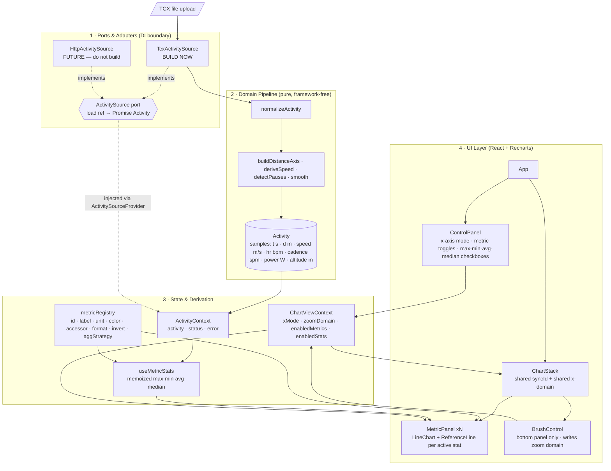

# Activity Visualiser — Architecture Spec

> **Audience:** an implementing coding agent (or human) working from an empty Vite project.
> **Status:** implementation in progress — see checklist below.
> **Scope of v1:** running and cycling, metric units only, TCX/FIT file input, stacked synced charts, statistic reference lines.

---

## 0. Implementation progress

Kept in sync after each feature lands — see build order in §11.

- [x] Test infra: vitest + React Testing Library, jsdom, `ResizeObserver` stub for Recharts
- [x] `domain/types.js` — JSDoc typedefs (Sample, Activity, RawTrackpoint)
- [x] `domain/units.js` — `formatPace`, `formatDuration`, `formatDistanceKm`, `mpsToSecPerKm` (TDD)
- [x] `stats/aggregate.js` — avg/max/median per `aggStrategy` (TDD). **Verified early:** avg pace = `totalMovingTime / totalDistance`, proven against a hand-computed case to differ from naive mean-of-instantaneous-pace by ~18%. `max` is invertAxis-aware (pace's "max" = fastest, i.e. numeric min).
- [x] `data/ActivitySource.js` port + `fixtures/sample-run.json` + `MockActivitySource` (TDD)
- [x] `metrics/metricRegistry.js`
- [x] `stats/useMetricStats.js` (TDD memoized hook)
- [x] `data/ActivitySource.js` — `ActivitySourceProvider`/`useActivitySource` DI context (TDD). **Fixed along the way:** `@testing-library/react`'s auto-cleanup needs a global `afterEach`, which this project doesn't have (`globals: false`); without it, DOM leaked across tests in the same file. `setupTests.js` now calls `afterEach(cleanup)` explicitly — applies to all future test files, not just this one.
- [x] `state/ActivityContext.jsx` — `activity`/`status`/`error`/`load(ref)`, backed by the injected `ActivitySource` (TDD)
- [x] `state/ChartViewContext.jsx` — `xMode`/`zoomDomain`/`enabledMetrics`/`enabledStats`/`hoverIndex` + setters (TDD). `enabledMetrics` is always re-sorted to canonical `metricOrder` on toggle, regardless of toggle sequence, so anything iterating it directly gets a stable order.
- [x] `app/providers.jsx` — `AppProviders({ source, children })` composing all three (TDD)
- [x] `ui/SyncedTooltip.jsx` — Recharts `<Tooltip content>` shared by every panel; header always shows elapsed time *and* distance regardless of `xMode`, body shows that panel's metric label/value/unit. Built now (ahead of its own build-order slot) because a panel needs *some* Tooltip for Recharts to render a crosshair at all — see next item.
- [x] `ui/MetricPanel.jsx` + `ui/ChartStack.jsx` — hardcoded via `ChartViewContext`'s default `enabledMetrics` (all of `metricOrder`, since `ControlPanel` doesn't exist yet to change it); `ChartStack` filters `metricOrder` by `activity.availableMetrics ∩ enabledMetrics`, first panel 200px / rest 140px, only the bottom panel shows axis ticks. Axis alignment and syncId crosshair sync are verified against real rendered Recharts SVG output in jsdom (parsed path/line pixel coordinates), not just component props. **Two jsdom pitfalls cost real debugging time:** (1) `ResponsiveContainer` measures its container via `getBoundingClientRect()` on mount; jsdom's is always all-zero, so every chart rendered at 0×0 with no children at all until `setupTests.js` got a global fixed-rect stub (800×200). (2) Recharts' default axis `interval="preserveEnd"` decides which ticks to keep using real text-length measurement, which jsdom can't do reliably — it was silently collapsing every axis to a single (often out-of-range-looking) tick. Fixed with `interval={0}` on both axes, which is a reasonable production default too since `tickCount` already caps how many "nice" ticks get generated. (3) Recharts schedules mouse-move handling via `requestAnimationFrame`, not synchronously — crosshair-sync tests must `fireEvent.mouseMove` then `await` a couple of rAF ticks before asserting on `.recharts-tooltip-cursor`.
- [x] `ui/ControlPanel.jsx` + `MetricToggle` + `StatCheckboxes` + `XAxisModeSwitch` (TDD, system test). Reads `activity.availableMetrics` directly, so it never offers a control for a metric the loaded activity has no data for — mirrors the filter `ChartStack` already applies. `MetricToggle`'s accessible name is just the metric label (e.g. "Cadence"); `StatCheckboxes` needed an explicit `aria-label` per input (`"Cadence max"`) because three plain "max"/"avg"/"median" checkboxes recur once per metric row and would otherwise collide under the same accessible name. Verified end-to-end against real rendered Recharts output (not just context state): unchecking a metric toggle removes that panel from `ChartStack`, checking a stat checkbox adds a `.recharts-reference-line` to the right panel only, and flipping the x-axis-mode switch changes the bottom panel's tick values from elapsed seconds to metres.
- [x] `Brush` + controlled `zoomDomain` wired across all panels (TDD, system test). Only the bottom panel renders the `Brush`; its `onChange` writes `zoomDomain` via `ChartViewContext`, which every panel's `XAxis domain` already read. **Non-obvious Recharts wrinkle:** `Brush` also tracks its own selected sample-index range internally (independent of our `zoomDomain`), and that index range — not literally `'dataMin'/'dataMax'` over the full sample array — is what those sentinels resolve against for every synced panel. Left uncontrolled, the Brush's index selection survives an `xMode` switch even after our `zoomDomain` context resets to `['dataMin','dataMax']`, silently re-narrowing "full" to whatever was last brushed (e.g. distance axis clipped to 0–100m instead of 0–200m after zooming in time mode then switching to distance). Fixed by making `Brush` a controlled component: `startIndex`/`endIndex` are derived from `zoomDomain` each render, so a context reset now also resets the Brush's own selection. Verified by simulating a real Recharts drag (`fireEvent.mousedown` on `.recharts-brush-traveller`, then `mousemove`/`mouseup` on `window`, since Brush's drag handlers are attached to `window`, not the traveller) — jsdom's `MouseEvent.pageX` is a getter that just returns `clientX` (no scroll-offset support), so the drag delta must be sent as `clientX` or Brush's internal math sees zero movement. Also discovered empirically: Recharts drops out-of-domain samples entirely from the line path on zoom (`M`/`L` point count shrinks) rather than clamping their pixel position to the plot edge — the system test asserts on point count for that reason, not on the pixel position of a specific sample.
- [x] `ui/FileDropZone.jsx` (TDD) — click-to-browse (hidden `<input type="file">` behind a `<label>`) + real drag-and-drop (`dragenter`/`dragover`/`drop`), hands a raw `File` up via `onFileSelected` and does no parsing itself, per the dependency rule in §3. Tracks its own `isDragActive` for a visual affordance, cleared on both `dragleave` and `drop`.
- [x] `ui/EmptyState.jsx` + `ui/ErrorState.jsx` (TDD) — `EmptyState` composes `FileDropZone` with a "Load sample activity" button (`onFileSelected` / `onLoadSample`) so the UI is explorable without a real TCX export on hand; `ErrorState` surfaces `error.message` directly (adapters throw specific reasons) behind `role="alert"` with a "Try again" button.
- [x] `App.jsx` wired end-to-end against `MockActivitySource` (TDD, system test). Exports `AppShell` (reads `ActivityContext`/renders by `status`) separately from the default-exported `App` (`AppShell` wrapped in `AppProviders` with a real `MockActivitySource` instance) — mirrors how every other UI test in this repo drives a component through `AppProviders` with a source double, and lets `App.test.jsx` cover `loading`/`error`/retry paths the real Mock can never produce (it always resolves). `AppShell` keeps the last-attempted `ActivityRef` in a `ref` so `ErrorState`'s "Try again" replays the exact same `load()` call rather than only ever falling back to the sample. Verified end-to-end against real rendered Recharts output, same as every other UI item above: idle → `EmptyState` → click "Load sample activity" or drop a file → `ControlPanel` + `ChartStack` render with real synced panels. Applied the §9 dark-theme tokens (`styles/tokens.css`, `styles/global.css`) and removed the leftover default-Vite-template files (`App.css`, `index.css`, `assets/{hero.png,react.svg,vite.svg}`) that weren't part of the folder scaffold in §4. **Verification gap, logged for transparency:** this sandbox has no headless-browser tooling (no `chromium-cli`/Playwright installed) and no Accessibility permission for AppleScript UI-scripting, so only the empty state was confirmed against a real rendered screenshot (Safari, `localhost` dev server) — the loaded-chart view was *not* independently screenshotted by the agent. The interactive flow's correctness rests on the system test above (real Recharts SVG assertions) plus a manual walkthrough handed to the user to click through themselves.
- [x] `domain/smooth.js`, `domain/buildDistanceAxis.js`, `domain/deriveSpeed.js`, `domain/detectPauses.js` (all TDD). `buildDistanceAxis` clamps any decrease/reset to the previous value and holds forward through a missing sample; falls back to haversine-over-lat/lon cumulative distance only when `DistanceMeters` is absent from *every* trackpoint (not per-sample — a file with occasional gaps in an otherwise-present field holds-forward instead, since "absent entirely" per §8 is a whole-file condition). `deriveSpeed` only reconstructs speed from distance/time deltas when the file has **no** sensor speed anywhere; when it does, per-sample nulls are passed through as-is rather than backfilled from the derived path, so a partially-instrumented file doesn't silently mix real and synthetic speed. `detectPauses` implements both §8 triggers (gap > 10s, sustained speed < 0.3 m/s for > 10s) as independent passes over the sample array.
- [x] `domain/normalizeActivity.js` — the pipeline entry point (TDD). Drops trackpoints that carry only a timestamp and nothing else (judged on the raw adapter fields, before any derivation), then runs `buildDistanceAxis` → `deriveSpeed` → `detectPauses` and assembles `Sample[]`. `availableMetrics` is computed here directly from which sample fields actually have data (not via `metricRegistry`, to keep `domain/` free of a dependency on the `metrics/` layer above it — see §3 dependency rule) — pace is "available" whenever any sample has `speed`, since pace is always derived at display time, never stored.
- [x] `data/tcx/parseTcx.js` (TDD) — namespace-aware (`getElementsByTagNameNS`, both the TCX and `ActivityExtension/v2` namespaces, prefix-independent), flattens every `Lap > Track > Trackpoint` under the `Activity` into one array (laps aren't surfaced yet, per §12). Doubles `TPX > RunCadence` (strides/min) into steps/min; ignores the top-level bike `<Cadence>`. Throws a specific, user-facing `Error` (shown verbatim by `ErrorState`) for: invalid XML, no `Activity` element, a non-`Running` `Sport` attribute (v1 is running-only — silently mislabeling a bike file would corrupt the cadence math), and zero usable trackpoints. Deliberately does **not** drop time-only trackpoints itself — that's `normalizeActivity`'s call, per the dependency rule that adapters do field-mapping only, never interpretation; a test locks in that layering so it can't silently drift.
- [x] `data/tcx/TcxActivitySource.js` (TDD) — `File.text()` → `parseTcx` → `normalizeActivity`, the last two of which now do the real work `MockActivitySource` always skipped. Rejects a non-`file` ref rather than silently no-op'ing.
- [x] **Real Garmin cross-check, unblocked** — user supplied a real 30-minute Garmin TCX export (`fixtures/activity_23870166877.tcx`, 1801 trackpoints, ~1 Hz) plus its Garmin-reported stats (`fixtures/activity_23870166877-meta.json`): 4.71 km, 30:00, avg pace 6:22/km. A dedicated integration test (`TcxActivitySource.realGarminFixture.test.js`) parses the real file end-to-end and asserts computed avg pace against Garmin's reported value — **matches to the second** (computed 6:22.06/km vs. reported 6:22/km), the strongest evidence yet that the `weightedPace` strategy (§6) is correct, not just internally consistent. This file also has no `<Watts>` anywhere, which incidentally covers the "at least one missing metric" case §11 step 8 asked for — `availableMetrics` correctly omits `power` and `ControlPanel` renders no toggle for it. It has **no gaps or sub-0.3 m/s stretches** (checked with a one-off script before writing tests), so `detectPauses`'s two trigger paths are verified only by synthetic unit tests, not against this real file — worth re-running the cross-check if a Garmin export containing an actual pause becomes available.
- [x] `App.jsx` composition root now dispatches by `ActivityRef` shape instead of injecting a single adapter instance: a `{type:'file'}` ref (drag-drop or browse) goes to `TcxActivitySource`, a `{type:'id'}` ref (the "Load sample activity" button) still goes to `MockActivitySource`. Both concrete adapters are instantiated in exactly one place (`App.jsx`); no other file imports either. This is a small deviation from §5's "swap the source instance, nothing else changes" framing — that framing assumed one adapter per app, but the sample-activity convenience button needs the mock fixture to keep working *alongside* real parsing, not instead of it. `App.test.jsx`'s file-drop test now exercises a real (small, hand-built) TCX string end-to-end and asserts the resulting `availableMetrics` to prove it went through the real parser, not the fixture. **Superseded 2026-08-07** (last entry in this list): the `{type:'id'}` → mock branch is gone with the sample button, so the dispatcher only picks between the two real parsers and §5's one-adapter-per-app framing holds again.
- [x] `data/fit/parseFit.js` + `data/fit/FitActivitySource.js` (TDD) — FIT (binary) parsing via `@garmin/fitsdk` (official Garmin package, zero runtime deps, pure ESM) added to recover Stryd running power, which Garmin Connect's FIT→TCX exporter silently drops (the existing `activity_23870166877.tcx` fixture has no `<Watts>` anywhere despite the run being recorded with a Stryd pod). **Non-obvious finding, verified at the byte level against the user's real FIT export (`fixtures/23870166877_ACTIVITY.fit`):** the `record` message definitions in this file don't include the standard power field at all — power exists *only* as a developer field, tied to a `developer_data_id` message whose `application_id` (`18fb2cf0-1a4b-430d-ad66-988c847421f4`) is Stryd's registered FIT app id. `@garmin/fitsdk` keys `record.developerFields` by a sequential `key` assigned during decode, not by `fieldDefinitionNumber` — resolving the right key requires matching `fieldDescriptionMesgs` by `nativeMesgNum === 20 && nativeFieldNum === 7` (i.e. "mirrors record's standard power field") first. A generic/naive FIT reader that only knows the standard profile would reproduce the exact same "no power" bug the TCX export has. See §8 for the rest of the FIT-specific parsing notes this uncovered (cadence doubling parity, semicircle lat/lon conversion, decode error shape). `parseFit` is `async` (unlike sync `parseTcx`) because `@garmin/fitsdk` (~1.3 MB, almost all of it the FIT field/message profile table) is dynamically imported *inside* it, keeping that weight out of the eager bundle for TCX-only users; `FitActivitySource` imports it normally since the file itself is tiny. `App.jsx`'s composition-root dispatcher now routes a dropped/browsed file to `FitActivitySource` or `TcxActivitySource` by extension (`.fit` vs `.tcx`) rather than always going to TCX. **Real Garmin FIT cross-check:** `FitActivitySource.realGarminFixture.test.js` parses the same 1801-trackpoint, 30-minute activity as the existing TCX cross-check test and matches it on distance/duration/avg pace — but where that TCX test asserts `power` is *absent* from `availableMetrics`, this one asserts the inverse: `availableMetrics` *does* contain `'power'` (avg 224 W, sane 85–270 W range), which is the actual proof the recovery works end-to-end, not just that the file parses.
- [x] **Cycling support** — widened `Sport` to `'running'|'cycling'` and wired the previously-dead `metricRegistry[id].sports` filtering into `ControlPanel`/`ChartStack` (via a new `isMetricForSport()` helper) — that field existed since the registry was first built but nothing read it until now. `parseTcx`/`parseFit` now resolve the file's actual sport (TCX `Sport="Biking"`, FIT `sessionMesgs[0].sport === 'cycling'`) instead of hard-rejecting anything but running; both branch cadence handling on it (TCX: plain top-level `<Cadence>` instead of `TPX>RunCadence`; FIT: `record.cadence` passed through undoubled) since the running-specific strides→steps doubling would silently corrupt a bike file's cadence otherwise — see §8. New `speed` metric (km/h, `metrics/metricRegistry.js`) replaces `pace` for cycling activities (`pace.sports` narrowed to `['running']`, `speed.sports` is `['cycling']`) — average speed uses `movingOnly` rather than `weightedPace`, since (unlike pace) average speed *is* the time-weighted mean of instantaneous speed by definition, so the reciprocal-avoidance strategy pace needs doesn't apply. Deliberately reuses `--metric-pace` as `speed`'s line color rather than adding a new CSS token, since the two are mutually exclusive per activity and never render together. `cadence.unit` became the registry's first sport-dependent field (`(sport) => sport==='cycling'?'rpm':'spm'`), resolved via a new `metricUnit()` helper everywhere `metric.unit` used to be read directly (`MetricPanel`'s `StatLabels`/`Tooltip`, `SyncedTooltip`) — both now take a `sport` prop threaded down from `activity.sport`. `normalizeActivity`'s `availableMetricsOf` stays sport-agnostic by design (per its existing comment) — it flags both `'pace'` and `'speed'` as available whenever sample speed data exists; sport-based visibility is entirely a UI-layer concern.
- [x] **Inferred workout name + sport chip** — added `Activity.name` (§5), computed in `normalizeActivity` by the new `domain/deriveWorkoutName.js` (TDD) from a time-of-day bucket (viewer's local browser time, i.e. `Date.prototype.getHours()`, not UTC — neither file format carries a timezone offset, and this is usually close enough since people tend to view an activity from roughly where they recorded it) plus a sport label. FIT's `sportLabel` (see §8) is used when present (e.g. "Morning Trail Run"); TCX and profile-less FIT files fall back to a generic `'running'`/`'cycling'` → `"Run"`/`"Ride"` map (e.g. "Morning Run") — so FIT and TCX exports of the *same* activity can get different names. New `ui/ActivityHeader.jsx` renders the name plus a separate, stable sport chip ("Running"/"Cycling", i.e. `activity.sport` capitalized) — deliberately **not** `sportLabel` again, which would just duplicate the name; the chip is the broad classification that also drives unit conventions elsewhere (spm vs rpm), the name is the specific, richer title.
- [x] **Cadence Y-axis zoom** — `stats/aggregate.js` gained `computeYDomain()`, which wires up the previously-dead `domainPadding` field (§6) into a real per-metric `<YAxis domain>` in `MetricPanel.jsx`, reusing the same `movingOnly` exclusion `extreme()`/`timeWeightedMean()` already use for stat lines so paused zero-cadence samples (`sample.moving === false`) stop dragging the computed min down to 0 and Recharts' "nice tick" rounding stops inflating the max to 220. Enabled for `cadence` (`domainPadding: 0.08`, matching `pace`/`speed`); `pace` and `speed` pick up the behavior for free since they already declared the field with nothing reading it. `heartRate`/`power`/`altitude` are untouched (no `domainPadding` → `computeYDomain` returns `undefined` → Recharts' current auto-domain, unchanged). **Non-obvious Recharts wrinkle:** an explicit `domain` alone was not enough — `<YAxis>`'s default `allowDataOverflow={false}` silently re-expands any explicit domain to cover *every* plotted data point, including the excluded-from-the-domain-calc paused `cadence: 0` samples (they're still in `data`, just skipped when computing `yDomain`), which snapped the axis straight back to ~0 in testing. Fixed with `allowDataOverflow={yDomain != null}` — only clips for metrics that opted into an explicit domain, so `heartRate`/`power`/`altitude` (still `domain={undefined}`) keep their exact prior auto-domain behavior.
- [x] **2026-08-07: stat labels moved below the chart** — `MetricPanel` reserved a fixed 200px right margin (`LineChart margin.right`) to fit avg/max/median labels as SVG `<text>` positioned at each stat's real y-value, decluttered vertically (`declutter`/`STAT_LABEL_GAP`/`MIN_STAT_LABEL_SPACING`) so close values (e.g. avg ≈ median) didn't overlap. On mobile that column ate a large share of viewport width, leaving little room for the plotted line itself. Fixed by shrinking `margin.right` to `12` and rendering the same text (`StatSummary`, a plain-HTML flex row of `.stat-chip`s) below the chart, outside the SVG — a flex row can't overlap, so the decluttering machinery (`StatLabels`/`declutter`/`STAT_LABEL_GAP`/`MIN_STAT_LABEL_SPACING`) was deleted outright rather than ported. `<ReferenceLine>`s are unchanged (still show the horizontal indicator); only the label moved. No show/hide toggle was added — chips are unconditional, same as the reference lines they annotate. The `.metric-panel` wrapper kept the old fixed pixel `height` from `ChartStack` (still driving `<ResponsiveContainer height>` for the chart itself), which left `.stat-summary` no room of its own — it overflowed the wrapper's bottom edge and painted over the next panel down. Fixed by switching the wrapper to `minHeight` instead of `height`: the chart keeps its exact prior height, but the box now grows to fit the chip row (single or wrapped) rather than clipping it.
- [x] **2026-08-07: added a `min` stat** — mirrors `max` rather than always being the literal numeric minimum: decided with the product owner that `min` is the *opposite* extreme from `max` on each metric's own (possibly inverted) axis, not literally "smallest number." For ordinary metrics this is identical to the literal minimum (`invertAxis: false`), but for `pace` (`invertAxis: true`) it's the slowest/worst moment — numerically the *largest* s/km — the mirror image of `max`'s fastest-moment behavior. The rejected alternative (literal numeric minimum always) would have made `min`/`max` show the identical value for pace, reading as a bug. Implemented as `extreme(samples, accessor, { invert: !invertAxis })` in `aggregate.js`, the boolean-flipped counterpart of `max`'s `invert: !!invertAxis`. Wired through `computeMetricStat`, `useMetricStats`, `StatKind`, `MetricPanel`'s `STAT_ORDER`/`STAT_DASH` (new `1 2` dash pattern), and `StatCheckboxes`' `STAT_KINDS` — all four stat-kind lists updated per the existing hardcoded-per-place pattern (no shared registry).
- [x] **2026-08-07: persistent sticky "Load an activity" bar** — the load controls (`FileDropZone` + "Load sample activity" button) used to live only in `EmptyState`, gated to `status === 'idle'`, so loading a *different* activity after one was already loaded (or after landing on `ErrorState`) meant fixing/retrying from the error screen or reloading the page. `EmptyState.jsx` is now `ui/LoadActivityBar.jsx` — controls-only, no heading/"or" separator — rendered unconditionally in `AppShell`'s `<header>` next to the `<h1>`, outside the `status` switch, so it's visible and usable across idle/loading/error/ready. `.app-header` became `position: sticky; top: 0` (the first sticky/`z-index` usage in the codebase) with an opaque `background: var(--bg)` so scrolled content doesn't show through, plus a flex-row layout (`flex-wrap: wrap`) so the bar drops under the title on narrow viewports without extra markup. `FileDropZone`'s label copy and `.file-drop-zone` styling shrank from a tall dashed drop card to an inline compact control to fit the header row.
- [x] **2026-08-07: feedback → GitHub issue, and with it the project's first server-side code.** A "Feedback" trigger in a new persistent `<footer>` (outside the `status` switch, like the header — someone staring at an error is exactly who most needs to report it) opens a native `<dialog>`; submitting `POST /api/feedback` files a labelled issue on `Mcklmo/timeseries-visualizer`. This breaks §1's "no server-side anything" non-goal *for this one route only* — the activity pipeline is untouched and still runs entirely client-side, which is what that non-goal was actually protecting. Two new top-level folders sit outside `src/`: `worker/` (the Cloudflare Worker — `index.js` routes `/api/feedback` and hands everything else to `env.ASSETS.fetch`) and `shared/` (`feedbackLimits.js`, plain values). **New dependency rule, extending §3:** `shared/` holds environment-agnostic values only — no Workers globals, no DOM, no React — and `worker/` and `src/` may each import from it, never from each other. That's what lets the length limits be defined once and still leave the server authoritative (the client's `maxLength` is a UX hint; `worker/lib/validateFeedback.js` re-checks everything). **Abuse protection is two-layer:** Cloudflare Turnstile is the "is this a human" gate, and the native Rate Limiting binding (5/60s keyed on `CF-Connecting-IP`) only caps blast radius behind it — deliberately *not* a hand-rolled KV counter, whose get-then-put races exactly like the thing it would replace (true atomicity would need a Durable Object, disproportionate here). **Non-obvious pieces:** (1) this is the "Workers with static assets" deploy model, not Cloudflare Pages, so Pages' `functions/` auto-routing convention does not exist and routing is explicit in `worker/index.js` — the README's old Pages-dashboard flow *could not have served this route at all* and was replaced, not amended. (2) `src/lib/feedbackClient.js` returns a discriminated result instead of throwing, breaking the `ActivitySource` adapters' throw-on-failure convention on purpose: the UI has to render a 422's per-field map inline but a 429/502/network error as one banner, a distinction a single thrown `Error` carries badly. (3) The Turnstile widget is lazy-loaded via a module-level singleton promise and rendered *explicitly* (`turnstile.render(el, …)`), not via the implicit `data-sitekey` div — only the explicit API returns a widget id, which is what `remove()` (no leaked hidden iframes across repeated opens) and `reset()` (tokens are single-use, so every failed submit needs a fresh one) require. (4) `<dialog>`'s `close` listener is attached with `addEventListener`, not a JSX `onClose` prop, since React's synthetic handling of that native event is inconsistent — this also funnels the "×" button and a real Escape keypress through one path. (5) jsdom 30 still has no `showModal`/`close`, so `setupTests.js` gained a stub; it *does* apply the UA `dialog:not([open]){display:none}` rule and map `<dialog>` to role `"dialog"`, so that stub alone is enough for role-based queries. Escape-to-close itself is browser behaviour jsdom won't simulate — left to the manual walkthrough rather than chased with more stubs. (6) Watch out: "Feedback" contains "back", which silently broke the pre-existing `getByRole('button', {name: /back/i})` in `App.test.jsx`'s About test.
- [x] **2026-08-07: sample activity removed, file entrypoint promoted** — the loudest control on the page ("Load sample activity", the only filled `--metric-pace` button in the header) pointed at bundled demo data rather than at the thing the app is for, and the sticky-bar change above had left a first-time visitor with an otherwise *completely empty* page body: `AppShell` had no `status === 'idle'` branch at all, so the only entrypoint was a small dim dashed strip that reads as chrome. The whole sample path is deleted — button, `SAMPLE_REF`, the `{type:'id'}` dispatcher branch, `data/mock/MockActivitySource.js`, and the 38 KB `fixtures/sample-run.json` it served — rather than kept as scaffolding: once the button was its last caller, the mock adapter was dead weight, and the real-Garmin fixtures now cover everything it demonstrated. In its place, the load control **splits by status**: a hero drop target (`ui/EmptyState.jsx`, the filename `4be0ff4` deleted and §4 still listed) fills `<main>` while idle, and the compact header control appears once something is loading/ready/errored — so `4be0ff4`'s "swap activity without leaving the chart view" property is fully retained. `FileDropZone` grew a `variant` prop (`'compact' | 'hero'`) for this and switched its hardcoded `id="tcx-file-input"` to `useId()`. **The invariant to preserve: exactly one `FileDropZone` is mounted at any time** — `showEmptyState = status === 'idle' && !showAbout`, header control when that's false. It is load-bearing four times over: two CTAs on the idle page is the exact problem this change fixes; two instances would collide on one DOM id (hence `useId()`); three test files query the zone with `getByLabelText(/drop a tcx file|click to browse/i)`, which throws on two matches (hence both variants keeping the literal "click to browse" copy); and `AboutPage` replaces the whole of `<main>`, so without the `!showAbout` term a visitor who opened About on a fresh page would have *no* load control anywhere — that term is pinned by its own assertion in `App.test.jsx`. The dispatcher routes non-`file` refs to `TcxActivitySource` (which rejects them with a real error) instead of dropping the branch, or `isFitFile` would read `.name` off an undefined `ref.file`. `'mock'` stays in the `kind` union (§5) — nearly every UI test still drives `AppProviders` with an inline `{kind:'mock', load}` double.
- [ ] `domain/downsample.js` (LTTB) — deferred until a long activity is actually sluggish

---

## 1. Purpose

A web UI in the spirit of Intervals.ICU / Garmin Connect: load a single running activity and inspect several metrics as **vertically stacked, time-synced line charts** sharing one x-axis (elapsed time or distance). The user toggles which metrics are shown, and toggles **max / min / avg / median** horizontal reference lines per metric.

**Explicit non-goals for v1:** swimming, imperial units, multi-activity comparison, persistence, auth, tests, server-side anything.

---

## 2. Constraints that shape the design

| Constraint | Consequence |
| --- | --- |
| API will replace TCX later | All input goes through an `ActivitySource` port; adapters are injected via React context. No component ever imports the TCX parser. |
| Swimming may come later | Metrics are declared in a **registry**, not hardcoded into components. `Activity.sport` exists from day one — cycling already uses this (§6). |
| Metric only | SI units are stored internally; conversion happens **only** in display formatters. Nothing else changes if imperial is ever added. |
| Recharts | `syncId` gives synced tooltip/crosshair for free, but **not** synced zoom — zoom must be a controlled `XAxis domain` fed identically to every panel. |
| ≥4 simultaneous charts | Rendering cost matters. Downsample for display, memoize aggressively, never recompute stats on hover. |

---

## 3. Layer diagram



**Dependency rule:** arrows point inward-to-outward only. `domain/` imports nothing from `ui/`, `data/`, or React. `data/` imports `domain/` types only. Violating this breaks the future API swap.

---

## 4. Folder scaffold

```
src/
  main.jsx
  App.jsx
  app/
    providers.jsx            # composes ActivitySourceProvider + ActivityProvider + ChartViewProvider
  data/
    ActivitySource.js        # port: JSDoc typedef + createActivitySource contract
    tcx/
      TcxActivitySource.js   # implements port; DOMParser based
      parseTcx.js            # XML -> RawTrackpoint[]; pure, no domain logic
    fit/
      FitActivitySource.js   # implements port; @garmin/fitsdk based
      parseFit.js            # FIT binary -> RawTrackpoint[]; pure, no domain logic. async — dynamic-imports @garmin/fitsdk
    http/
      HttpActivitySource.js  # STUB ONLY — throws 'not implemented'
  domain/
    types.js                 # Activity, Sample, RawTrackpoint typedefs
    normalizeActivity.js     # RawTrackpoint[] -> Activity  (the pipeline entry point)
    deriveSpeed.js
    buildDistanceAxis.js
    detectPauses.js
    smooth.js                # centred rolling mean, window in samples
    downsample.js            # LTTB for display; domain stays full-resolution
    units.js                 # SI conversions + formatters (mm:ss, km, bpm...)
  stats/
    aggregate.js             # max / min / avg / median, strategy-aware
    useMetricStats.js        # memoized hook over activity + registry
  metrics/
    metricRegistry.js        # THE extension point — see §6
  state/
    ActivityContext.jsx
    ChartViewContext.jsx
  lib/
    feedbackClient.js        # POST /api/feedback; returns a discriminated result, never throws
  ui/
    ChartStack.jsx
    MetricPanel.jsx
    ControlPanel.jsx
    MetricToggle.jsx
    StatCheckboxes.jsx
    XAxisModeSwitch.jsx
    FileDropZone.jsx
    SyncedTooltip.jsx
    EmptyState.jsx
    ErrorState.jsx
    AboutPage.jsx
    FeedbackWidget.jsx       # footer trigger; owns isOpen
    FeedbackDialog.jsx       # <dialog> shell; form mounted only while open
    FeedbackForm.jsx         # fields + Turnstile mount point + result states
    useTurnstile.js          # lazy script load, explicit render/remove/reset
  styles/
    tokens.css
    global.css
shared/
  feedbackLimits.js          # plain values, imported by BOTH worker/ and src/
worker/                      # Cloudflare Worker (wrangler.jsonc `main`)
  index.js                   # /api/feedback -> route; everything else -> env.ASSETS.fetch
  routes/
    feedback.js              # method -> size -> parse -> validate -> rate limit -> Turnstile -> GitHub
  lib/
    validateFeedback.js      # server-authoritative; the client's maxLength is only a hint
    buildIssuePayload.js     # pure: submission + metadata -> {title, body, labels}
    verifyTurnstile.js       # injectable fetchImpl; fails closed
    githubClient.js          # injectable fetchImpl; never returns GitHub's body or the token
    rateLimit.js             # wrapper over env.FEEDBACK_RATE_LIMITER.limit()
    httpResponses.js
fixtures/
  activity_23870166877.tcx        # real Garmin export, cross-checked against
  activity_23870166877-meta.json  # ...Garmin's own reported stats
  23870166877_ACTIVITY.fit        # same activity as FIT, carries Stryd power
```

**Dependency rule for the two new top-level folders:** `shared/` holds
environment-agnostic *values* only — no Workers globals (`Response`, `env`), no
DOM, no React. `worker/` and `src/` may each import from `shared/`; neither may
import from the other.

---

## 5. Core contracts

Types are given as TypeScript for precision. If the project stays JavaScript, express these as JSDoc `@typedef` in `domain/types.js` — the shapes are binding either way.

```ts
type Sport = 'running' | 'cycling';           // union grows later (swimming, ...)
type MetricId = 'pace' | 'speed' | 'heartRate' | 'cadence' | 'power' | 'altitude';
type StatKind = 'max' | 'min' | 'avg' | 'median';
type XAxisMode = 'time' | 'distance';

/** One normalized sample. SI units, always. */
interface Sample {
  t: number;            // seconds since activity start (monotonic, gap-aware)
  d: number;            // cumulative metres (monotonic, non-decreasing)
  speed?: number;       // m/s   — pace/speed are derived at display time
  heartRate?: number;   // bpm
  cadence?: number;     // steps/min for running (NOT strides), pedal rpm for cycling — see §8
  power?: number;       // watts
  altitude?: number;    // metres
  moving: boolean;      // false inside a detected pause
}

interface Activity {
  id: string;
  sport: Sport;
  name: string;                 // inferred (not read verbatim — neither FIT nor TCX has a title field)
  startTime: Date;
  totalTime: number;            // s, elapsed
  totalMovingTime: number;      // s
  totalDistance: number;        // m
  samples: Sample[];            // full resolution
  availableMetrics: MetricId[]; // drives which panels can render
}

/** Untouched adapter output. Adapters do no interpretation beyond field mapping. */
interface RawTrackpoint {
  time: Date;
  distanceMeters?: number;
  altitudeMeters?: number;
  heartRateBpm?: number;
  cadenceSpm?: number;          // running: already doubled if source was strides. cycling: pedal rpm, undoubled
  watts?: number;
  speedMps?: number;
  lat?: number;
  lon?: number;
}

/** THE dependency-injection boundary. */
interface ActivitySource {
  readonly kind: 'tcx' | 'fit' | 'http' | 'mock';
  load(ref: ActivityRef): Promise<Activity>;
}

type ActivityRef =
  | { type: 'file'; file: File }
  | { type: 'id'; id: string };
```

`ActivitySourceProvider` takes a source instance as a prop and publishes it on context. Swapping to the API later is:

```jsx
<ActivitySourceProvider source={new HttpActivitySource(baseUrl)}>
```

No other file changes.

---

## 6. Metric registry — the extension point

Adding elevation, or later swimming's stroke rate, must mean **adding one object here** and nothing else. `unit` may be a plain string or a `(sport) => string` function when it varies by sport (cadence: spm vs rpm) — resolve it via `metricUnit(metric, sport)`, never `metric.unit` directly. Per-metric `sports: [...]` gates which activities offer that metric at all — filtered in via `isMetricForSport()` at both `ControlPanel` and `ChartStack`.

```js
// metrics/metricRegistry.js
export const metricRegistry = {
  pace: {
    id: 'pace',
    label: 'Pace',
    unit: 'min/km',
    color: 'var(--metric-pace)',
    accessor: (s) => (s.speed && s.speed > 0.3 ? 1000 / s.speed : null), // s per km
    format: formatPace,          // 287 -> '4:47'
    invertAxis: true,            // faster reads higher
    aggStrategy: 'weightedPace', // see below
    domainPadding: 0.08,
    sports: ['running'],
  },
  speed: {
    id: 'speed',
    label: 'Speed',
    unit: 'km/h',
    color: 'var(--metric-pace)', // shares pace's hue — the two never render together
    accessor: (s) => (s.speed != null ? mpsToKmh(s.speed) : null),
    format: formatSpeedKmh,      // 28.42 -> '28.4'
    invertAxis: false,
    aggStrategy: 'movingOnly',   // avg speed IS the time-weighted mean by definition; movingOnly just excludes pauses
    domainPadding: 0.08,
    sports: ['cycling'],
  },
  heartRate: { id:'heartRate', label:'Heart rate', unit:'bpm', accessor:(s)=>s.heartRate ?? null,
               format:(v)=>Math.round(v), invertAxis:false, aggStrategy:'timeWeighted', sports:['running','cycling'] },
  cadence:   { id:'cadence',   label:'Cadence',   unit:(sport)=>(sport==='cycling'?'rpm':'spm'), accessor:(s)=>s.cadence ?? null,
               format:(v)=>Math.round(v), aggStrategy:'movingOnly', domainPadding: 0.08, sports:['running','cycling'] },
  power:     { id:'power',     label:'Power',     unit:'W',   accessor:(s)=>s.power ?? null,
               format:(v)=>Math.round(v), aggStrategy:'timeWeighted', sports:['running','cycling'] },
  altitude:  { id:'altitude',  label:'Elevation', unit:'m',   accessor:(s)=>s.altitude ?? null,
               format:(v)=>Math.round(v), aggStrategy:'timeWeighted', sports:['running','cycling'] },
};

export const metricOrder = ['pace', 'speed', 'heartRate', 'power', 'cadence', 'altitude'];
```

**Aggregation strategies** (`stats/aggregate.js`):

- `timeWeighted` — mean weighted by the duration each sample represents. Sampling is often irregular; a naive array mean silently over-weights dense sections.
- `movingOnly` — same, but excludes `moving === false` samples. Correct for cadence: standing still is not 0 spm, it's *no data*.
- `weightedPace` — **average pace = totalMovingTime ÷ totalDistance.** Never the mean of instantaneous paces; that is mathematically wrong and will visibly disagree with every other app the user owns.
- Median for all strategies: computed over moving samples only, un-weighted, on the raw (unsmoothed) series.

Stats are computed over the **whole activity**, not the zoom window. Keep this fixed; reference lines that drift as the user brushes are disorienting. If a "stats follow zoom" toggle is wanted later, add it explicitly in `ChartViewContext`.

---

## 7. Rendering rules

**ChartStack**
- One `MetricPanel` per id in `metricOrder` that is both in `activity.availableMetrics` and in `viewState.enabledMetrics`.
- Every panel gets the identical `syncId="activity"`, the same `XAxis dataKey`, and the same controlled `domain={zoomDomain}`.
- `XAxis` is `type="number"` with `dataKey` = `t` or `d` depending on `xMode`. **Never use category axis** — sampling is irregular and category spacing would lie about time.
- Only the bottom panel renders `XAxis` ticks and the `Brush`; upper panels set `hide` on their axis but keep identical `domain` and left `YAxis` width so the plot areas align pixel-for-pixel. Fixed `yAxisWidth` token, not `auto`.
- Panel heights: first panel ~200px, subsequent ~140px. Whole stack scrolls with the page; do not nest scroll areas.

**MetricPanel**
- `<LineChart>` with `dot={false}`, `isAnimationActive={false}` (animation on 10k points is a jank generator), `connectNulls={false}` so sensor dropouts render as gaps rather than invented straight lines.
- For each enabled `StatKind`, render a `<ReferenceLine y={value}>` (no inline label) so the horizontal indicator still shows where the stat sits relative to the line; dash patterns distinguish kinds: max `4 4`, min `1 2`, avg solid-thin, median `2 3`. The stat's text (`` `${label} ${format(value)} ${unit}` ``) renders as a "chip" in a plain-HTML row below the chart (`StatSummary`, outside the SVG) rather than as a positioned label — always shown for every enabled stat, no show/hide toggle.
- `invertAxis: true` → `<YAxis reversed />` plus reversed domain calculation.

**Tooltip**
- One shared `SyncedTooltip` component used by all panels so the hovered sample reads identically everywhere. Header shows both elapsed time *and* distance regardless of `xMode` — users think in both.

**Downsampling**
- Below ~2,000 samples, render raw. Above, run LTTB (largest-triangle-three-buckets) to ~1,500 points **for display only**, keyed on the current zoom domain so zooming reveals real detail. Stats always use the full-resolution series.

---

## 8. TCX & FIT parsing notes (these cost real debugging time)

### TCX

- Namespace: `http://www.garmin.com/xmlschemas/TrainingCenterDatabase/v2`. Use `getElementsByTagNameNS` or strip namespaces — plain `getElementsByTagName` fails inconsistently across browsers on namespaced docs.
- Structure: `TrainingCenterDatabase > Activities > Activity > Lap+ > Track+ > Trackpoint+`. Flatten all laps into one sample array; keep lap boundary times aside for a possible future lap overlay.
- **Running cadence lives in `Extensions > TPX > RunCadence` and is in strides per minute — multiply by 2 to get steps per minute.** The plain top-level `<Cadence>` element is the *cycling* field instead — already pedal rpm, no doubling. `parseTcx` branches on the resolved `sport` (`Activity Sport="Running"` → `RunCadence`×2, `Sport="Biking"` → plain `<Cadence>`) rather than reading both.
- `Activity Sport` maps `"Running"` → `'running'`, `"Biking"` → `'cycling'`; anything else (e.g. `"Other"`) is rejected with a user-facing error, same as an unparseable file.
- Power: `Extensions > TPX > Watts`. Often absent — that is normal, not an error. (Garmin Connect's FIT→TCX export drops power even when the original FIT file has it via a developer field — see FIT notes below.)
- Speed: `Extensions > TPX > Speed` in m/s when present. When absent, derive from distance/time deltas, then smooth (5–15 s window) or the pace chart will be unreadable noise.
- `<DistanceMeters>` can be missing, non-monotonic, or reset. `buildDistanceAxis` must enforce monotonicity: clamp any decrease to the previous value, and fall back to haversine over lat/lon if distance is absent entirely.
- Trackpoints with only a `<Time>` and nothing else are common. Drop them before normalization.
- Pause detection: gap between consecutive timestamps > 10 s, or speed < 0.3 m/s sustained over > 10 s → mark `moving: false`. Keep the samples; do not delete them, or elapsed-time x-axis breaks.

Parsing is synchronous for now. If files exceed ~20k trackpoints, move `TcxActivitySource` into a Web Worker — the port boundary makes that change invisible to everything above it.

### FIT

Decoded with `@garmin/fitsdk` (official Garmin package, zero runtime deps, pure ESM — `Stream.fromArrayBuffer(buffer)` + `new Decoder(stream).read()`, no options object needed since the useful defaults — `applyScaleAndOffset`, `convertTypesToStrings`, `convertDateTimesToDates`, etc. — are already `true`).

- **Power is frequently only a *developer field*, not the standard `record` field.** A Stryd pod's FIT export declares power via a `field_description` message (`native_mesg_num: 20` i.e. `record`, `native_field_num: 7`, the standard power field it mirrors), tied to a `developer_data_id` message whose `application_id` is Stryd's registered FIT app id (`18fb2cf0-1a4b-430d-ad66-988c847421f4`). The decoder does **not** merge developer field values into the record object by name — each decoded `record` message's `developerFields` object is keyed by a sequential `key` assigned during decode (visible on `fieldDescriptionMesgs[].key`), not by `fieldDefinitionNumber`. Resolve the key once per file by matching `fieldDescriptionMesgs` on `nativeMesgNum === 20 && nativeFieldNum === 7`, then read `record.developerFields[thatKey]`. Check the standard `record.power` field first regardless, so a power meter that populates field 7 natively still works without going through developer-field resolution.
- **Running cadence is per-leg, exactly like TCX's `RunCadence` — multiply `record.cadence` by 2 to get steps per minute.** Verified against a real export: `sessionMesgs[0].avgCadence`/`avgRunningCadence` matched the raw per-record `cadence` mean before doubling. Cycling cadence (`sessionMesgs[0].sport === 'cycling'`) is already pedal rpm — `record.cadence` passes through undoubled. Sport comes from `sessionMesgs[0].sport`, already resolved to a string (`'running'`/`'cycling'`) by the SDK; missing session data defaults to `'running'` rather than blocking.
- `positionLat`/`positionLong` are raw semicircle integers — the SDK does not auto-convert these despite converting everything else. Multiply by `180 / 2**31` to get degrees.
- `record.enhancedAltitude`/`enhancedSpeed` are already scaled by the decoder; prefer them over the plain `altitude`/`speed` fields (only present on older/lower-resolution devices).
- A non-FIT/garbage buffer does not throw synchronously — `decoder.read()` returns `{ messages: {}, errors: [Error(...)] }`. `parseFit` checks `errors.length` itself, mirroring how `parseTcx` throws a friendly message on invalid XML.
- **Neither FIT nor TCX carries a genuine free-text activity title** — that's a Garmin Connect database concept, not part of either file export (confirmed by decoding the real fixtures). FIT does carry the watch's sport-profile label though: `sessionMesgs[0].sportProfileName` (e.g. `"Trail Run"` for a custom profile, `"Run"` for the default one) and `sportMesgs[0].name`, which are typically duplicates of each other — `parseFit` checks both (`sportProfileName` first) since either can be absent, and exposes the result as `sportLabel`. TCX has no equivalent field anywhere in the schema — its only `<Name>` elements are `<Creator><Name>` (device model) and `<Author><Name>` (exporting app), neither usable as a title. `domain/deriveWorkoutName.js` uses `sportLabel` when present, falling back to a generic sport-based label (`"Run"`/`"Ride"`) otherwise — see its own header comment for the time-of-day bucketing rules.
- The package is ~1.3 MB unpacked, almost all of it `src/profile.js` (the full FIT field/message profile table). `parseFit.js` dynamically `import()`s it internally so TCX-only users don't pay for it — this is also why `parseFit`, unlike sync `parseTcx`, returns a `Promise`.

---

## 9. Visual tokens

The chart *is* the interface, so the chrome stays quiet and the ink stays loud. Dark neutral ground, one hue per metric, everything else greyscale.

```css
/* styles/tokens.css */
:root {
  --bg:            #12151a;
  --panel:         #171b22;
  --grid:          #232935;
  --text:          #e6e9ef;
  --text-dim:      #8b93a3;
  --stat-line:     #6f7889;

  --metric-pace:      #4cc9f0;
  --metric-heartrate: #ef476f;
  --metric-power:     #ffd166;
  --metric-cadence:   #06d6a0;
  --metric-altitude:  #9b8cff;

  --panel-gap: 4px;      /* tight — panels must read as one instrument */
  --y-axis-width: 56px;  /* FIXED, shared by all panels for alignment */
  --radius: 6px;
  --font-ui:   system-ui, -apple-system, 'Segoe UI', sans-serif;
  --font-data: 'IBM Plex Mono', ui-monospace, 'SF Mono', monospace;
}
```

Numerals — axis ticks, tooltip values, reference-line labels, stat readouts — all use `--font-data` with tabular figures so digits don't jitter as values change under the cursor. Labels and controls use `--font-ui`. Metric hue is used consistently for that metric's line, its panel title, and its toggle chip; reference lines stay neutral grey so they never compete with the data.

Quality floor: visible keyboard focus rings, all toggles reachable by keyboard, `prefers-reduced-motion` respected (there is almost no motion to begin with), layout collapses to a single column below 720px with panel heights reduced ~25%.

---

## 10. State shape

```js
// ChartViewContext
{
  xMode: 'time',                          // 'time' | 'distance'
  zoomDomain: ['dataMin', 'dataMax'],     // Recharts domain, controlled
  enabledMetrics: ['pace','heartRate','cadence','power'],
  enabledStats: { pace:['avg'], heartRate:['avg','max'], cadence:[], power:[] },
  hoverIndex: null,                       // optional: for external readouts
}

// ActivityContext
{ activity: Activity|null, status: 'idle'|'loading'|'ready'|'error', error: Error|null, load(ref) }
```

`enabledStats` is per-metric on purpose: "avg heart rate" and "avg pace" are independently interesting, and a global stat toggle would clutter every panel at once.

---

## 11. Build order

1. `domain/types.js`, `domain/units.js` — types and formatters first; everything else references them.
2. `data/ActivitySource.js` + `MockActivitySource` + a JSON fixture. **Build the whole UI against the mock**, so the parser is never on the critical path. *(Historical: that is how this was built. The mock adapter and its fixture were deleted once the real parsers landed and the sample button that was their last caller went — see the last entry in §0. Test doubles are now inline `{kind:'mock', load}` objects passed to `AppProviders`.)*
3. `metrics/metricRegistry.js`, `stats/aggregate.js`, `stats/useMetricStats.js`.
4. `state/*`, `app/providers.jsx`.
5. `ui/MetricPanel.jsx` → `ui/ChartStack.jsx` with hardcoded enabled metrics. Verify axis alignment and `syncId` crosshair across 4 panels before adding controls.
6. `ui/ControlPanel.jsx`, toggles, stat checkboxes, x-axis mode switch.
7. `Brush` + controlled `zoomDomain` across all panels.
8. `data/tcx/parseTcx.js` + `TcxActivitySource`, then swap the provider from mock to TCX. Test with a real Garmin export containing pauses and at least one missing metric.
9. `domain/downsample.js` once a long activity (>2 h) feels sluggish.

**Definition of done for v1:** drop a TCX file, see ≥4 aligned synced panels, switch x-axis between elapsed time and distance, toggle any metric on/off, toggle max/min/avg/median lines per metric, brush-zoom all panels together, and have average pace match what Garmin Connect reports for the same file.

---

## 12. Known future seams (build for, don't build)

- **Swimming:** add to the `Sport` union; add `sports: [...]` filtering in the registry (cycling already does exactly this — see §6); swimming needs a `lengths`-based x-axis mode, which is why `xMode` is already an enum rather than a boolean.
- **API source:** implement `HttpActivitySource.load({type:'id'})`, swap the provider. If the API returns already-normalized samples, the adapter skips `normalizeActivity` — that is the adapter's call, not the UI's.
- **Multi-activity overlay:** `ActivityContext` becomes a list; `MetricPanel` renders N `<Line>` per panel. The registry and stats layer need no change.
- **Laps:** parser already sees lap boundaries; surface them as `ReferenceArea` bands.
