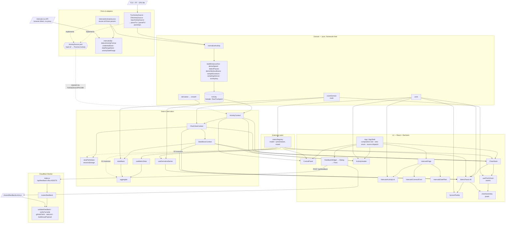

# ActivityMaxxer — Architecture as Built

> **Audience:** anyone about to change the system — no prior reading required.
> **Status:** as-built description, verified against the working tree on 2026-08-08 (branch `derivatives`).
> **Companion:** `ARCHITECTURE.md` is the *decision record*. This document is the *current map*.

---

## 1. Context — why this document exists

`doc/ARCHITECTURE.md` is a specification written against an empty Vite project, plus a 40-entry
build log, a build order and a roadmap. It is a valuable record of why things are the way they
are, and it stays untouched. But it was never a description of the system as built, and the gap
is now load-bearing in two specific ways:

- Its layer diagram still shows a `BrushControl` component that has since been deleted.
- Its stated dependency rule — *"arrows point inward-to-outward only"* — has acquired four real
  exceptions, none of which were written down anywhere.

A second thing anchors this document: **Strava sync is the next feature.** The working assumption
going in was "the input data is already behind dependency injection, so perhaps all is good."
That is half right. The half that is right is genuinely reassuring and is documented in §9. The
half that fails is load-bearing. So §7 below is ranked by what Strava actually needs, not by
abstract tidiness — four of its nine items are marked **[Strava]** because they are prerequisites
rather than cleanups.

---

## 2. What the system is — three runtime flows

The app is a static, client-side time-series viewer for endurance-activity files, deployed as a
Cloudflare Worker with static assets. Three flows run through it, and they are more independent
than their shared codebase suggests.

**Activity flow (the main one).** A file drop or an id reference enters an `ActivitySource`, which
dispatches to `parseTcx` / `parseFit` / `parseGpx`, hands the resulting raw trackpoints to
`normalizeActivity`, and publishes an `Activity` into `ActivityContext`. From there
`ChartViewContext` (zoom, x-axis mode, metric/stat toggles) and then `StatsBasisContext` (which
window statistics are computed over) derive view state, which `ChartStack` fans out to one
`MetricPanel` per visible metric, each rendering Recharts.

**Feedback flow.** `FeedbackWidget` → `FeedbackDialog` → `FeedbackForm` (with `useTurnstile`) →
`feedbackClient` → `POST /api/feedback` → the Worker → Turnstile siteverify → a GitHub issue. This
is a complete vertical feature that touches the activity flow at exactly two points: a footer
mount in `App.jsx`, and the shared constants in `shared/feedbackLimits.js`.

**intervals.icu flow.** `IntervalsPage` → `intervalsApi` → intervals.icu **directly from the
browser** — no proxy, no Worker route. It rejoins the activity flow only by handing up an
`{ type: 'id' }` activity reference for the main flow to load.

The build is `vite build` → `dist/`, after which `scripts/build-seo-pages.mjs` prerenders static
pages, `sitemap.xml` and `robots.txt` into `dist/`. `worker/index.js` is 13 lines: it matches
`/api/feedback` and hands every other request to the `ASSETS` binding. This is *not* Cloudflare
Pages — it is Workers with static assets, so routing is explicit and visible.

---

## 3. Layers as built

Measured on 2026-08-08, non-test files only.

| Layer | Files | LOC | Imports |
|---|---|---|---|
| `shared/` | 1 | 13 | nothing — the browser + Worker kernel |
| `src/domain/` | 16 | 1275 | only `domain/` — no React, no DOM |
| `src/data/` | 13 | 1300 | `domain/`, React (see finding D3) |
| `src/metrics/` | 1 | 194 | `domain/units.js` |
| `src/state/` | 3 | 305 | `domain/`, `metrics/`, `data/`, React |
| `src/stats/` | 5 | 443 | `domain/`, `metrics/`, `state/`, React |
| `src/lib/` | 1 | 64 | nothing app-specific (`feedbackClient`) |
| `src/ui/` | 26 | 2500 | everything below + Recharts |
| `src/app/` + `App.jsx` | 2 | 231 | composition root |
| `src/main.jsx` | 1 | 11 | entry point |
| `worker/` | 8 | 415 | `shared/` |

**77 non-test source files, ~6,750 LOC.**

**Test posture: 69 test files, 862 tests, all passing.** That ratio — roughly one test file per
source file — is the single most important fact for §7: every refactor listed there is guarded by
existing tests, which is why they are safe to attempt at all.

---

## 4. Module dependency diagram

**How to read it.** Arrows are *dependency and data flow*, and the diagram deliberately omits
ancillary edges — React, Recharts, and leaf hooks (`useIsNarrow`, `useDebouncedValue`,
`useTouchHoverHandoff`, `derivativeStyle`) — which would otherwise touch nearly every UI node
without telling you anything. Three edges are worth naming precisely because they are *not* import
edges:

- `VC --> Panel` and `SB --> Panel`: `MetricPanel` imports neither context. `ChartStack` reads them
  and passes `zoomDomain` and `statsBasis` down as props (`src/ui/ChartStack.jsx:101-113`). The
  panel is deliberately a pure-ish presentational component; keep it that way.
- `SBF --> AGG`: `statsBasis.js` does not import `aggregate.js`. The basis flows in as *arguments*.
  That is the point of the seam described in §6.

**Four ways this differs from `ARCHITECTURE.md` §3 (its layer diagram).** If you have read that
document, these are the deltas:

1. **No `BrushControl`.** It was deleted; zoom is now gesture- and wheel-driven.
2. **The gesture triad is shown explicitly** — `zoomDomain` (math) → `chartGeometry` (pixels) →
   `usePinchZoom` (events). The spec collapsed this into one box; it is the best-factored part of
   the repo and deserves to be visible.
3. **`StatsBasisContext` sits between `ChartViewContext` and the UI.** It did not exist in the
   spec's diagram at all.
4. **Two dotted inversion edges** (`REG -.-> AGG`, `REG -.-> VP`) record dependencies that run
   against the stated rule. See §5.

---

## 5. Where the dependency rule holds, and where it doesn't

The rule, as stated in `ARCHITECTURE.md` §3: *arrows point inward-to-outward only; `domain/`
imports nothing from `ui/`, `data/`, or React.*

**For `domain/` the rule holds completely** — 16 files, zero outward imports, no React, no DOM.
That is the property worth protecting, and it is intact.

Four real exceptions exist elsewhere. None is a crisis; all four are cheap to fix and each one is
cited by a §7 item.

| ID | Anchor | Finding |
|---|---|---|
| **D1** | `src/stats/aggregate.js:8` | Pure aggregation math imports `metricRegistry`, a module carrying CSS custom-property colour strings, display labels and `format` functions. Only `scalarStatKinds` is actually wanted. Statistics cannot be computed without loading presentation. |
| **D2** | `src/state/viewPrefsStore.js:33` | Persistence *validation* imports `metricOrder` and `statKinds` from the registry. A registry edit silently changes what a previously stored payload validates as — the failure is invisible and lands on the user's restored session. |
| **D3** | `src/data/ActivitySource.js:5` | The port *definition* and its DI container live in one module (`createContext, createElement, useContext`), so anything merely referencing the port type pulls React with it. |
| **D4** | `src/domain/types.js:6` | `@typedef {'max'\|'min'\|'avg'\|'median'} StatKind` is stale: it omits `'d1'` and `'d2'`, which `metricRegistry.statKinds` now includes and `viewPrefsStore` persists. JSDoc-only, so nothing breaks at runtime — but this is the type every other layer cites when describing itself. |

D1 and D2 are the same underlying problem (the registry mixes model with presentation) and are
resolved together by §7 item 4. D3 is resolved by item 8. D4 is a one-line fix with no dependents.

---

## 6. Seams that already work

This section exists so §7 reads as *"more of this"* rather than *"this is bad."* The repo has four
boundaries that are genuinely well-drawn, and the first is the template the rest of this document
keeps pointing back to.

**The gesture triad — the best boundary in the repo.** `domain/zoomDomain.js` is pure interval
math with no DOM. `ui/chartGeometry.js` converts pixels to domain values. `ui/usePinchZoom.js`
handles events. Each is unit-tested independently, and the hard part — the maths — is tested
without simulating a single touch. Every item in §7 is imitating this shape: *pure core, thin
adapter, tests on the core.*

**`stats/statsBasis.js` keeps aggregation zoom-unaware.** A zoom window is just a different set of
arguments; there is no `isZoomed` branching anywhere in `aggregate.js`. A whole category of
"stats disagree with the chart" bugs is structurally impossible.

**The port.** `IntervalsActivitySource` adds *no* parsing code — it reuses all three parsers byte
for byte. That is what keeps Stryd developer-field power alive on the download path without a
second implementation, and it is why the four-route cross-check fixture strategy works.

**The feedback slice.** An entire vertical feature — UI, client, Worker route, GitHub integration —
with exactly one mount point and one shared constants module. It is the proof that this codebase
*can* hold a self-contained feature without it leaking everywhere.

---

## 7. Decoupling opportunities, ranked

Ranked by leverage, with Strava prerequisites first. **[Strava]** marks a prerequisite for §9, not
a cleanup. Effort is in parentheses.

### 1. [Strava] Lift intervals.icu orchestration out of the page, and add a provider-neutral row DTO *(medium — the single biggest blocker)*

`src/ui/IntervalsPage.jsx` is 385 lines, the largest file in the repo. It holds credential state,
the browse effect, the search effect, `mergeById`, date-range persistence, `IntervalsApiError`
code→message mapping, empty/loading copy, *and* rendering.

Worse for Strava, the list component reads provider-specific fields directly:
`activity.source === 'STRAVA'` (`src/ui/IntervalsActivityList.jsx:23`), `activity.file_type`
(`:26`), `activity.icu_distance` (`:68`), `activity.start_date_local` (`:71`).

→ Extract orchestration to `data/intervals/useIntervalsActivities.js`, **and** introduce an
`ActivityRow` DTO — `{ id, name, startedAt, distanceM, durationS, unsupportedReason }` — that each
provider maps into, so the list renders either provider's rows unchanged.

Without this, a Strava picker duplicates all 385 lines.

### 2. [Strava] Move the source dispatcher out of `App.jsx`, and qualify the id ref *(low)*

`src/App.jsx:186-199` instantiates four concrete adapters and owns `sourceFor`, which maps
`ref.type === 'id'` → `intervalsSource` **unconditionally**. A Strava id would be indistinguishable
from an intervals.icu one — the dispatcher has no way to tell them apart.

→ `data/sourceRegistry.js` exporting `createDefaultSource({ getApiKey })`, and widen
`IdActivityRef` (`src/data/ActivitySource.js:14`) with a `provider` field.

Also extract the inline `useIsScrolled` (`src/App.jsx:34-45`) to `ui/useIsScrolled.js`, beside the
existing `ui/useIsNarrow.js`. The `view` enum can stay in `App.jsx` until a third view exists —
that is a deliberate call, not an oversight.

### 3. [Strava] Make file-format detection provider-agnostic *(trivial)*

`src/data/intervals/detectActivityFormat.js` exports `detectActivityFormat` and `gunzipIfNeeded` —
both pure, both byte-level, neither intervals-specific — yet they sit under `data/intervals/`.

→ Move to `data/fileFormat.js`.

**This exposes a latent defect worth recording: the file path and the network path disagree about
format detection.** The network path sniffs bytes and gunzips. `sourceFor` trusts the filename
extension, so a `.fit.gz` dropped on the page falls through to `TcxActivitySource` and dies on
"invalid XML" — using inflate code the repo already owns, one directory away.

### 4. Split `metricRegistry` into model + presentation *(medium — highest leverage of the non-Strava items)*

`src/metrics/metricRegistry.js:24-124` mixes domain semantics (`accessor`, `aggStrategy`,
`invertAxis`, `sports`, `domainPadding`, derivative `perSecondScale`) with presentation (`label`,
`unit`, `color: 'var(--metric-pace)'`, `format`, derivative `label`/`unit`/`format`).

→ `metrics/metricModel.js` + `metrics/metricPresentation.js`, same ids in both. `stats/aggregate.js`
and `state/viewPrefsStore.js` then import the model only — **resolving D1 and D2 together.**
Touches roughly 8 files, all test-covered.

### 5. [Strava] Shared guarded-storage kernel *(low)*

Three modules reimplement the identical `try { globalThis.X ?? null } catch { return null }`
accessor plus per-call try/catch: `src/state/viewPrefsStore.js:47` (`browserSessionStorage`),
`src/data/intervals/credentialStore.js:30` (`browserStorage`),
`src/data/intervals/dateRangeStore.js:39` (`browserSessionStorage`). Two of them also repeat a
`SCHEMA_VERSION` + normalize/validate shape.

→ `lib/safeStorage.js` with an injectable `Storage`; the three keep only their schema and
validation. **Preserve and document the deliberate localStorage-vs-sessionStorage split** — that is
a stated decision, not an inconsistency.

Strava makes this a fourth store *and* changes the shape: `credentialStore` holds one
never-expiring string, where Strava needs `{ accessToken, refreshToken, expiresAt }` plus
refresh-on-expiry. The storage backend is already a factory argument; the *shape and lifecycle* are
not, and that is what Strava stresses.

### 6. Extract chart-row building out of `MetricPanel` *(low–medium)*

`src/ui/MetricPanel.jsx:134` (`const data = useMemo`) builds rows, merges the derivative series,
applies `perSecondScale`, and inserts gap breaks — all framework-free logic living inside a
Recharts component.

→ `domain/buildChartRows.js` plus a thin `useChartRows` memo. This makes the ordering constraint
already documented in that function — the derivative must merge **before** `insertGapBreaks`, which
shifts every index past the first gap — testable without rendering a chart. Prerequisite for ever
swapping Recharts.

### 7. One `visibleMetricsFor()` selector *(trivial)*

The same predicate is written twice: `src/ui/ChartStack.jsx:44` (with `enabledMetrics`) and
`src/ui/ControlPanel.jsx:25` (without). ChartStack's own comment warns that two copies "would be
free to disagree" — it meant two copies *within* that file, but the cross-file pair is real today.

→ One exported selector beside `isMetricForSport` (`src/metrics/metricRegistry.js:192`).

### 8. Separate the port type from the DI container *(trivial)*

Split `src/data/ActivitySource.js` into a typedef-only `activitySourcePort.js` (zero imports) and
an `ActivitySourceContext.jsx`. **Resolves D3.**

### 9. Minor — `ChartViewProvider`'s activity dependency *(note only)*

`src/state/ChartViewContext.jsx:47` reads the activity solely for `activity.id`, used as the view-
prefs key. This is what makes the provider nesting order in `src/app/providers.jsx` load-bearing.
**Note it; do not push on it** — the coupling is documented and intentional.

### Flagged without a recommendation

`domain/units.js` is a *formatting* module living in the domain layer, imported by `metricRegistry`
and five UI files. Either it is domain vocabulary (a defensible position — "pace is min/km" is
arguably a domain fact) or it belongs in `ui/`. This document's job is to force that decision to be
made once, deliberately, rather than to make it.

---

## 8. Deliberately not worth decoupling

Recorded so nobody spends a weekend on them:

- **`worker/`** — 415 lines, one route, already cleanly layered (`index` → `routes` → `lib`).
- **The three parsers** — independent by construction, sharing nothing but the `RawTrackpoint`
  output shape. That is the correct amount of coupling.
- **`StatsBasisContext`'s dependency on both `ActivityContext` and `ChartViewContext`** — this is
  derived state. Depending on both inputs is what it *is*, it is documented, and it is correct.

---

## 9. Readiness for Strava

*All external facts in this section verified 2026-08-08. Strava's CORS behaviour and API policy
have both changed within the past year — **re-check before building.***

> **Verdict: yes for everything above `data/`. No for four things inside and below it — and the
> most important of the four is not an engineering problem.**

### What genuinely already works

The real port on the domain side is `RawTrackpoint[]`, **not `File`**.
`normalizeActivity({ sport, sportLabel, trackpoints })` never sees a file, so a Strava adapter can
skip the parsers entirely and still satisfy `load(ref) => Promise<Activity>`.

Strava's stream keys map onto `RawTrackpoint` (`src/domain/types.js:38`) essentially 1:1 —
`distance`→`distanceMeters`, `altitude`→`altitudeMeters`, `heartrate`→`heartRateBpm`,
`cadence`→`cadenceSpm`, `watts`→`watts`, `velocity_smooth`→`speedMps`, `latlng`→`lat`/`lon`.

**Nothing above `data/` changes.** The original intuition was right — but the reason is subtler
than "it's behind DI," and the four items below are where it stops being right.

### (a) The "no server" property is gone, and it is not negotiable

Strava requires `client_secret` for the initial code→token exchange **and** for every refresh, and
access tokens expire after six hours. A static site cannot hold that secret. The Worker therefore
returns as a real OAuth client with a stored secret and a refresh route.

`ARCHITECTURE.md` §12 already predicted exactly this for intervals.icu OAuth — it called it "the
one thing that would flip the 'no server-side code' answer." Strava forces it.

**Worse: Strava's CORS support has a documented history of disappearing and returning.** The
streams endpoint lost `Access-Control-Allow-Origin`, was reported restored around September 2025,
with later reports of it dropping again; community consensus still recommends a server-side proxy.
`src/data/intervals/intervalsApi.js:9` already warns that a CORS refusal and a dead network are
indistinguishable from the browser — for Strava that is not hypothetical. So §12's
"`/api/intervals/*` Worker pass-through escape hatch" should be built for Strava **from day one**,
which means athlete data passes through the Worker at least contingently.

Copy that becomes false and must be revised:

- `doc/overview.md:61` — "serves nothing but the page itself"
- `README.md` (the intervals.icu section, ~line 195) — "there's no Worker route involved"
- `src/ui/IntervalsConnectForm.jsx:88-89` — "the key and your activities never pass through this
  app's server"

**This is a product decision, not an engineering one.** It is presented here with its cost stated
so it can be decided deliberately.

### (b) The rate limit is architectural, and it inverts a settled decision

Strava's limits are **per-application, not per-athlete**: 100 non-upload requests / 15 min and
1,000 / day, shared across *every user of the app*.

intervals.icu's limits are per-key, which is why `ARCHITECTURE.md` §12 could reason: at 1 call per
list load, 1 per search burst and 1 per activity opened, usage is nowhere near the ceiling — *which
is why neither is cached yet*. **That reasoning does not transfer.** One shared 1,000/day quota is
roughly 500 activity views per day for the entire app, across all users.

**Caching stops being optional.** Strava's API Policy §6.2 permits a cache of up to seven days;
§7.4 requires deletion within 30 days of revocation, and §6.3 within 48 hours of a user action.
The repo's existing `sessionStorage` pattern (`viewPrefsStore`, `dateRangeStore`) already has the
right lifecycle for that — which is why decoupling item #5 lands in exactly the right place.

### (c) The parser-reuse payoff does not transfer

`IntervalsActivitySource`'s header states "There is no new parsing code here, and that is the
entire point." That is true **only because intervals.icu returns the original uploaded file.**

**Strava exposes no original-file endpoint.** The only telemetry route is
`GET /activities/{id}/streams`. So `StravaActivitySource` is the first adapter that must
*construct* `RawTrackpoint[]` itself, with its own tests, and it cannot join the existing
four-route cross-check fixture strategy.

Two consequences to record as decisions:

- **The `time` stream is elapsed seconds**, so `RawTrackpoint.time` (a `Date`) must be rebuilt from
  the activity's `start_date`. Carry it on the ref — following the precedent that already widened
  `IdActivityRef` with an optional `name` (`src/data/ActivitySource.js:14`) — rather than spending a
  second request per activity against a shared quota.
- **Strava supplies a `moving` stream, which must be discarded.** `RawTrackpoint` has no such field,
  and `normalizeActivity` derives pauses itself via `detectPauses`. This is consistent with §12's
  rule that production stays derived so every format behaves identically — but it is a choice, so
  it is named here rather than left to whoever writes the adapter.

### (d) The picker is not reusable

See decoupling item #1. `IntervalsActivityList` reads intervals.icu field names directly, so the
Strava picker either duplicates it or the row DTO lands first.

### One thing that gets better

`src/ui/IntervalsActivityList.jsx:23` currently greys out **every Strava-synced row** — intervals.icu
doesn't keep the original file for them. Direct Strava support closes a hole the product already
documents in `README.md:199` and `doc/SEO_LAUNCH.md:337`.

### Smaller items — listed, not analysed

- `Sport` is `'running' | 'cycling' | 'track'` against Strava's ~50 `sport_type` values. §12 already
  flags this for intervals.icu; Strava makes it worse.
- Strava API Policy §4.4 requires Garmin attribution for Garmin-derived data. The app **already
  implements this** (`src/ui/IntervalsPage.jsx:67`, `hasGarminData`) and can reuse it.
- Policy §5.4 restricts combining Strava data with other data — worth a lawyer's read before the
  §12 "multi-activity overlay" seam is ever built against Strava.

### Sequencing

**Do decouplings #1, #2, #3 and #5 first.** All four are small, independently verifiable, and each
is a prerequisite. Then the Worker OAuth route. Then `StravaActivitySource`.

**Do not start with the adapter.** It is the part the architecture already supports.

### Sources

- [Strava — Authentication](https://developers.strava.com/docs/authentication/) — `client_secret`
  required for exchange *and* refresh; six-hour token lifetime; `activity:read` /
  `activity:read_all` scopes
- [Strava — API Reference](https://developers.strava.com/docs/reference/) — stream types (`time,
  distance, latlng, altitude, velocity_smooth, heartrate, cadence, watts, temp, moving,
  grade_smooth`); no original-file endpoint
- [Strava — Rate Limits](https://developers.strava.com/docs/rate-limits/) — "limited on a
  **per-application** basis"; 100/15min and 1,000/day non-upload
- [Strava — API Agreement / Policy](https://www.strava.com/legal/api_policy) — §6.2 seven-day cache
  cap, §6.3 48-hour deletion, §7.4 30-day deletion on revocation, §4.4 Garmin attribution, §5.4
  data-combination restriction
- [Strava Community Hub — streams CORS problem](https://communityhub.strava.com/developers-api-7/activities-xxx-streams-cors-problem-when-fetching-from-browser-11257)
  — CORS lost then restored (Sept 2025), no official Strava statement
