# ActivityMaxxer — Architecture as Built

> **Audience:** anyone about to change the system — no prior reading required.
> **Status:** as-built description, verified against the working tree on 2026-08-09 (branch `derivatives`),
> with Strava stages 0a–2 landed. §9 records what shipped and what is still outstanding.
> **Companion:** `ARCHITECTURE.md` is the *decision record*. This document is the *current map*.

---

## 1. Context — why this document exists

`doc/ARCHITECTURE.md` is a specification written against an empty Vite project, plus a 40-entry
build log, a build order and a roadmap. It is a valuable record of why things are the way they
are, and it stays untouched. But it was never a description of the system as built, and the gap
is now load-bearing in two specific ways:

- Its layer diagram still shows a `BrushControl` component that has since been deleted.
- Its stated dependency rule — *"arrows point inward-to-outward only"* — has acquired four real
  exceptions, none of which were written down anywhere.

A second thing anchors this document: **Strava sync was the next feature, and it is now mostly
built.** The working assumption going in was "the input data is already behind dependency
injection, so perhaps all is good." That was half right. The half that was right is genuinely
reassuring; the half that failed was load-bearing. So §7 below is ranked by what Strava actually
needed, not by abstract tidiness — four of its nine items are marked **[Strava]**, and all four
have since shipped. **§9 is now the record of what landed, what changed against the assessment,
and what is still outstanding**, rather than a forecast.

---

## 2. What the system is — four runtime flows

The app is a client-side time-series viewer for endurance-activity files, deployed as a Cloudflare
Worker with static assets. Four flows run through it, and they are more independent than their
shared codebase suggests. **Only one of the four is not client-side**, and which one is the single
most useful thing to know here.

**Activity flow (the main one).** A file drop or an id reference enters `sourceRegistry`, which
dispatches — on the filename extension for a file, on `ref.provider` for an id — to one of five
adapters. Three of them parse (`parseTcx` / `parseFit` / `parseGpx`); the Strava one assembles
trackpoints from stream arrays instead. All five hand `RawTrackpoint[]` to `normalizeActivity`,
which publishes an `Activity` into `ActivityContext`. **That is the real port** — nothing below
`data/` has ever seen a `File`. From there
`ChartViewContext` (zoom, x-axis mode, metric/stat toggles) and then `StatsBasisContext` (which
window statistics are computed over) derive view state, which `ChartStack` fans out to one
`MetricPanel` per visible metric, each rendering Recharts.

**Feedback flow.** `FeedbackWidget` → `FeedbackDialog` → `FeedbackForm` (with `useTurnstile`) →
`feedbackClient` → `POST /api/feedback` → the Worker → Turnstile siteverify → a GitHub issue. This
is a complete vertical feature that touches the activity flow at exactly two points: a footer
mount in `App.jsx`, and the shared constants in `shared/feedbackLimits.js`.

**intervals.icu flow.** `IntervalsPage` → `intervalsApi` → intervals.icu **directly from the
browser** — no proxy, no Worker route. It rejoins the activity flow only by handing up an
`{ type: 'id', provider: 'intervals' }` activity reference for the main flow to load.

**Strava flow — the one that is not client-side.** `StravaPage` → `stravaApi` → **this app's own
Worker** at `/api/strava/*` → Strava. It is the only data path that touches a server, and it is not
a preference: Strava's OAuth requires a `client_secret` that cannot live in a web page, and its
streams endpoint has lost and regained CORS more than once. The Worker is stateless — it holds the
secret, forwards the browser's bearer token upstream, and hands Strava's body back verbatim. Like
intervals.icu, this flow rejoins the main one by handing up an id reference — but that reference
must carry `startedAtUtc` and `sportType` as well, for reasons §9 explains. See §9(a)/(b).

The build is `vite build` → `dist/`, after which `scripts/build-seo-pages.mjs` prerenders static
pages, `sitemap.xml` and `robots.txt` into `dist/`. `worker/index.js` is 18 lines: it matches
`/api/feedback` and `/api/strava/*`, and hands every other request to the `ASSETS` binding. This is
*not* Cloudflare Pages — it is Workers with static assets, so routing is explicit and visible.

---

## 3. Layers as built

Measured on 2026-08-09, non-test files only.

| Layer | Files | LOC | Imports |
|---|---|---|---|
| `shared/` | 1 | 13 | nothing — the browser + Worker kernel |
| `src/domain/` | 16 | 1275 | only `domain/` — no React, no DOM |
| `src/data/` | 25 | 2771 | `domain/`, `lib/`, React (see finding D3) |
| `src/metrics/` | 1 | 194 | `domain/units.js` |
| `src/state/` | 3 | 296 | `domain/`, `metrics/`, `data/`, React |
| `src/stats/` | 5 | 443 | `domain/`, `metrics/`, `state/`, React |
| `src/lib/` | 2 | 197 | nothing app-specific (`feedbackClient`, `safeStorage`) |
| `src/ui/` | 28 | 2650 | everything below + Recharts |
| `src/app/` + `App.jsx` | 2 | 231 | composition root |
| `src/main.jsx` | 1 | 11 | entry point |
| `worker/` | 11 | 980 | `shared/` |

**~94 non-test source files, ~9,000 LOC** — `data/` and `worker/` roughly doubled, and both grew
for the same reason: Strava is the first provider that needs a server half and the first adapter
that builds `RawTrackpoint[]` rather than reusing a parser.

**Test posture: 83 test files, 1,073 tests, all passing.** That ratio — roughly one test file per
source file — is the single most important fact for §7: every refactor listed there is guarded by
existing tests, which is why they are safe to attempt at all. It is also what made the three
Stage-0 refactors provably behaviour-preserving: their acceptance criterion was that the *existing*
suite passed unchanged.

---

## 4. Module dependency diagram

```mermaid
flowchart TB
  subgraph UI["UI — React + Recharts"]
    Shell[App / AppShell<br/>composition root · view enum]
    Ctl[ControlPanel]
    Stack[ChartStack]
    Panel[MetricPanel xN]
    Tip[SyncedTooltip]
    Hdr[ActivityHeader]
    IPage[IntervalsPage<br/>copy + layout only]
    IHook[useIntervalsActivities<br/>read orchestration + search]
    SPage[StravaPage<br/>copy + layout only]
    SHook[useStravaActivities<br/>read orchestration, NO search]
    SCb[useStravaOAuthCallback<br/>mounted once, in AppShell]
    IList[ActivityRowList<br/>provider-neutral]
    IConn[IntervalsConnectForm]
    SConn[StravaConnectButton]
    IDate[ActivityDateFilter<br/>provider-neutral]
    Fb[FeedbackWidget → Dialog → Form]
    Geo[chartGeometry<br/>pixels]
    Pinch[usePinchZoom<br/>events]
    Shell --> Ctl & Stack & IPage & SPage & SCb & Fb & Hdr
    Stack --> Panel --> Tip
    Stack --> Pinch --> Geo
    Panel --> Geo
    IPage --> IHook & IList & IConn & IDate
    SPage --> SHook & IList & SConn & IDate
  end

  subgraph STATE["State & derivation"]
    AC[ActivityContext]
    VC[ChartViewContext]
    VP[viewPrefsStore<br/>sessionStorage]
    SB[StatsBasisContext]
    SBF[statsBasis]
    AGG[aggregate]
    UMS[useMetricStats]
    UDS[useDerivativeSeries]
    AC --> VC --> SB
    VC --> VP
    SB --> SBF
    UMS --> AGG
  end

  subgraph METRICS["Extension point"]
    REG[metricRegistry<br/>model + presentation, mixed]
  end

  subgraph DOMAIN["Domain — pure, framework-free"]
    NORM[normalizeActivity]
    DERIVE[buildDistanceAxis · deriveSpeed · detectPauses<br/>deriveWorkoutName · sampleDurations · samplingInterval · activityKey]
    ZOOM[zoomDomain<br/>math]
    DERIV[derivative → smooth]
    UNITS[units]
    MODEL[(Activity<br/>Sample· RawTrackpoint)]
    NORM --> DERIVE --> MODEL
  end

  subgraph DATA["Ports & adapters"]
    PORT{{ActivitySource port<br/>load ref → Promise Activity}}
    DISP["sourceRegistry<br/>the ONLY place adapters are instantiated<br/>file→extension · id→ref.provider"]
    NEUTRAL[fileFormat · activityDateRange<br/>provider-neutral, pure]
    SAFE[lib/safeStorage<br/>guarded-storage kernel]
    FILES[TcxActivitySource · FitActivitySource · GpxActivitySource<br/>→ parseTcx / parseFit / parseGpx]
    ICU[IntervalsActivitySource<br/>reuses all three parsers]
    API[intervalsApi · credentialStore · dateRangeStore]
    STV["StravaActivitySource<br/>builds RawTrackpoint[] itself"]
    SAPI[stravaApi · stravaAuth · stravaTokenStore<br/>stravaBoundsFor · streamCache · sportFor]
    S2T[streamsToTrackpoints<br/>pure: StreamSet + startTime + sport]
    ROW[(ActivityRow<br/>typedef, zero imports)]
    MAP[toActivityRow ×2<br/>wire shape stops here]
    FILES -.implements.-> PORT
    ICU -.implements.-> PORT
    STV -.implements.-> PORT
    DISP --> FILES & ICU & STV
    ICU --> API & NEUTRAL
    STV --> SAPI --> SAFE
    STV --> S2T
    API --> SAFE
    MAP --> ROW
  end

  subgraph WORKER["Cloudflare Worker"]
    WIDX[index.js<br/>/api/feedback · /api/strava/* else ASSETS]
    WFB[routes/feedback]
    WST[routes/strava<br/>stateless: holds client_secret, stores no token]
    WLIB[validateFeedback · verifyTurnstile<br/>githubClient · rateLimit · buildIssuePayload]
    WSLIB[stravaOAuth · stravaProxy<br/>header allowlists, both directions]
    WIDX --> WFB --> WLIB
    WIDX --> WST --> WSLIB
    WST --> WLIB
  end

  SHARED[/shared/feedbackLimits.js/]

  FILE[/TCX · FIT · GPX file/] --> FILES
  ICUAPI[/intervals.icu API<br/>browser-direct, no proxy/] --> API
  STVAPI[/Strava API<br/>via the Worker — client_secret + unreliable CORS/] --> WSLIB
  SAPI -->|"/api/strava/*, same-origin"| WIDX
  FILES --> NORM
  ICU --> NORM
  STV --> NORM
  MODEL --> AC
  PORT -.injected via ActivitySourceProvider.-> AC
  AC --> Stack & Ctl & Hdr
  VC --> Stack & Panel
  SB --> Stack & Panel & Hdr
  ZOOM --> VC & Pinch & SBF
  DERIV --> UDS --> Panel
  UNITS --> REG & Tip & Hdr & Panel & IList
  IHook --> API & MAP
  SHook --> SAPI & MAP
  SCb --> SAPI
  SConn --> SAPI
  ROW --> IList
  REG --> Panel & Ctl & Stack & UMS & UDS
  SBF --> AGG
  Fb --> SHARED
  SHARED --> WLIB
  Fb -->|POST /api/feedback| WIDX
  Shell -->|createDefaultSource| DISP

  %% inversions — see section 5
  REG -.->|D1 inversion| AGG
  REG -.->|D2 inversion| VP
```

**How to read it.** Arrows are *dependency and data flow*, and the diagram deliberately omits
ancillary edges — React, Recharts, and leaf hooks (`useIsNarrow`, `useDebouncedValue`,
`useTouchHoverHandoff`, `derivativeStyle`) — which would otherwise touch nearly every UI node
without telling you anything. Three edges are worth naming precisely because they are *not* import
edges:

- `VC --> Panel` and `SB --> Panel`: `MetricPanel` imports neither context. `ChartStack` reads them
  and passes `zoomDomain` and `statsBasis` down as props (`src/ui/ChartStack.jsx:101-113`). The
  panel is deliberately a pure-ish presentational component; keep it that way.
- `SBF --> AGG`: `statsBasis.js` does not import `aggregate.js`. The basis flows in as *arguments*.
  That is the point of the seam described in §6.
- `Shell --> SCb`: `useStravaOAuthCallback` hangs off the shell rather than off `StravaPage`, and
  that placement is load-bearing. An OAuth return is a property of the **page load**, not of a
  view: the athlete leaves from the Strava page, but Strava sends them back to `/`, which on a
  cold load renders the activity view. Mounted inside the page they cannot see, the code would
  never be exchanged.

**What the two picker columns share, and what they deliberately do not.** `ActivityRowList`,
`ActivityDateFilter`, `activityDateRange` and `toActivityRow`'s *position* are shared; the two
hooks are not. `useStravaActivities` is `useIntervalsActivities` **minus the entire search half**
— Strava has no search endpoint, so there is no debounce, no second list, no `searchStatus`, and
one effect rather than two. Merging them into one hook with an optional search would produce a
shape decided by a flag; the parts worth sharing are already shared as modules.

**Four ways this differs from `ARCHITECTURE.md` §3 (its layer diagram).** If you have read that
document, these are the deltas:

1. **No `BrushControl`.** It was deleted; zoom is now gesture- and wheel-driven.
2. **The gesture triad is shown explicitly** — `zoomDomain` (math) → `chartGeometry` (pixels) →
   `usePinchZoom` (events). The spec collapsed this into one box; it is the best-factored part of
   the repo and deserves to be visible.
3. **`StatsBasisContext` sits between `ChartViewContext` and the UI.** It did not exist in the
   spec's diagram at all.
4. **Two dotted inversion edges** (`REG -.-> AGG`, `REG -.-> VP`) record dependencies that run
   against the stated rule. See §5.

---

## 5. Where the dependency rule holds, and where it doesn't

The rule, as stated in `ARCHITECTURE.md` §3: *arrows point inward-to-outward only; `domain/`
imports nothing from `ui/`, `data/`, or React.*

**For `domain/` the rule holds completely** — 16 files, zero outward imports, no React, no DOM.
That is the property worth protecting, and it is intact.

Four real exceptions exist elsewhere. None is a crisis; all four are cheap to fix and each one is
cited by a §7 item.

| ID | Anchor | Finding |
|---|---|---|
| **D1** | `src/stats/aggregate.js:8` | Pure aggregation math imports `metricRegistry`, a module carrying CSS custom-property colour strings, display labels and `format` functions. Only `scalarStatKinds` is actually wanted. Statistics cannot be computed without loading presentation. |
| **D2** | `src/state/viewPrefsStore.js:33` | Persistence *validation* imports `metricOrder` and `statKinds` from the registry. A registry edit silently changes what a previously stored payload validates as — the failure is invisible and lands on the user's restored session. |
| **D3** | `src/data/ActivitySource.js:5` | The port *definition* and its DI container live in one module (`createContext, createElement, useContext`), so anything merely referencing the port type pulls React with it. |
| **D4** | `src/domain/types.js:6` | `@typedef {'max'\|'min'\|'avg'\|'median'} StatKind` is stale: it omits `'d1'` and `'d2'`, which `metricRegistry.statKinds` now includes and `viewPrefsStore` persists. JSDoc-only, so nothing breaks at runtime — but this is the type every other layer cites when describing itself. |

D1 and D2 are the same underlying problem (the registry mixes model with presentation) and are
resolved together by §7 item 4. D3 is resolved by item 8. D4 is a one-line fix with no dependents.

---

## 6. Seams that already work

This section exists so §7 reads as *"more of this"* rather than *"this is bad."* The repo has four
boundaries that are genuinely well-drawn, and the first is the template the rest of this document
keeps pointing back to.

**The gesture triad — the best boundary in the repo.** `domain/zoomDomain.js` is pure interval
math with no DOM. `ui/chartGeometry.js` converts pixels to domain values. `ui/usePinchZoom.js`
handles events. Each is unit-tested independently, and the hard part — the maths — is tested
without simulating a single touch. Every item in §7 is imitating this shape: *pure core, thin
adapter, tests on the core.*

**`stats/statsBasis.js` keeps aggregation zoom-unaware.** A zoom window is just a different set of
arguments; there is no `isZoomed` branching anywhere in `aggregate.js`. A whole category of
"stats disagree with the chart" bugs is structurally impossible.

**The port.** `IntervalsActivitySource` adds *no* parsing code — it reuses all three parsers byte
for byte. That is what keeps Stryd developer-field power alive on the download path without a
second implementation, and it is why the four-route cross-check fixture strategy works.

**The feedback slice.** An entire vertical feature — UI, client, Worker route, GitHub integration —
with exactly one mount point and one shared constants module. It is the proof that this codebase
*can* hold a self-contained feature without it leaking everywhere.

---

## 7. Decoupling opportunities, ranked

Ranked by leverage, with Strava prerequisites first. **[Strava]** marks a prerequisite for §9, not
a cleanup. Effort is in parentheses.

### 1. [Strava] Lift intervals.icu orchestration out of the page, and add a provider-neutral row DTO — **DONE (2026-08-09)**

`src/ui/IntervalsPage.jsx` was 385 lines, the largest file in the repo, holding credential state,
the browse effect, the search effect, `mergeById`, date-range persistence, `IntervalsApiError`
code→message mapping, empty/loading copy, *and* rendering. The list component read
provider-specific fields directly — `activity.source === 'STRAVA'`, `file_type`, `icu_distance`,
`start_date_local` — none of which Strava's payload shares.

Landed as two behaviour-preserving commits, with `IntervalsPage.test.jsx`'s 41 assertions untouched
as the proof:

- `src/ui/useIntervalsActivities.js` — all 8 pieces of state, all 3 effects, `mergeById` and
  `rejectKey`. The page is down to ~150 lines of copy, layout and JSX.
- `src/data/activityRow.js` — the `ActivityRow` typedef, zero imports.
- `src/data/intervals/toActivityRow.js` — the mapper, plus `unsupportedReason` moved off the list.
  Both read paths map at the boundary, so `mergeById`, `activityInRange`, `widenedStart` and the
  list see rows only. `intervalsApi.js` is untouched and stays the raw transport.
- `src/ui/IntervalsActivityList.jsx` → `src/ui/ActivityRowList.jsx`, with `.intervals-list` /
  `.intervals-activity` renamed to `.activity-list` / `.activity-row`.

**Two decisions worth carrying forward.**

*The hook is in `ui/`, not `data/intervals/` as this item originally specified.* It needs
`useDebouncedValue`, which is in `ui/`, and nothing below `ui/` imports from `ui/` anywhere in this
repo — `data/` would have created the first such edge, and deepened finding D3, which item 8 exists
to remove. Every import the hook makes is one the page already made, so the extraction added zero
cross-layer edges. The complaint was that orchestration sat in *the page*; `ui/` answers that fully.
The precedent is `useDebouncedValue` itself, extracted from this same page for the same reason.

*The DTO carries two fields beyond the six sketched here*, both forced by rendering that already
existed and both genuinely provider-neutral: `sportLabel`, because `describeActivity` prints the
sport as meta segment 2 and the line silently loses it otherwise; and `isGarminDerived`, because
intervals.icu's API Terms §1.1 and Strava's API Policy §4.4 require the same Garmin attribution —
the flag is shared, the attribution *sentence* stays per-provider in the page. `provider` is
deliberately **not** on the row: qualifying `IdActivityRef` is item 2's job.

Adding Strava is now a new mapper, a new hook and a new page; the list and the date logic are
reused as-is.

**Left for a separate change** — three pre-existing rough edges, recorded as comments in the hook
rather than fixed, since this refactor was strictly behaviour-preserving: `connect` never calls
`setError(null)` and self-heals only via an ordering dependency on the browse effect; `rejectKey`
leaves `error`/`results`/`searchStatus` set, stranding hits behind the connect form; "Searching…"
renders on top of stale results where its browse-side twin is gated on `isAwaitingFirstWindow`.

### 2. [Strava] Move the source dispatcher out of `App.jsx`, and qualify the id ref — **DONE (`51bdc55`)**

Was: `App.jsx` instantiated four concrete adapters and owned `sourceFor`, which mapped
`ref.type === 'id'` → `intervalsSource` **unconditionally**. A Strava id would have been
indistinguishable from an intervals.icu one.

Shipped as `data/sourceRegistry.js` exporting `createDefaultSource({ getIntervalsApiKey,
getStravaAccessToken, fetchImpl })`. `IdActivityRef` gained a **required** `provider` — an id ref
without one throws rather than falling through, because the failure mode of a wrong guess is
reading from the wrong athlete's account. It also gained `startedAtUtc` and `sportType`; the
second was not in the original plan and is explained in §9.

`useIsScrolled` moved to `ui/useIsScrolled.js`. The `view` enum stayed in `App.jsx`, as called —
Stage 3 is what gives it a third value.

### 3. [Strava] Make file-format detection provider-agnostic — **DONE (`1c9d01c`)**

`detectActivityFormat` + `gunzipIfNeeded` moved to `data/fileFormat.js`, and
`activityDateRange.js` up to `data/activityDateRange.js` with `toApiDate` (from `intervalsApi.js`)
folded into it — the single import that had pinned an otherwise provider-neutral module to one
provider.

**The latent defect this exposed is still open**, and is now a ~6-line change rather than a
refactor: the network path sniffs bytes and gunzips, while `sourceFor` trusts the filename
extension — so a `.fit.gz` dropped on the page still falls through to `TcxActivitySource` and dies
on "invalid XML", using inflate code one directory away. Its own commit or not at all.

### 4. Split `metricRegistry` into model + presentation *(medium — highest leverage of the non-Strava items)*

`src/metrics/metricRegistry.js:24-124` mixes domain semantics (`accessor`, `aggStrategy`,
`invertAxis`, `sports`, `domainPadding`, derivative `perSecondScale`) with presentation (`label`,
`unit`, `color: 'var(--metric-pace)'`, `format`, derivative `label`/`unit`/`format`).

→ `metrics/metricModel.js` + `metrics/metricPresentation.js`, same ids in both. `stats/aggregate.js`
and `state/viewPrefsStore.js` then import the model only — **resolving D1 and D2 together.**
Touches roughly 8 files, all test-covered.

### 5. [Strava] Shared guarded-storage kernel — **DONE (`ea80ae3`)**

`lib/safeStorage.js` now owns the guarded property reads (`localStorageOrNull` /
`sessionStorageOrNull`) and the try/catch'd accessors (`createSafeStorage` →
`{getString, setString, remove, getJson, setJson}`). `viewPrefsStore`, `credentialStore` and
`dateRangeStore` keep only their `SCHEMA_VERSION`, `normalize*` and key constant, and their tests
passed byte-unchanged — which is what makes the extraction provably behaviour-preserving.

The deliberate localStorage-vs-sessionStorage split is preserved and documented at each call site;
it is a stated decision in three module headers, not an inconsistency to flatten.

Strava is the fourth store and the one that forced this: `stravaTokenStore` holds
`{accessToken, refreshToken, expiresAt, athleteId}` with rotation and a 60-second expiry skew,
where `credentialStore` holds one never-expiring string. `stravaAuth.js` deliberately uses the raw
`Storage` for its CSRF state instead, because it needs `getItem`-then-`removeItem` as one guarded
unit — a shape the wrapper does not offer.

### 6. Extract chart-row building out of `MetricPanel` *(low–medium)*

`src/ui/MetricPanel.jsx:134` (`const data = useMemo`) builds rows, merges the derivative series,
applies `perSecondScale`, and inserts gap breaks — all framework-free logic living inside a
Recharts component.

→ `domain/buildChartRows.js` plus a thin `useChartRows` memo. This makes the ordering constraint
already documented in that function — the derivative must merge **before** `insertGapBreaks`, which
shifts every index past the first gap — testable without rendering a chart. Prerequisite for ever
swapping Recharts.

### 7. One `visibleMetricsFor()` selector *(trivial)*

The same predicate is written twice: `src/ui/ChartStack.jsx:44` (with `enabledMetrics`) and
`src/ui/ControlPanel.jsx:25` (without). ChartStack's own comment warns that two copies "would be
free to disagree" — it meant two copies *within* that file, but the cross-file pair is real today.

→ One exported selector beside `isMetricForSport` (`src/metrics/metricRegistry.js:192`).

### 8. Separate the port type from the DI container *(trivial)*

Split `src/data/ActivitySource.js` into a typedef-only `activitySourcePort.js` (zero imports) and
an `ActivitySourceContext.jsx`. **Resolves D3.**

### 9. Minor — `ChartViewProvider`'s activity dependency *(note only)*

`src/state/ChartViewContext.jsx:47` reads the activity solely for `activity.id`, used as the view-
prefs key. This is what makes the provider nesting order in `src/app/providers.jsx` load-bearing.
**Note it; do not push on it** — the coupling is documented and intentional.

### Flagged without a recommendation

`domain/units.js` is a *formatting* module living in the domain layer, imported by `metricRegistry`
and five UI files. Either it is domain vocabulary (a defensible position — "pace is min/km" is
arguably a domain fact) or it belongs in `ui/`. This document's job is to force that decision to be
made once, deliberately, rather than to make it.

---

## 8. Deliberately not worth decoupling

Recorded so nobody spends a weekend on them:

- **`worker/`** — 415 lines, one route, already cleanly layered (`index` → `routes` → `lib`).
- **The three parsers** — independent by construction, sharing nothing but the `RawTrackpoint`
  output shape. That is the correct amount of coupling.
- **`StatsBasisContext`'s dependency on both `ActivityContext` and `ChartViewContext`** — this is
  derived state. Depending on both inputs is what it *is*, it is documented, and it is correct.

---

## 9. Strava — the readiness assessment, and what actually shipped

*Rewritten 2026-08-09. The 2026-08-08 version of this section was a **pre-build assessment**, and
**four of its claims were already stale when the work started** — the developer program changed on
2026-06-01. The corrected facts are inline below, each marked. External facts here were verified
2026-08-09; Strava's CORS behaviour and API policy have both changed within the past year, so
**re-check anything load-bearing if this is more than a month old.***

> **The original verdict — "yes for everything above `data/`, no for four things inside and below
> it, and the most important of the four is not an engineering problem" — held.** Nothing above
> `data/` changed. The product decision in (a) was taken deliberately, and (c) is exactly where the
> work went.

### Where the code stands

| Stage | Ships | Commit |
|---|---|---|
| 0a `data/fileFormat.js`, `data/activityDateRange.js` | invisible | `1c9d01c` |
| 0b `lib/safeStorage.js` | invisible | `ea80ae3` |
| 0c `data/sourceRegistry.js`, `provider` on the id ref | invisible | `51bdc55` |
| 1 `worker/routes/strava.js` + `lib/stravaOAuth` + `lib/stravaProxy` | routes exist, nothing calls them | `9964c40` |
| 2 all of `src/data/strava/` | no UI mounts it | `a57cd65` |
| 4 copy — README, `/about`, launch, this document | ✅ | `c7150aa` |
| 3 UI — the OAuth callback, the picker, the third view | first user-visible change | — |

**Three things are outstanding.**

1. **The two Strava apps are not registered**, so the client ids in `wrangler.jsonc` and `.env`
   are still placeholders and `StravaConnectButton` renders a developer notice rather than a
   button. **Nothing has been exercised end to end against real Strava.** Stage 1 was verified
   against `wrangler dev` + curl; everything else is unit-tested only. README step 14 is the
   walkthrough to run once the apps exist, and its two ⚠ items are the failures that are silent.
2. **Strava's official "Connect with Strava" button artwork is not in the repo.** Their API
   Agreement requires *their* asset, not a recreation, so `StravaConnectButton` ships an
   explicitly unbranded stand-in in Strava orange with the swap documented in its header —
   drawing a lookalike would turn an unfinished button into a trademark problem. The **"Powered
   by Strava" attribution**, which is a separate and always-required obligation, is in place and
   tested.
3. **Fixture tiers 2 and 3** (a recorded real response, and the tolerant cross-check against
   `fixtures/23870166877_ACTIVITY.fit`) need a real account and an upload. Check **API Policy
   §5.3**, which prohibits using Strava Data in connection with AI development, before committing
   a real fixture into this repo.

### What genuinely already works

The real port on the domain side is `RawTrackpoint[]`, **not `File`**.
`normalizeActivity({ sport, sportLabel, trackpoints })` never sees a file, so a Strava adapter can
skip the parsers entirely and still satisfy `load(ref) => Promise<Activity>`.

Strava's stream keys map onto `RawTrackpoint` (`src/domain/types.js:38`) essentially 1:1 —
`distance`→`distanceMeters`, `altitude`→`altitudeMeters`, `heartrate`→`heartRateBpm`,
`cadence`→`cadenceSpm`, `watts`→`watts`, `velocity_smooth`→`speedMps`, `latlng`→`lat`/`lon`.

**Nothing above `data/` changes.** The original intuition was right — but the reason is subtler
than "it's behind DI," and the four items below are where it stops being right.

One correction to the mapping above, because it is the trap that fails silently: `cadence` →
`cadenceSpm` is **not** 1:1. Strava's cadence stream is RPM, and for a foot sport that is *one leg*
(~85). `RawTrackpoint.cadenceSpm` is contractually already-doubled. That is why `sport` is an
argument to `streamsToTrackpoints`, resolved **before** assembly — and why `IdActivityRef` carries
`sportType`, which was not in the original plan: the sport has to be known before the trackpoints
exist, and the alternative was a provider-specific field on the neutral `ActivityRow`.

### (a) The "no server" property is gone, and it is not negotiable

Strava requires `client_secret` for the initial code→token exchange **and** for every refresh, and
access tokens expire after six hours. A static site cannot hold that secret. The Worker therefore
returns as a real OAuth client with a stored secret and a refresh route.

`ARCHITECTURE.md` §12 already predicted exactly this for intervals.icu OAuth — it called it "the
one thing that would flip the 'no server-side code' answer." Strava forces it.

**Worse: Strava's CORS support has a documented history of disappearing and returning.** The
streams endpoint lost `Access-Control-Allow-Origin`, was reported restored around September 2025,
with later reports of it dropping again; community consensus still recommends a server-side proxy.
`src/data/intervals/intervalsApi.js:9` already warns that a CORS refusal and a dead network are
indistinguishable from the browser — for Strava that is not hypothetical. So §12's
"`/api/intervals/*` Worker pass-through escape hatch" should be built for Strava **from day one**,
which means athlete data passes through the Worker at least contingently.

**DECIDED: taken, deliberately.** The proxy was built from day one rather than kept as a
contingency, because CORS breaking is a total outage and the secret is needed regardless. **The
Worker is stateless** — it holds `client_secret`, forwards the browser's bearer token upstream and
never stores an athlete token or touches KV/D1/DO. That makes Policy §6.3 and §7.4 trivially
satisfied server-side: there is nothing to delete. The honest cost, which belongs in the copy and
now is in it: the athlete's token transits the Worker in a request header and their telemetry in a
response body. Same-origin HTTPS, never logged, never persisted.

The proxy forwards Strava's body **verbatim**, so `src/data/strava/stravaApi.js` is written against
Strava's wire shape. If Strava's CORS ever becomes reliable, going direct is changing one base-URL
constant. Only the Worker's *own* failures use the `{ok:false, error, message}` envelope — which is
also how the client tells our 429 from Strava's.

Copy that became false, and where it now stands — **all revised**:

- `doc/overview.md` — was "serves nothing but the page itself"; now covers both providers and says
  plainly that Strava does route through the server
- `README.md` — the intervals.icu section is scoped to intervals.icu, and there is a "Connecting
  Strava" section beside it
- `scripts/seo/pages.mjs` — the `/about` "what reaches the network, and when" inventory has a third
  bullet, and `pages.test.mjs` now pins it
- `src/ui/IntervalsConnectForm.jsx:88-89` — **unchanged, deliberately.** It is scoped to
  intervals.icu, which stays direct-to-API, so it stays literally true.
  `IntervalsPage.test.jsx:93` pins the phrase.

### (b) The rate limit is architectural — **and the 2026-06-01 program change inverts this item**

**The numbers in the pre-build version of this section were wrong**, and wrong in the direction
that matters. Corrected, as of 2026-06-01:

- Standard Tier read limits are **200 requests / 15 min and 2,000 / day** (overall 400 / 4,000),
  not 100 / 1,000. Still **per-application**, shared across every athlete.
- Standard Tier now caps an app at **10 connected athletes** and requires a **paid Strava
  subscription** (enforced 2026-06-30). Extended Access lifts both but needs review.

That cap is what inverts the conclusion. At ≤10 athletes, 2,000 reads/day is ~200 per athlete per
day, which is comfortable — so **caching is an ergonomics win, not a survival requirement**, and
the decision was to ship on Standard Tier with honest copy about the cap rather than block on an
Extended Access review. Athlete 11 gets its own `StravaApiError` code and copy saying what actually
happened, not a generic auth failure.

Caching landed client-side, for a reason the pre-build version missed: cross-user caching is
useless here, because each athlete's activities are private to them. Client-side also makes §6.3
and §7.4 automatic *by evaporation*. Two caches, with different lifecycles on purpose:

1. **Stream sets — in-memory LRU, cap 8, no TTL**, wired inside `StravaActivitySource.load` so
   `ErrorState`'s "Try again" gets it free. **Not sessionStorage**: a 90-minute run at 1 Hz is
   300–600 KB of JSON against a ~5 MB per-origin budget already shared with `viewPrefsStore` —
   whose `save` *swallows* `QuotaExceededError`, so the visible symptom of getting this wrong would
   be remembered chart views randomly breaking, on an unrelated feature, with no error anywhere.
2. **The activity list — sessionStorage, ~10 KB, TTL 15 minutes.** Fifteen minutes rather than
   §6.2's seven-day ceiling because an athlete who just uploaded a run expects to see it, and a
   stale list reads as a broken feature.

**Never retry a 429.** Unlike intervals.icu the copy can name a real wait: Strava's window resets
on the quarter hour and the rate-limit headers are readable because this is same-origin.

**Cloudflare's rate-limit binding cannot express "2,000/day"** — `period` must be 10 or 60 seconds,
and the counters are per-colo and eventually consistent, documented as *not* an accurate accounting
system. `STRAVA_RATE_LIMITER` is a per-IP **burst cap** only. The app-wide daily budget can be
*observed* through the `X-ReadRateLimit-Usage` header and not enforced; the module says so rather
than implying the guard does more than it does.

### (c) The parser-reuse payoff does not transfer

`IntervalsActivitySource`'s header states "There is no new parsing code here, and that is the
entire point." That is true **only because intervals.icu returns the original uploaded file.**

**Strava exposes no original-file endpoint.** The only telemetry route is
`GET /activities/{id}/streams`. So `StravaActivitySource` is the first adapter that must
*construct* `RawTrackpoint[]` itself, with its own tests, and it cannot join the existing
four-route cross-check fixture strategy.

**This was the correct read, and it is where the work went** (`a57cd65`). Three consequences, all
now decided and implemented:

- **The `time` stream is elapsed seconds**, so `RawTrackpoint.time` is rebuilt from the activity's
  `start_date`, carried on the ref as `startedAtUtc` — following the precedent that already widened
  `IdActivityRef` with an optional `name` — rather than spending a second request per activity.
  Deliberately **not** `start_date_local`, which carries a bogus trailing `Z` on what is really the
  athlete's wall clock; that value becomes `ActivityRow.startedAt` with the `Z` stripped, because
  `ActivityRowList` and `startDayOf` both do a bare `new Date(startedAt)` and leaving it on lands
  every row west of Greenwich on the wrong calendar day, where the on-by-default filter drops it.
- **`moving` is never requested**, which is a stronger form of discarding it: there is no field for
  a later change to start reading. `normalizeActivity` derives pauses via `detectPauses`, so every
  format behaves identically. `temp` and `grade_smooth` are likewise not requested — no
  `RawTrackpoint` field exists for either, and `temp` is named in the module header as the seam for
  a future temperature metric.
- **`velocity_smooth` IS requested, knowingly**, and this is the one place the app gives something
  up. `deriveSpeed` short-circuits the moment any trackpoint carries `speedMps`, so Strava's
  pre-smoothed speed — not this app's own derivation — drives every pace chart on this path, and a
  Strava-loaded activity will *not* numerically match its own FIT file. Requested anyway because
  adapters do field mapping, not interpretation, and it is Strava's own displayed number. The
  divergence is documented in `streamsToTrackpoints.js`, and the fixture cross-check (when it can
  be built) asserts a **tolerance rather than equality** — that tolerance being the honest
  statement of how far a Strava stream sits from the original file.

### (d) The picker is not reusable — **RESOLVED (2026-08-09)**

Was: `IntervalsActivityList` read intervals.icu field names directly, so the Strava picker either
duplicated it or the row DTO landed first. The DTO landed first — see decoupling item #1.
`ActivityRowList` and `activityDateRange` now render and filter `ActivityRow`s from any provider,
and the orchestration a second picker needs is a hook to copy the shape of rather than 385 lines to
copy outright.

### One thing that gets better

`unsupportedReason` in `src/data/intervals/toActivityRow.js` greys out **every Strava-synced row** — intervals.icu
doesn't keep the original file for them. Direct Strava support closes a hole the product already
documents in `README.md:199` and `doc/SEO_LAUNCH.md:337`.

### Smaller items — how each was answered

- `Sport` is `'running' | 'cycling' | 'track'` against Strava's ~50 `sport_type` values. Resolved by
  `sportFor.js`: a lookup table for the foot and wheel sports, and **everything else falls back to
  `track`, never throwing.** `track` means "a generic GPS log with no sport of its own" and
  `metricRegistry` gives it every metric except pace, so a Swim charts as speed + HR + altitude —
  correct rather than degraded, and strictly better than the file parsers, which throw. Strava adds
  sport types faster than a table can track them and a new one must not break the picker. **The
  honest cost, stated because it is silent:** an unknown *foot* sport lands in `track`, is therefore
  not a foot sport, and its cadence is not doubled.
- Strava API Policy §4.4 requires Garmin attribution for Garmin-derived data. The app already
  implemented this for intervals.icu, and the mechanism is reused — but the *detection* had to
  change: `device_name` is a `DetailedActivity` field, so a Strava **list** row cannot use it.
  `external_id?.startsWith('garmin')` can. The `isGarminDerived` flag on the row is shared; the
  attribution *sentence* stays per-provider, because intervals.icu's names intervals.icu.
- Policy §5.4 restricts combining Strava data with other data — still open, and still worth a
  lawyer's read before the §12 "multi-activity overlay" seam is ever built against Strava.
- **Policy §5.3 prohibits using Strava Data in connection with AI application development,
  training, evaluation or operation.** Directly relevant to committing a recorded real response as
  a fixture into a repo worked on with AI agents. Unresolved; read it before doing so.

### Sequencing — as executed

**Decouplings #2, #3 and #5 first**, then the Worker, then `data/strava/`, then copy, then the UI.
That order held and is worth keeping if any of this is ever redone: **do not start with the
adapter.** It is the part the architecture already supports, and it would have been written wrong
without `provider`, `startedAtUtc` and `safeStorage` in place first.

Stages 1 and 2 parallelise once 0c has landed — Stage 2 depends only on the Worker's route
*contract*, not its implementation.

### Sources

- [Strava — Authentication](https://developers.strava.com/docs/authentication/) — `client_secret`
  required for exchange *and* refresh; six-hour token lifetime; `activity:read` /
  `activity:read_all` scopes
- [Strava — API Reference](https://developers.strava.com/docs/reference/) — stream types (`time,
  distance, latlng, altitude, velocity_smooth, heartrate, cadence, watts, temp, moving,
  grade_smooth`); no original-file endpoint
- [Strava — Rate Limits](https://developers.strava.com/docs/rate-limits/) — "limited on a
  **per-application** basis". **Read limits are 200/15min and 2,000/day** (overall 400/4,000) on
  Standard Tier as of 2026-06-01. The 100/1,000 figures in the pre-build version of this section
  were the older schedule.
- [Strava — Developer Program tiers](https://developers.strava.com/docs/getting-started/) —
  Standard Tier caps an app at **10 connected athletes** and requires a paid Strava subscription
  (changed 2026-06-01, enforced 2026-06-30); Extended Access lifts both, by application and review.
- [Cloudflare — Rate limiting binding](https://developers.cloudflare.com/workers/runtime-apis/bindings/rate-limit/)
  — `period` must be 10 or 60 seconds; counters are per-colo and eventually consistent,
  "intentionally designed to not be used as an accurate accounting system"
- [Strava — API Agreement / Policy](https://www.strava.com/legal/api_policy) — §6.2 seven-day cache
  cap, §6.3 48-hour deletion, §7.4 30-day deletion on revocation, §4.4 Garmin attribution, §5.4
  data-combination restriction
- [Strava Community Hub — streams CORS problem](https://communityhub.strava.com/developers-api-7/activities-xxx-streams-cors-problem-when-fetching-from-browser-11257)
  — CORS lost then restored (Sept 2025), no official Strava statement
